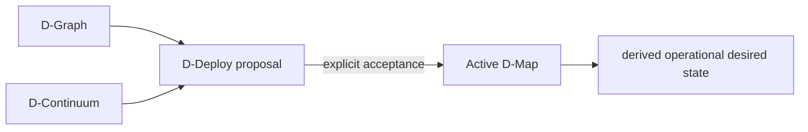
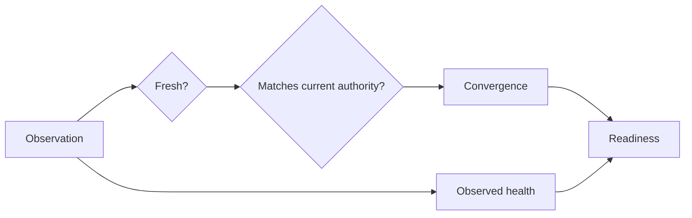
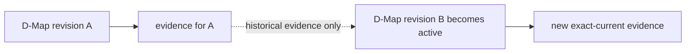

# Desired state, authority and observed evidence

A useful diagnosis needs three independent answers: **what is intended, what is currently accepted, and what the runtime evidence supports**. DATUM v1 keeps those questions separate so that runtime facts cannot silently rewrite control-plane authority.

## Application semantics

D-Graph defines application services and calls. Its canonical shape contains no placement, container identity or observed health.

DForward defines logical middleware elements, interfaces and connections without embedding broker addresses or runtime readiness.

These contracts describe **what should exist structurally**, not what is currently running.

## Accepted placement

D-Map is the canonical accepted placement authority. D-Deploy creates proposals and explicit acceptance establishes the active D-Map.

Derived projections may repeat accepted placement for node-specific consumption, but they must not originate a competing placement decision.

DMap/1 and DMap/2 are real contract versions with different scopes. DMap/1 maps D-Servs to D-Nodes and binds D-Graph/D-Continuum references. DMap/2 additionally carries DForward context, DIoT placements and related realizations.



The projection on the right consumes authority from the D-Map; it does not replace it.

## Operational realization

Operational records describe how accepted authority is realized in concrete runtime terms.

Examples include:

- container/native-process reconciliation assignments;
- DIoT runtime bindings;
- D-Call routes and delivery grants;
- exact D-Code invocation authorization.

A DIoT runtime binding can carry a concrete broker URI. That says which operational endpoint is bound to a governed placement. It does **not** prove that the broker is reachable or healthy.

Likewise, a reconciliation context can describe exactly what a node is authorized to realize without proving that the mutation has already succeeded.

## Observed evidence

A canonical DMonitor observation identifies its subject, provenance, observation time and observed condition. Exact references use identity, revision and digest.

A hostname, image name, container name, process name or port may be useful operational data, but it is not a substitute for canonical identity unless an explicit governed binding establishes that relationship.

An old realization may remain healthy after accepted authority advances. That health report is still valid evidence about the old realization, but it cannot establish readiness for the new authority.

| Situation | Interpretation |
|---|---|
| Binding registered, no admitted observation | Runtime readiness is not proven |
| Runtime exists, but evidence is stale | Current readiness is not proven |
| Fresh evidence matches current authority and reports Healthy | Can support readiness when convergence conditions also hold |
| Healthy evidence references obsolete authority | Cannot establish current placement readiness |
| Fresh exact-current evidence reports Unhealthy | Convergence may hold while readiness fails |

## Freshness, convergence, health and readiness are different

These terms answer different questions:



**Freshness** asks whether evidence is recent enough to be admitted.

**Convergence** asks whether admitted evidence corresponds to the current desired/accepted realization.

**Health** is the runtime condition reported by evidence.

**Readiness** is a current server-derived conclusion over authority, convergence, freshness and admitted health policy.

Therefore `Healthy` is not a synonym for `Ready`, and `Converged` is not a synonym for `Healthy`.

## Static and dynamic middleware views

The authority-only DForward projection describes structural relationships. For `scope = any_element`, fields such as `readiness_authority = "dmonitor"` and `readiness_state = "pending_fresh_evidence"` remain structural markers rather than live decisions.

D1 evaluates governed placement/application readiness from current authority and evidence.

D2 evaluates a cross-node `any_element` dependency by resolving the exact provider from current accepted DForward/DMap/2 authority and consuming that provider placement's D1 readiness.

A dependency can therefore be satisfied while the whole application is still NotReady because another unrelated required placement is missing or unhealthy.

Provider ambiguity, placement ambiguity, absent provider readiness or a provider that is not Ready fail closed as a blocked dependency. A caller cannot choose an alternate provider through the read-only readiness query.

## Runtime success does not create authority

Suppose a container is manually started on `fog-01` while the active D-Map places its logical D-Serv on `cloud-01`.

The manually running container is a runtime fact, but it does not change placement authority:

```text
active D-Map: service → cloud-01
manual process: service-like container on fog-01
```

DATUM must not infer:

```text
therefore service → fog-01
```

Instead, evidence from `fog-01` must either correlate honestly to an authorized realization or remain unbound/non-authoritative.

## Authority movement invalidates old correlations

When a new D-Map is accepted, old evidence does not disappear, but its ability to support **current** readiness changes.



This is why DATUM carries exact references instead of relying only on logical names.

## Planned capabilities

Some capabilities are not implemented yet and should be described directly as future work rather than through internal development milestone names. Examples include the consolidated management dashboard and additional automated distribution/acquisition mechanisms.

## Sources

[Canonical DGraph](https://github.com/dnredson/datum/blob/3e0baa8f415b822f69eef86c0cbfe2a3681e3a65/dserver/src/core/canonical_dgraph.rs), [ADR-0023](https://github.com/dnredson/datum/blob/3e0baa8f415b822f69eef86c0cbfe2a3681e3a65/documentation/adr/ADR-0023-canonical-dforward-diot-dmap-v2.md), [ADR-0024](https://github.com/dnredson/datum/blob/3e0baa8f415b822f69eef86c0cbfe2a3681e3a65/documentation/adr/ADR-0024-canonical-dmonitor-observation-model.md), [D2 dependency core](https://github.com/dnredson/datum/blob/3e0baa8f415b822f69eef86c0cbfe2a3681e3a65/dserver/src/core/dforward_dependency_readiness.rs).
