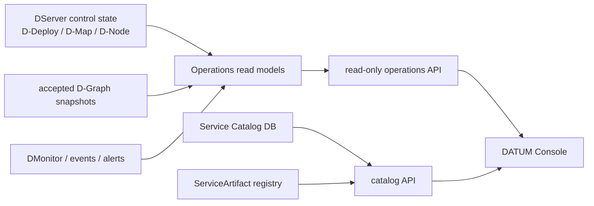
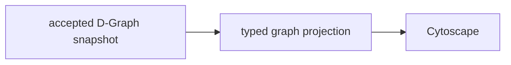
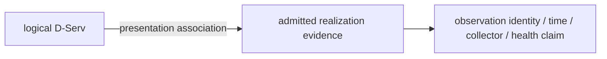
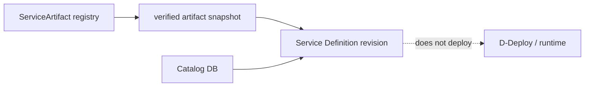

# DATUM Console architecture

DATUM Console is the graphical **presentation and operator-workspace layer** of DATUM v1. Its central architectural rule is simple:

> The interface may compose facts from several domains, but it must not become a parallel source of authority.

## Components



The operations API is read-only. Catalog write routes mutate **catalog definitions only**; they do not produce placement, runtime mutation or monitoring evidence.

## Frontend stack

The published Console is a lightweight TypeScript/Vite application using:

- TypeScript;
- Vite;
- Bootstrap;
- Bootstrap Icons;
- Cytoscape for graph rendering.

The client has explicit route parsing and validates project identifiers before creating project URLs.

## Route model

```text
/
├── projects
│   └── :project_id
│       └── graph
└── catalog
```

The current UI has global overview, project navigation, project overview, project graph and catalog routes. Dedicated placement/deploy/runtime/history project routes are not implemented yet.

## Read-projection architecture

The operations API reads existing DServer sources and builds bounded projection DTOs. It is designed so that a failing source can remain explicitly unavailable/corrupt rather than poisoning every other dimension or silently becoming an empty successful result.

Project-scoped operations routes require the route project ID and `X-Datum-Project` header to match. This provides scope consistency for the read request; it should not be described as a general authentication mechanism.

## Global and project workspaces

The Console does not synthesize one universal `project.status` value. Instead, the project workspace exposes dimensions such as:

- source coverage;
- known application references and their provenance;
- accepted placement references;
- alerts/attention;
- recent operational events;
- monitoring/temporal context;
- source/read issues.

Keeping dimensions independent avoids turning “one red thing exists” into “the whole project is red”, or “no loaded alert” into “the project is healthy”.

## Logical graph source

The graph uses accepted logical application snapshots. Application grouping in Cytoscape is presentation-only; the canonical D-Graph still contains D-Serv and D-Call semantics, not an extra UI grouping vertex.



The graph can be filtered by included application snapshot and exposes canonical graph IDs/revisions/digests in the details view.

## Runtime evidence source

A separate runtime-graph projection supplies admitted DMonitor D-Serv-realization evidence. The UI may associate evidence to logical D-Servs by exact project/application/service identity.



That association does **not** assert:

- current placement;
- a unique running process;
- convergence;
- current readiness;
- ownership of the runtime by the UI.

A monitor epoch is not an execution-instance identifier. An observed D-Map reference is not a convergence result.

## Bounded previews and completeness

Operational views can be bounded. The runtime graph, for example, reports how many latest subject/monitor-epoch records were included and whether the projection is partial.

The UI therefore carries completeness/availability information alongside data. Operators must be able to distinguish:

```text
empty and complete
partial preview
source unavailable
source corrupt
source not configured
```

These states are semantically different.

## Visual semantic contract

Graph styling classifies presentation:

| Category | Interpretation |
|---|---|
| infrastructure | execution resource, not project ownership |
| logical software | logical D-Serv/component, not runtime instance |
| runtime | realization evidence distinct from logical software |
| storage | explicitly modeled storage |
| IoT/device | explicitly modeled device |

Relations include logical D-Call, realization, placement, physical/network and observation/monitoring semantics. Styling never creates the relationship; a typed source must support it first.

Status overlays are likewise visual tokens. They must retain the underlying entity category and must not invent a new canonical health model.

## Catalog architecture

The catalog has its own persistence (`DATUM_SERVICE_CATALOG_DB_PATH`) and a narrow mutation boundary.



Atomic definitions pin verified artifact identity. Composite definitions describe exact components or declarative discovery/provisioning metadata. Catalog save cannot start software.

## Security/fail-closed principles visible in the UI

- malformed project identifiers are rejected by routing;
- project-scoped reads require matching route/header scope;
- unsafe repository URLs/paths are rejected in catalog definitions;
- secret values are not catalog fields;
- stale catalog revision/artifact identity conflicts rather than silently overwriting;
- unreadable sources remain explicit errors/availability states;
- exact identities are shown rather than replaced by friendly-but-ambiguous names.

## Future UI increments

The architecture is intentionally ready for additional project sections. Placement proposal/review, deploy, runtime control and history pages can be added by consuming their existing owner domains or new governed APIs. They should not introduce an independent `deployed`, `healthy` or `placed` database owned by the frontend.

## Sources

- [Console router](https://github.com/dnredson/datum/blob/7a79bd84bc05a1ea18870715cc033567ff472afc/console/src/app/router.ts)
- [project workspace](https://github.com/dnredson/datum/blob/7a79bd84bc05a1ea18870715cc033567ff472afc/console/src/pages/project-workspace.ts)
- [project graph](https://github.com/dnredson/datum/blob/7a79bd84bc05a1ea18870715cc033567ff472afc/console/src/pages/project-graph.ts)
- [graph visual semantics](https://github.com/dnredson/datum/blob/7a79bd84bc05a1ea18870715cc033567ff472afc/console/src/components/graph-visuals.ts)
- [operations API](https://github.com/dnredson/datum/blob/7a79bd84bc05a1ea18870715cc033567ff472afc/dserver/src/api/operations.rs)
- [catalog API](https://github.com/dnredson/datum/blob/7a79bd84bc05a1ea18870715cc033567ff472afc/dserver/src/api/service_catalog.rs)
