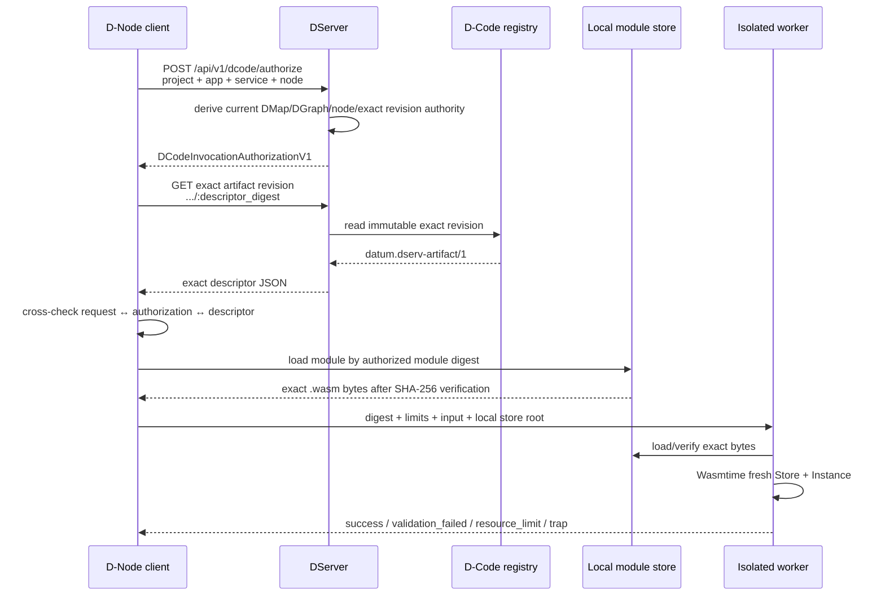
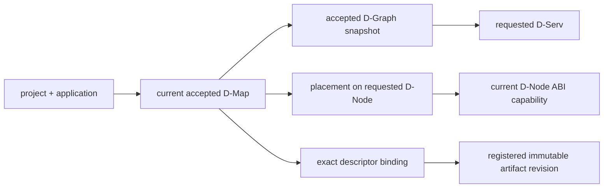
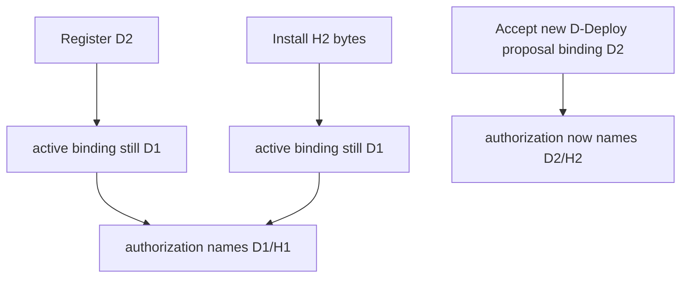

# DServer → D-Node governed D-Code execution

This page answers a practical question precisely:

> **What does DServer actually send to a D-Node/client before a WASM module executes?**

The short answer is: **authority and an exact descriptor — not the module bytes.**

## End-to-end sequence



## Step 0 — what must already exist

Before this flow can succeed, the control plane must already have:

- a current accepted D-Map for the application;
- a D-Graph snapshot containing the service;
- that service placed on the requesting `node_id`;
- a structural D-Node declaration supporting `datum-dnode/0`;
- at least one registered canonical D-Serv artifact revision;
- when multiple revisions exist, an explicit active D-Deploy binding to the intended descriptor digest.

The D-Node must also already have the exact authorized module bytes in its local content-addressed store. DServer does not fill that gap automatically.

## Step 1 — the client asks for authorization

The governed client sends:

```json
{
  "project_id": "proj:example",
  "application_id": "app:example",
  "service_id": "probe",
  "node_id": "rpi-01"
}
```

to:

```text
POST /api/v1/dcode/authorize
```

The client does **not** choose `artifact_id`, `version`, module digest or descriptor digest in this request. That omission is deliberate: executable revision selection must be derived from current authority, not caller preference.

## Step 2 — DServer derives current authority

DServer resolves the chain:



If an active exact binding exists, DServer consults only that descriptor digest. If no binding exists and exactly one revision exists, the unambiguous fallback can resolve it. Once multiple revisions exist, absence of an explicit binding fails closed with `dcode_active_binding_missing` rather than selecting “latest”.

## Step 3 — what the authorization contains

A successful `DCodeInvocationAuthorizationV1` contains:

| Field | Why it matters |
|---|---|
| `authorization_id` | identity for this derived authorization context |
| `project_id` | project scope |
| `application_id` | application identity |
| `service_id` | exact logical D-Serv |
| `node_id` | node that current D-Map authorizes for this service |
| `dmap_ref` | exact active D-Map id/revision/digest |
| `dgraph_ref` | exact accepted D-Graph id/revision/digest |
| `dserv_artifact_id` | canonical artifact ID |
| `dserv_artifact_digest` | **module content digest** — exact `.wasm` bytes |
| `dserv_artifact_descriptor_digest` | **whole descriptor digest** — exact policy/config revision |
| `dnode_abi` | currently `datum-dnode/0` |

This response is much closer to a **cryptographic/structural execution capability description** than to a “run this path” command.

Example shape:

```json
{
  "authorization_id": "dcode-auth:proj:example:app:example:probe:rpi-01:2",
  "project_id": "proj:example",
  "application_id": "app:example",
  "service_id": "probe",
  "node_id": "rpi-01",
  "dmap_ref": {
    "id": "dmap:app:example",
    "revision": 2,
    "digest": "sha256:..."
  },
  "dgraph_ref": {
    "id": "dgraph:example",
    "revision": 1,
    "digest": "sha256:..."
  },
  "dserv_artifact_id": "dserv:app:example:probe",
  "dserv_artifact_digest": "<64-hex module digest>",
  "dserv_artifact_descriptor_digest": "sha256:<64-hex descriptor digest>",
  "dnode_abi": "datum-dnode/0"
}
```

The exact formatting of digest fields follows their owning contract; the conceptual distinction is what matters here.

## Step 4 — client fetches the exact descriptor revision

The client uses the authorization's descriptor digest to call:

```text
GET /api/v1/dcode/artifacts/:application_id/:dserv_id/:descriptor_digest
```

This is the governed path. The logical endpoint:

```text
GET /api/v1/dcode/artifacts/:application_id/:dserv_id
```

is suitable only when lookup is unambiguous. It returns `409` when more than one revision exists, because choosing one implicitly would be unsafe.

## Step 5 — client independently verifies what it received

The client checks that the authorization corresponds to the original requested project/application/service/node. It then verifies that the fetched descriptor:

- belongs to the authorized application;
- belongs to the authorized service;
- recomputes to exactly the authorized descriptor digest;
- declares exactly the authorized module content digest.

This duplication of checks is intentional defense in depth. The execution boundary does not treat “DServer returned JSON” as sufficient proof that every relationship was routed correctly.

## Step 6 — the client loads local bytes by digest

Only now does the node consult its local module store. The selected key is the authorized module digest, not a caller-selected filename.

```text
<dnode-root>/dcode/sha256/<digest>.wasm
```

The store rereads the file and recomputes SHA-256. A corrupted file fails rather than executing under the identity encoded by its filename.

### What DServer does not send

DServer does **not** send in this flow:

- the `.wasm` bytes;
- a filesystem path to execute;
- “the newest artifact”;
- a caller-selected revision;
- a shell command;
- a Docker command;
- a WASI capability set;
- a new node identity.

The server sends authority/descriptor information. The exact content bytes are local operational material.

## Step 7 — isolated execution

The SmartSentinel parent spawns a short-lived `smartsentinel-dcode-worker` child. The worker loads the module by digest and performs the actual Wasmtime work.

Inside the worker/runtime:

1. verify/compile exact module bytes;
2. reject all host imports;
3. check the exact required ABI exports;
4. create a fresh Wasmtime `Store` and `Instance`;
5. configure fuel and memory limits;
6. allocate/write invocation input into guest linear memory;
7. call `datum_handle`;
8. bounds-check and read output;
9. return a typed outcome to the parent.

The parent enforces the whole-invocation wall-clock timeout using OS process supervision. A worker crash, panic or hang is contained outside the long-lived parent address space.

## Why registration and installation do not activate code

Imagine D1/H1 is active and D2/H2 is prepared:



This is one of the most important safety properties in DATUM v1: **content availability is not execution authority**.

## Fresh does not mean atomic

The authorization is freshly derived immediately before execution and immutable artifact revisions cannot mutate underneath an exact digest. However, DServer and a remote D-Node do not participate in one distributed atomic transaction. Current authority could theoretically move after the authorization response and before guest execution. This residual distributed TOCTOU limitation is explicitly documented; DATUM v1 does not claim otherwise.

## Sources

- [D-Code HTTP API](https://github.com/dnredson/datum/blob/c08ccc4d715d9eb76644e3f1bd7d80a7945265c4/dserver/src/api/dcode.rs)
- [D-Code authorization derivation](https://github.com/dnredson/datum/blob/c08ccc4d715d9eb76644e3f1bd7d80a7945265c4/dserver/src/core/dcode_authorization.rs)
- [governed client preflight](https://github.com/dnredson/datum/blob/c08ccc4d715d9eb76644e3f1bd7d80a7945265c4/DATUM/src/dcode/client.rs)
- [local module store](https://github.com/dnredson/datum/blob/c08ccc4d715d9eb76644e3f1bd7d80a7945265c4/DATUM/src/dcode/module_store.rs)
- [isolated D-Code worker](https://github.com/dnredson/datum/blob/c08ccc4d715d9eb76644e3f1bd7d80a7945265c4/DATUM/src/dcode/worker.rs)
