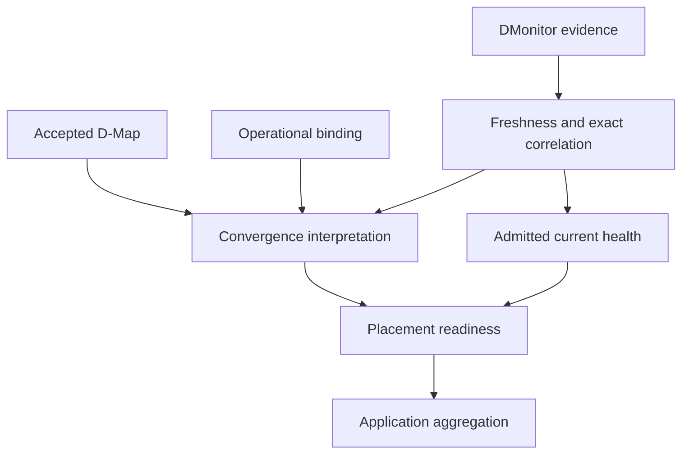

# Architecture overview

The architecture separates application semantics, accepted placement, operational bindings and runtime evidence. DServer evaluates these together without making an observation into a new placement authority.

## Responsibilities

| Component | Responsibility |
|---|---|
| Canonical contracts | Describe application, continuum, placement and middleware semantics |
| DServer | Govern acceptance, retain operational state, ingest evidence and derive views |
| SmartSentinel / node-side producers | Observe local runtime state and publish evidence through supported paths |
| D-Node execution paths | Run governed application D-Code and support D-Call realization |
| Deployment executor | Perform concrete authorized lifecycle operations |

## The readiness relationship

This is a dependency diagram for interpretation, not a network topology or an automatic remediation loop.

## State ownership

Accepted DDeploy state exposes the active placement authority. DMap/2 additionally carries the accepted DForward context and DIoT placements. Operational runtime bindings attach realization details to that authority. DMonitor records facts about observations; it cannot choose placement.

D1 readiness uses one coherent in-process snapshot and one server-owned evaluation time. It is derived again for each call and is not persisted as an independent boolean.

Canonical control-state domains use the existing control-state persistence mechanisms. Legacy compatibility surfaces also exist; they should not be presented as the authority for every canonical subsystem.

## Observation and correction

SmartSentinel's broader responsibilities can be described as preventive governance, detective observation and explicitly governed corrective execution. Canonical DMonitor itself is **detective**: observing divergence does not authorize or execute a correction.

Continue with [desired state, authority and evidence](authority-and-evidence.md).

## Sources

[ADR-0023](https://github.com/dnredson/datum/blob/c059c3341c7901eeea77ce4881bbd341580d8aef/documentation/adr/ADR-0023-canonical-dforward-diot-dmap-v2.md), [ADR-0024](https://github.com/dnredson/datum/blob/c059c3341c7901eeea77ce4881bbd341580d8aef/documentation/adr/ADR-0024-canonical-dmonitor-observation-model.md), [D1 handler](https://github.com/dnredson/datum/blob/c059c3341c7901eeea77ce4881bbd341580d8aef/dserver/src/api/dmonitor_readiness.rs).
