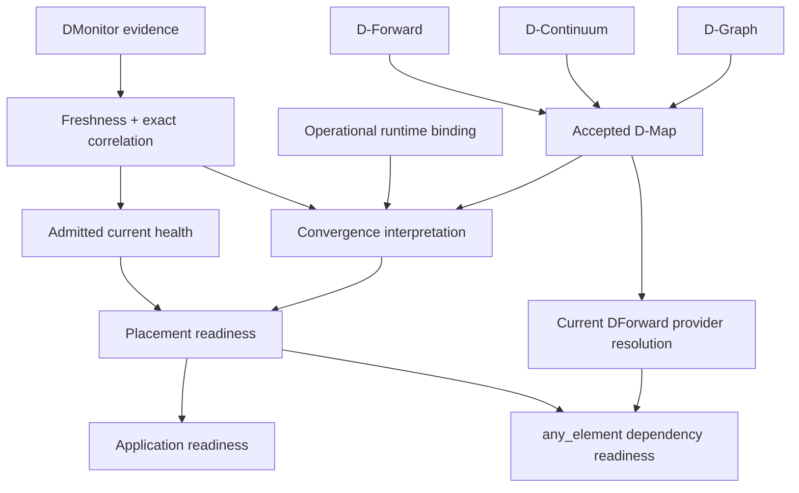

# Architecture overview

The architecture separates application semantics, structural continuum facts, accepted placement, operational bindings and runtime evidence. DServer evaluates these together without allowing an observation to become placement authority.

## Responsibility planes

| Plane | Main entities | Question answered |
|---|---|---|
| Application | D-Graph, D-Serv, D-Call, D-Serv artifact/D-Code | What does the application consist of and execute? |
| Continuum | D-Continuum, D-Node | What structural execution resources/capabilities are declared? |
| Placement | D-Deploy, D-Map | Where are required entities accepted to run? |
| Middleware | D-Forward, DIoT, chains/interfaces | How is middleware/data-path composition modeled? |
| Operational realization | D-Call routes/grants, DIoT runtime bindings | How does accepted authority resolve to concrete runtime transport? |
| Observation | DMonitor observation | What did a collector actually observe? |
| Interpretation | convergence, health assessment, readiness | What does current admitted evidence prove? |

## Main implementation responsibilities

| Component | Responsibility |
|---|---|
| Canonical contracts | Describe application, continuum, placement and middleware semantics |
| DServer | Govern acceptance, retain control state, derive authority, ingest evidence and compute views |
| SmartSentinel / node-side producers | Observe local runtime state and publish evidence through supported paths |
| D-Node execution paths | Run governed application D-Code and support D-Call realization |
| Deployment/executor paths | Perform concrete lifecycle operations only when separately authorized |

## The readiness relationship

This is an interpretation/authority dependency diagram, not network topology and not an automatic remediation loop.

## State ownership

The structural D-Node registry is DServer's source of truth for declared D-Node facts. DDeploy acceptance exposes active placement authority. DMap/2 additionally carries accepted DForward context and DIoT placements/realizations. Operational runtime bindings attach concrete realization information to that authority. DMonitor records observations; it cannot choose placement.

D1 readiness uses a coherent in-process snapshot and server-owned evaluation time/policy. D2 resolves `any_element` providers from current accepted DMap/2/DForward authority and evaluates their exact placement readiness under D1 governance. Both are derived on read rather than persisted as independent truth booleans.

## Canonical versus operational/legacy surfaces

DServer contains code accumulated across multiple development stages. Therefore names such as `graph`, `operational-dgraph`, `dgraph`, Controlled WASM and canonical D-Graph can coexist while representing different models.

This documentation uses these rules:

- a schema/ADR-backed canonical entity is described as **canonical**;
- a server-owned concrete realization record is described as **operational**;
- older compatibility/planning/executor surfaces are documented because they exist, but they do not silently inherit canonical authority;
- an HTTP route is not evidence that its payload is a canonical DATUM contract.

See the [complete HTTP API](../reference/http-api.md) for route inventory and the [core API](../reference/core-api.md) for the canonical control-plane subset.

## Observation and correction

SmartSentinel's broader responsibilities can be described as preventive governance, detective observation and explicitly governed corrective execution. Canonical DMonitor itself is **detective**: observing divergence does not authorize or execute a correction.

Continue with [desired state, authority and evidence](authority-and-evidence.md), the [end-to-end lifecycle](lifecycle.md), and the [entity encyclopedia](../concepts/entities.md).

## Sources

[ADR-0023](https://github.com/dnredson/datum/blob/3e0baa8f415b822f69eef86c0cbfe2a3681e3a65/documentation/adr/ADR-0023-canonical-dforward-diot-dmap-v2.md), [ADR-0024](https://github.com/dnredson/datum/blob/3e0baa8f415b822f69eef86c0cbfe2a3681e3a65/documentation/adr/ADR-0024-canonical-dmonitor-observation-model.md), [D-Node registry](https://github.com/dnredson/datum/blob/3e0baa8f415b822f69eef86c0cbfe2a3681e3a65/dserver/src/core/dnode_registry.rs), [D-Deploy](https://github.com/dnredson/datum/blob/3e0baa8f415b822f69eef86c0cbfe2a3681e3a65/dserver/src/core/ddeploy.rs), [D1 handler](https://github.com/dnredson/datum/blob/3e0baa8f415b822f69eef86c0cbfe2a3681e3a65/dserver/src/api/dmonitor_readiness.rs), [D2 handler](https://github.com/dnredson/datum/blob/3e0baa8f415b822f69eef86c0cbfe2a3681e3a65/dserver/src/api/dforward_dependency_readiness.rs).
