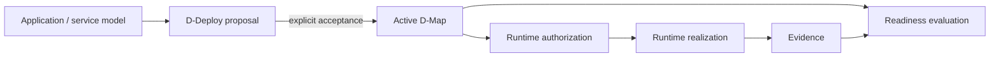
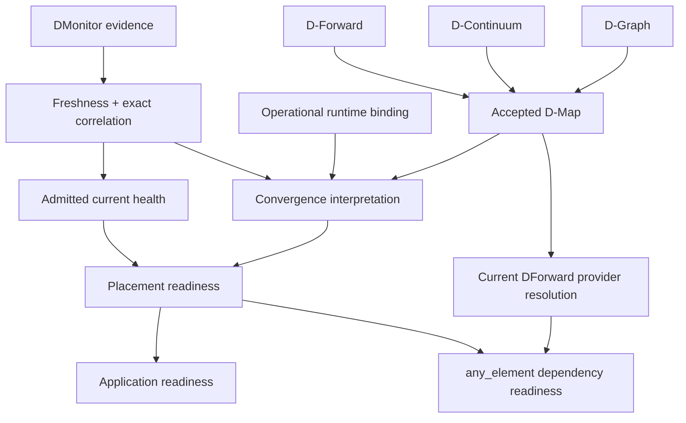

# Architecture overview

DATUM v1 separates application semantics, structural continuum facts, accepted placement, operational realization and runtime evidence. DServer evaluates these domains together without allowing one domain to silently become authority for another.

## Responsibility planes

| Plane | Main entities | Question answered |
|---|---|---|
| Application | D-Graph, D-Serv, D-Call, D-Serv artifact/D-Code | What does the application consist of and execute? |
| Continuum | D-Continuum, D-Node | What structural execution resources and capabilities are declared? |
| Placement | D-Deploy, D-Map | Where are required entities accepted to run? |
| Middleware | D-Forward, DIoT, chains/interfaces | How is middleware/data-path composition modeled? |
| Operational realization | reconciliation, D-Call routes/grants, DIoT runtime bindings | How does accepted authority resolve to concrete runtime behavior? |
| Observation | DMonitor observation | What did a collector actually observe? |
| Interpretation | convergence, health assessment, readiness | What does current admitted evidence prove? |

## Main implementation responsibilities

| Component | Responsibility |
|---|---|
| Canonical contracts | Describe application, continuum, placement and middleware semantics |
| DServer | Govern acceptance, retain control state, derive authority, ingest evidence and compute views |
| SmartSentinel / node-side producers | Realize authorized node state, observe local runtime state and publish evidence through supported paths |
| D-Node execution paths | Run governed application D-Code and supported runtime workloads |
| Reconciliation/executor paths | Perform concrete host mutations only when separately authorized |

## Authority flows one way

```mermaid
flowchart LR
    MODEL["Application / service model"] --> PROP["D-Deploy proposal"]
    PROP -->|"explicit acceptance"| MAP["Active D-Map"]
    MAP --> AUTH["Runtime authorization"]
    AUTH --> REAL["Runtime realization"]
    REAL --> OBS["Evidence"]
    MAP --> READY["Readiness evaluation"]
    OBS --> READY
```

The direction matters. Evidence can confirm or contradict an accepted realization, but it does not create placement authority. A running process does not rewrite the D-Map; a D-Map does not prove that a process is running.

## Readiness relationship

```mermaid
flowchart TD
    DG["D-Graph"] --> A["Accepted D-Map"]
    CONT["D-Continuum"] --> A
    DF["D-Forward"] --> A
    A --> C["Convergence interpretation"]
    B["Operational runtime binding"] --> C
    E["DMonitor evidence"] --> F["Freshness + exact correlation"]
    F --> C
    F --> H["Admitted current health"]
    C --> R["Placement readiness"]
    H --> R
    R --> G["Application readiness"]
    A --> P["Current DForward provider resolution"]
    P --> D["any_element dependency readiness"]
    R --> D
```

This is an authority/evidence dependency diagram, not network topology and not an automatic remediation loop.

## State ownership

The structural D-Node registry is DServer's source of truth for declared D-Node facts. D-Deploy acceptance establishes active placement authority. DMap/2 additionally carries accepted DForward context and DIoT placements/realizations. Operational runtime bindings attach concrete realization information to that authority. DMonitor records observations; it cannot choose placement.

D1 readiness evaluates application/placement readiness from a coherent server-owned view of current authority and admitted evidence. D2 resolves `any_element` providers from current accepted DMap/2/DForward authority and evaluates the exact provider placement. Both are derived views rather than separately persisted truth booleans.

## Canonical and operational surfaces

DATUM v1 contains several different representations because they answer different questions. Names such as canonical D-Graph, operational desired state, ServiceArtifact, D-Code descriptor and runtime binding should not be collapsed into one generic “deployment object”.

Use these rules:

- a schema-backed semantic contract is described as **canonical**;
- a server-owned concrete runtime/realization record is described as **operational**;
- compatibility or auxiliary surfaces remain bounded by their own contracts and do not silently inherit canonical authority;
- the existence of an HTTP route does not by itself make that route's payload a canonical DATUM contract;
- derived projections may repeat current authority for consumption, but must not originate competing placement decisions.

See the [complete HTTP API](../reference/http-api.md) for route inventory and the [core API](../reference/core-api.md) for the main control-plane surfaces.

## Observation and correction

SmartSentinel's responsibilities can be described as **preventive**, **detective** and **corrective**:

- preventive governance constrains what may be proposed, accepted or executed;
- detective paths observe runtime state and report evidence;
- corrective execution changes host/runtime state only through explicit governed authorization.

DMonitor itself is detective. Detecting divergence does not automatically authorize a correction.

## What is not implemented yet

Some architectural directions are intentionally documented as future work rather than implied by historical development labels. Examples include the consolidated management dashboard, automatic D-Code module distribution and richer governed acquisition mechanisms for native software.

Continue with [desired state, authority and evidence](authority-and-evidence.md), the [end-to-end lifecycle](lifecycle.md), and the [entity encyclopedia](../concepts/entities.md).

## Sources

[ADR-0023](https://github.com/dnredson/datum/blob/3e0baa8f415b822f69eef86c0cbfe2a3681e3a65/documentation/adr/ADR-0023-canonical-dforward-diot-dmap-v2.md), [ADR-0024](https://github.com/dnredson/datum/blob/3e0baa8f415b822f69eef86c0cbfe2a3681e3a65/documentation/adr/ADR-0024-canonical-dmonitor-observation-model.md), [D-Node registry](https://github.com/dnredson/datum/blob/3e0baa8f415b822f69eef86c0cbfe2a3681e3a65/dserver/src/core/dnode_registry.rs), [D-Deploy](https://github.com/dnredson/datum/blob/3e0baa8f415b822f69eef86c0cbfe2a3681e3a65/dserver/src/core/ddeploy.rs), [D1 handler](https://github.com/dnredson/datum/blob/3e0baa8f415b822f69eef86c0cbfe2a3681e3a65/dserver/src/api/dmonitor_readiness.rs), [D2 handler](https://github.com/dnredson/datum/blob/3e0baa8f415b822f69eef86c0cbfe2a3681e3a65/dserver/src/api/dforward_dependency_readiness.rs).
