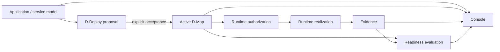

# Architecture overview

DATUM v1 separates application semantics, reusable service modeling, structural continuum facts, accepted placement, operational realization, runtime evidence and graphical presentation. DServer and the Console evaluate these domains together without allowing one domain to silently become authority for another.

## Responsibility planes

| Plane | Main entities | Question answered |
|---|---|---|
| Application | D-Graph, D-Serv, D-Call, D-Serv artifact/D-Code | What does the application consist of and execute? |
| Reusable service modeling | catalog Service Definition | What reusable service/composition does an operator want to describe? |
| Continuum | D-Continuum, D-Node | What structural execution resources and capabilities are declared? |
| Placement | D-Deploy, D-Map | Where are required entities accepted to run? |
| Middleware | D-Forward, DIoT, chains/interfaces | How is middleware/data-path composition modeled? |
| Operational realization | reconciliation, D-Call routes/grants, DIoT runtime bindings | How does accepted authority resolve to concrete runtime behavior? |
| Observation | DMonitor observation | What did a collector actually observe? |
| Interpretation | convergence, health assessment, readiness | What does current admitted evidence prove? |
| Presentation | DATUM Console | How can operators inspect several domains without creating new authority? |

## Main implementation responsibilities

| Component | Responsibility |
|---|---|
| Canonical contracts | Describe application, continuum, placement and middleware semantics |
| DServer | Govern acceptance, retain control/catalog state, derive authority, ingest evidence and compute safe read projections |
| DATUM Console | Present server-owned projections, accepted logical graph structure, runtime evidence and catalog revisions |
| SmartSentinel / node-side producers | Realize authorized node state, observe local runtime state and publish evidence through supported paths |
| D-Node execution paths | Run governed application D-Code and supported runtime workloads |
| Reconciliation/executor paths | Perform concrete host mutations only when separately authorized |

## Authority flows one way


```mermaid
flowchart LR
    MODEL["Application / service model"] --> PROP["D-Deploy proposal"]
    PROP -->|"explicit acceptance"| MAP["Active D-Map"]
    MAP --> AUTH["Runtime authorization"]
    AUTH --> REAL["Runtime realization"]
    REAL --> OBS["Evidence"]
    MAP --> READY["Readiness evaluation"]
    OBS --> READY
    MODEL --> UI["Console"]
    MAP --> UI
    OBS --> UI
    READY --> UI
```

The Console is downstream of the owning domains. A visual element can repeat or combine facts; it cannot originate placement simply by being drawn.

## State ownership

The structural D-Node registry is DServer's source of truth for declared D-Node facts. D-Deploy acceptance establishes active placement authority. Operational runtime bindings attach concrete realization information to that authority. DMonitor records observations; it cannot choose placement. The service catalog owns reusable definition revisions but does not own deployment.

D1 readiness evaluates application/placement readiness from a coherent server-owned view of current authority and admitted evidence. D2 resolves `any_element` providers from current accepted DMap/2/DForward authority and evaluates the exact provider placement. Both are derived views rather than separately persisted truth booleans.

## Console as a presentation plane

The Console consumes bounded read projections from DServer. Its graph deliberately keeps accepted logical snapshots and DMonitor realization evidence separate. Visual categories and relationship styles are a presentation contract only.

For example:

```text
purple logical service node
        ≠ running process

dashed placement relation
        ≠ ownership

runtime evidence child
        ≠ current placement authority

red/amber visual attention
        ≠ a new canonical health field
```

See [DATUM Console architecture](console.md) for the complete boundary.

## Canonical and operational surfaces

DATUM v1 contains several representations because they answer different questions. Names such as canonical D-Graph, catalog Service Definition, operational desired state, ServiceArtifact, D-Code descriptor and runtime binding should not be collapsed into one generic “deployment object”.

Use these rules:

- a schema-backed semantic contract is described as **canonical**;
- a versioned catalog definition is reusable modeling, not placement;
- a server-owned concrete runtime/realization record is **operational**;
- evidence reports observed reality;
- Console/read projections present or correlate facts without replacing their owners;
- the existence of an HTTP route does not by itself make that route's payload a canonical DATUM contract.

## What is not implemented yet

Dedicated Console pages/actions for placement, deploy, runtime mutation and history are not implemented yet. Automatic D-Code distribution and native package-manager acquisition are also not implemented as governed primitives.

Continue with [DATUM Console architecture](console.md), [desired state, authority and evidence](authority-and-evidence.md), the [end-to-end lifecycle](lifecycle.md), and the [entity encyclopedia](../concepts/entities.md).
