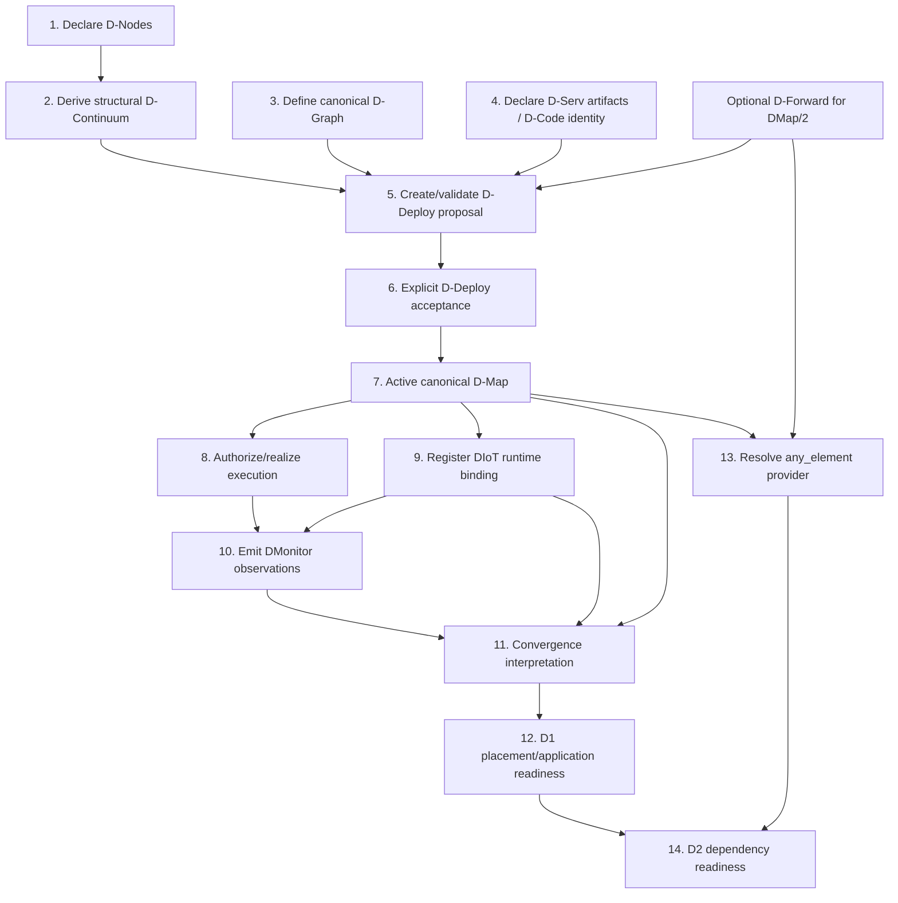

# Lifecycle and authority flow

This page follows one application from structural declaration to evidence-derived readiness. The purpose is not to prescribe one deployment workflow for every future release; it is to make the **authority transitions at the Phase 114D2 baseline** explicit.

## End-to-end flow



## 1. Declare structural D-Nodes

The D-Node registry records structural facts: `node_id`, platform, static capacity and supported D-Node ABI versions. This is server-owned structural inventory, not Sentinel liveness.

Re-declaring identical content is an idempotent no-op. Attempting to mutate an existing declaration in place fails closed in v0.1; remove and redeclare is the explicit structural transition.

Relevant API: `GET /api/v1/dnodes`, `PUT|GET|DELETE /api/v1/dnodes/:node_id`.

## 2. Derive authoritative D-Continuum

DServer can derive a project-scoped `datum.dcontinuum/1` from the current structural registry. The same global node inventory is stamped with the requested project scope; this does not imply project ownership of physical nodes.

Relevant API: `GET /api/v1/dcontinuum/authoritative`.

## 3. Define the canonical application D-Graph

The application plane declares D-Servs and D-Calls without placement. D-Serv resource requirements and D-Node ABI requirements are structural requirements used later during placement validation/planning.

D-Graph itself has no endpoint in the core set that simply “activates” a graph. D-Deploy proposal/acceptance carries/retains validated source snapshots and materializes placement authority around them.

## 4. Declare D-Serv artifacts / D-Code identity

Each D-Serv executable is described by `datum.dserv-artifact/1`: content-addressed WebAssembly identity, ABI, ports, limits and safety constraints.

The declaration is immutable per `(application_id, dserv_id)` in v0.1. The server registry stores metadata/digests; module bytes stay in node-local content-addressed storage.

Relevant API: `POST /api/v1/dcode/artifacts`, `GET /api/v1/dcode/artifacts/:application_id/:dserv_id`.

## 5. Create and validate a D-Deploy proposal

A proposal is a candidate mapping, not authority. It carries project/application context, source provenance and exact source contract references/snapshots. Validation checks structure and cross-contract consistency.

DMap/1 proposal surfaces are under `/api/v1/ddeploy/...`; DMap/2 surfaces are under `/api/v1/ddeploy/v2/...`.

A deterministic planner may produce candidate placements, but a planner decision is still not an active D-Map.

## 6. Explicitly accept the proposal

Acceptance is the authority transition. The server assigns/materializes canonical D-Map identity/revision after fail-closed checks, persists acceptance, and activates it for the project/application.

A proposal can be stale if active authority or authoritative D-Continuum changed after proposal creation. Compare-and-swap style checks prevent silent acceptance under different assumptions.

Relevant APIs:

```text
POST /api/v1/ddeploy/proposals/:proposal_id/accept
POST /api/v1/ddeploy/v2/proposals/:proposal_id/accept
```

## 7. Active D-Map becomes placement authority

After acceptance, consumers should use active placement authority rather than re-reading eligibility hints as if those hints still selected placement.

DMap/1 covers D-Serv placement. DMap/2 additionally binds DForward, DIoT placements, D-Call realizations and external port bindings.

Relevant APIs: `GET /api/v1/ddeploy/active` and `GET /api/v1/ddeploy/v2/authority`.

## 8. Authorize D-Code and D-Call execution

D-Code authorization checks the current authority chain before allowing an invocation. D-Call route derivation reuses that authorization for source/destination and derives destination from active authority rather than accepting a caller-selected target.

Relevant APIs include:

```text
POST /api/v1/dcode/authorize
GET  /api/v1/dcall/calls/:project_id/:application_id/:source_service_id
POST /api/v1/dcall/grants
POST /api/v1/dcall/grants/:grant_id/redeem
```

A D-Call grant is short-lived and single-use. It binds authority at issuance/delivery rather than becoming a permanent route declaration.

## 9. Register DIoT runtime bindings for DMap/2 realizations

A DIoT runtime binding resolves one accepted DIoT placement to a concrete MQTT broker URI. Its DIoT/node/DMap/DForward/artifact identities are server-derived from current authority.

Registration does not contact the broker. It says *this is the concrete operational transport configuration currently bound to this placement*, not *the broker is alive*.

Relevant APIs:

```text
PUT /api/v1/diot/runtime-bindings/:project_id/:application_id/:placement_id
GET /api/v1/diot/runtime-bindings/:project_id/:application_id/:placement_id
GET /api/v1/diot/runtime-bindings/:project_id/:application_id/:placement_id/current
```

The `/current` view is useful when a consumer wants a binding only if its recorded authority still matches the active authority.

## 10. Emit canonical DMonitor evidence

Collectors publish one `datum.dmonitor-observation/1` at a time. Typed subject identity tells the server what was actually observed; exact refs, when available, correlate it to authority.

Relevant API: `POST /api/v1/dmonitor/observations/:project_id`.

Ingestion retains stream ordering semantics and does not convert evidence into desired state.

## 11. Derive convergence

Convergence asks whether admitted evidence matches the current desired realization. For a DIoT placement, exact DMap, DForward and runtime-binding correlation can all matter.

Relevant API: `POST /api/v1/dmonitor/convergence/:project_id/:application_id/evaluate`.

Convergence is not health. A realization can be exactly current (`Converged`) and still report `Unhealthy`.

## 12. Derive D1 readiness

D1 combines governed convergence with admitted current health and freshness policy. A placement needs positive proof; missing/stale/ambiguous/unhealthy evidence fails closed to NotReady.

Application readiness aggregates required D-Serv and DIoT placements.

Relevant API: `GET /api/v1/dmonitor/readiness/:project_id/:application_id`.

## 13. Resolve an `any_element` provider

For a consumer DIoT requirement, Phase 114D2 reads the **current accepted** DForward topology. It resolves the candidate provider through chains/hops and then resolves that logical provider to its exact current DIoT placement.

Provider selection is not caller input. Zero/multiple candidates or placements fail closed.

## 14. Derive D2 dependency readiness

The final dependency state is `satisfied` only if the exact current provider placement is Ready under D1 governance. It is otherwise `blocked` with a dependency-specific finding.

Relevant API:

```text
GET /api/v1/dforward/dependency-readiness/:project_id/:application_id/:node_id
```

The `node_id` identifies the consumer node to evaluate; it is not a caller-selected provider node.

## What changes authority and what only changes evidence?

| Event | Placement authority changes? | Evidence/derived view can change? |
|---|---:|---:|
| New D-Node declaration | No active D-Map automatically | Yes, future proposal feasibility/source continuum changes |
| Create proposal | No | No active placement change |
| Accept proposal | **Yes** | Yes, old evidence/bindings can become stale |
| Register new DIoT runtime binding | No D-Map change | Yes, realization identity changes |
| Publish DMonitor observation | No | **Yes** |
| Observation becomes stale with time | No | **Yes** |
| Query readiness | No | Computes current derived result |
| Query dependency readiness | No | Computes current derived result |

## Failure-closed philosophy

Several domains follow the same rule: when the system cannot positively establish the exact current authority/evidence relationship, it does not guess.

Examples include unknown nodes, digest mismatches, stale proposal snapshots, missing provider placement, ambiguous provider, stale runtime binding, missing readiness and conflicting health. This is why identifiers and exact references are part of architecture rather than merely metadata.

## Sources

[D-Node registry](https://github.com/dnredson/datum/blob/3e0baa8f415b822f69eef86c0cbfe2a3681e3a65/dserver/src/core/dnode_registry.rs), [D-Deploy](https://github.com/dnredson/datum/blob/3e0baa8f415b822f69eef86c0cbfe2a3681e3a65/dserver/src/core/ddeploy.rs), [D-Serv artifact](https://github.com/dnredson/datum/blob/3e0baa8f415b822f69eef86c0cbfe2a3681e3a65/dserver/src/core/dserv_artifact.rs), [D-Call](https://github.com/dnredson/datum/blob/3e0baa8f415b822f69eef86c0cbfe2a3681e3a65/dserver/src/core/dcall.rs), [DIoT runtime binding](https://github.com/dnredson/datum/blob/3e0baa8f415b822f69eef86c0cbfe2a3681e3a65/dserver/src/core/diot_runtime_binding.rs), [DMonitor model](https://github.com/dnredson/datum/blob/3e0baa8f415b822f69eef86c0cbfe2a3681e3a65/DATUM/src/agent/canonical_dmonitor.rs), [D1 readiness](https://github.com/dnredson/datum/blob/3e0baa8f415b822f69eef86c0cbfe2a3681e3a65/dserver/src/core/dmonitor_readiness.rs), [D2 dependency readiness](https://github.com/dnredson/datum/blob/3e0baa8f415b822f69eef86c0cbfe2a3681e3a65/dserver/src/core/dforward_dependency_readiness.rs).
