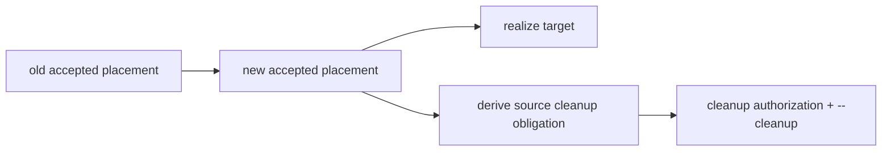

# Lifecycle and authority flow

DATUM v1 separates application modeling, placement authority, runtime realization and evidence. This page shows the end-to-end control flow without treating “deployment” as one undifferentiated state.

## High-level lifecycle


```mermaid
flowchart LR
    MODEL["Model application/service"] --> ART["Register artifacts"]
    ART --> GRAPH["D-Graph"]
    GRAPH --> PLAN["D-Deploy proposal"]
    PLAN --> ACCEPT["Explicit acceptance"]
    ACCEPT --> MAP["Active D-Map"]
    MAP --> AUTH["Runtime authorization"]
    AUTH --> REAL["Node realization"]
    REAL --> OBS["Evidence"]
    OBS --> READY["Readiness"]
```

Each transition has different ownership and meaning.

## 1. Model application intent

The canonical D-Graph describes D-Servs and D-Calls without embedding placement, runtime addresses or live health.

Existing operational software is modeled separately through `ServiceArtifact`. Canonical D-Code is described through immutable `datum.dserv-artifact/1` descriptor revisions.

## 2. Establish structural continuum authority

DServer's D-Node registry declares structural node platform, static capacity and supported ABI versions. DServer derives the authoritative project-scoped D-Continuum from that structural registry.

Generic telemetry or Sentinel heartbeat does not redefine structural node authority.

## 3. Create a placement proposal

D-Deploy evaluates the D-Graph against current structural continuum facts, project commitments and artifact eligibility. The result is an immutable proposal candidate.

A proposal is not placement authority.

## 4. Explicitly accept placement

Acceptance revalidates load-bearing current facts and materializes the canonical D-Map.

```text
proposal
   ↓ explicit acceptance
D-Map authority
```

The accepted D-Map now answers *where is each required logical entity authorized to run?*

## 5. Derive operational node state

DServer projects accepted placement into node-specific operational desired state. The projection does not create a second placement authority: it is derived from the accepted D-Map.

For operational container/native realization, DServer resolves exact ServiceArtifact assignments and execution projection/generation data.

For D-Code, current D-Deploy authority also selects the exact immutable descriptor revision used by governed invocation.

## 6. Authorize mutation or invocation

Placement alone is not permission to mutate a host.

Operational reconciliation requires current resource binding, exact node/graph/artifact snapshot and finite authorization before host mutation.

D-Code uses fresh execution authorization that binds current D-Map, D-Graph, D-Node and exact descriptor revision.

## 7. Realize runtime state

Depending on service type:

```text
container      → governed Docker realization
native process → verified content materialization + managed process
D-Code         → exact local WASM digest + isolated Wasmtime invocation
```

Runtime realization is an observed operational fact, not a change to D-Graph semantics.

## 8. Observe

DMonitor observations and other runtime evidence describe what actually happened. Evidence can be healthy, unhealthy, degraded, missing or stale.

When exact canonical correlation cannot be established, evidence should remain unbound rather than guessing identity from hostnames/container names.

## 9. Derive convergence and readiness

DServer combines admitted evidence with current accepted authority and freshness policy.

```text
accepted placement
+ exact-current realization correlation
+ fresh admitted evidence
+ health policy
= readiness conclusion
```

A service can therefore be:

- accepted but not realized;
- realized but not observed;
- observed but stale;
- converged but unhealthy;
- healthy at one moment but later NotReady when evidence expires.

## Migration lifecycle

Placement changes create two distinct operational obligations:


```mermaid
flowchart LR
    OLD["old accepted placement"] --> NEW["new accepted placement"]
    NEW --> TARGET["realize target"]
    NEW --> SOURCE["derive source cleanup obligation"]
    SOURCE --> CLEAN["cleanup authorization + --cleanup"]
```

The target must realize current desired state. The old source may need governed cleanup when history/current authority proves that the service was previously placed there and is no longer desired there.

Cleanup is a dedicated operation, intentionally distinct from ordinary rollback.

## Rollback

Rollback is an explicit new operation/transition. DATUM does not treat rollback as “go back in time and pretend old authority is still current.” The rollback path must itself be governed by current authorization and execution semantics.

## D-Code revision changes

Multiple immutable descriptor revisions may coexist for one logical D-Serv:

```text
D1/H1
D2/H2
D3/H3
```

Registering a new descriptor or installing its bytes does not activate it. Current accepted D-Deploy authority must bind the exact revision before fresh D-Code authorization can select it.

## What the planned dashboard should show

The lifecycle maps naturally to derived UI states:

```text
Modeled
Registered
Execution identity complete
Proposed
Accepted
Assigned
Authorized
Realized
Observed
Healthy
Ready
Cleanup pending/completed
```

These should remain derived from the domains that own each fact; the dashboard should not persist an independent `deployment_status` truth.

## Capabilities not implemented yet

- packaged turnkey installation;
- automatic D-Code module distribution;
- native package-manager acquisition;
- the new management dashboard;
- a fully reproduced clean multi-machine deployment guide in this documentation.

## Sources

See [Sources and provenance](../reference/sources.md), [Authority and evidence](authority-and-evidence.md), [Service-to-node lifecycle](../tutorials/service-to-node.md) and [Runtime realization](../tutorials/runtime-realization.md).
