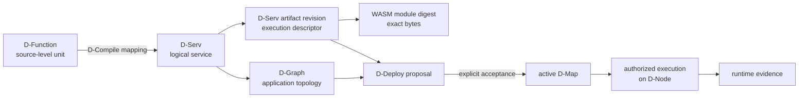
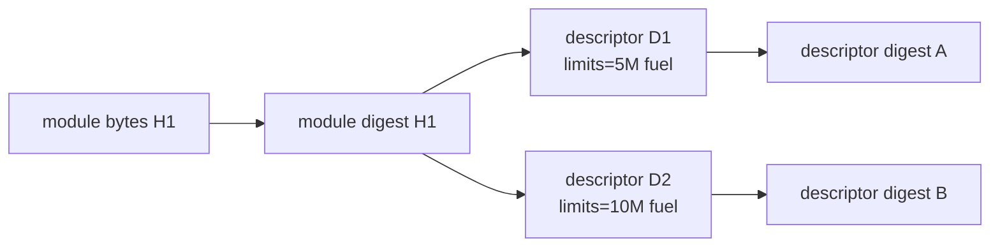
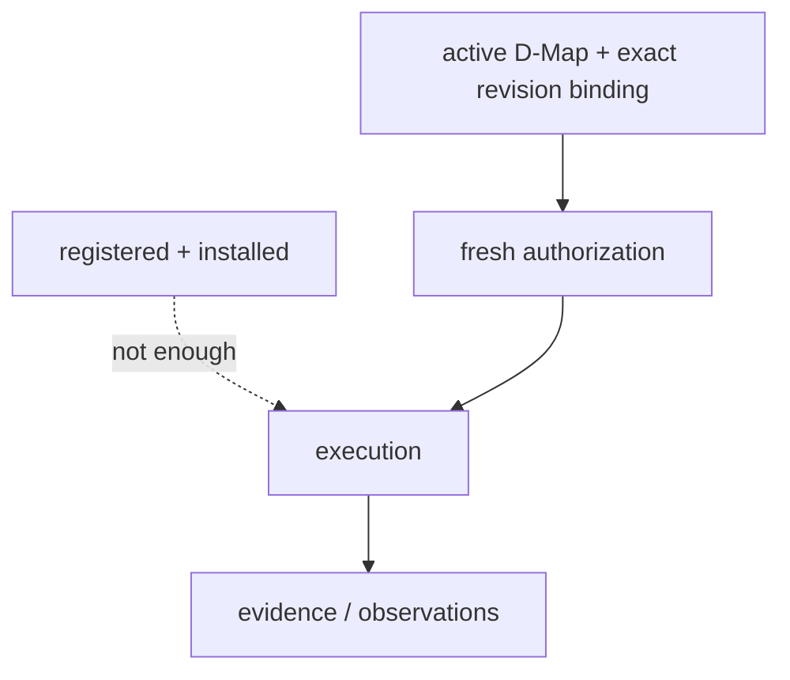
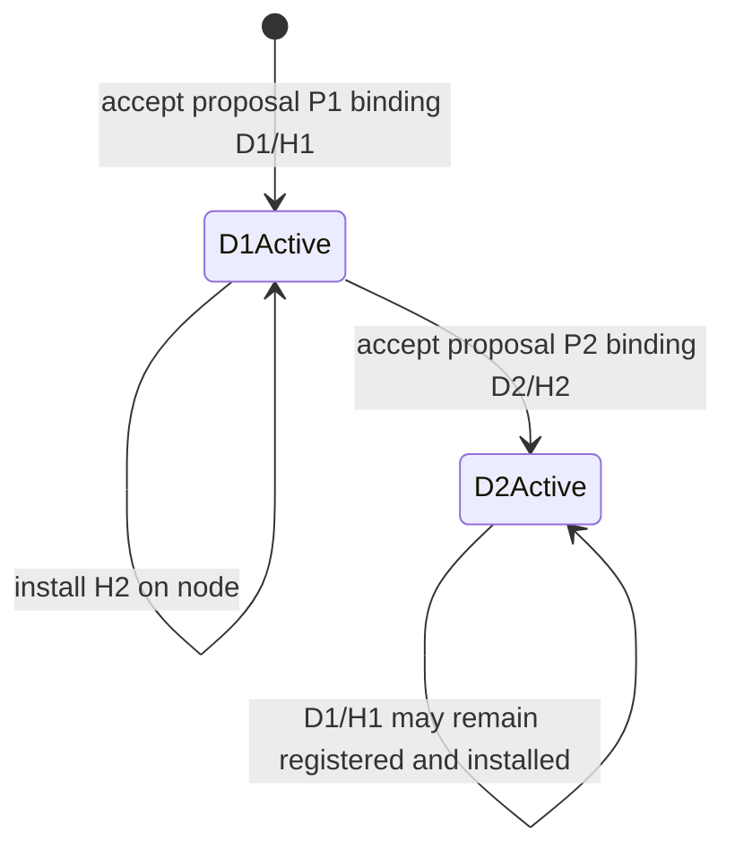

# Software component model

“Software component” can mean several different objects in a distributed system. DATUM intentionally gives each representation a different identity so that source meaning, topology, executable bytes, execution policy, placement and observed runtime state do not overwrite one another.

## One component, many representations



These are related but not interchangeable.

## 1. D-Script: compile-time source meaning

`datum.dscript/1` is the canonical compile-time representation of a D-Application. It contains:

- `application_id`;
- `dscript_id`;
- `revision`;
- a set of D-Functions;
- conservative string-to-string annotations per D-Function.

D-Script deliberately contains **no placement, node, executable digest, D-Graph edges, runtime health, PID, image, broker or deployment authority**.

A D-Function is therefore closer to “a named source-level functionality unit” than to “a process” or “a container”.

## 2. D-Compile mapping: how functions become services

The production D-Compile submission supplies an explicit `services[]` mapping. Each service mapping names:

- a `service_id`;
- the set of `function_ids` assigned to it;
- structural CPU/memory requirements.

In DATUM v1 the function mapping forms an exact partition: the mapping is part of compile intent and gets its own canonical digest. It is not inferred later from container names or runtime state.

## 3. D-Graph: the logical distributed application

The generated D-Graph represents D-Serv vertices and D-Call edges. It answers:

> What logical services make up this application, and what semantic calls connect them?

It still does not answer where a service runs or which executable revision is active.

## 4. D-Code module: the exact executable bytes

For D-Code in DATUM v1, the executable is WebAssembly. The module's SHA-256 digest is content identity. Two byte-different modules are two different content identities even if both implement the same logical D-Serv.

```text
logical service:  probe
revision H1 bytes -> SHA256 H1
revision H2 bytes -> SHA256 H2

H1 != H2
but both may implement service_id = probe
```

This is how DATUM can preserve **logical identity while changing implementation**.

## 5. Canonical D-Serv artifact: the executable contract

`datum.dserv-artifact/1` describes one immutable D-Code revision. Important fields include:

| Area | Fields / meaning |
|---|---|
| logical identity | `application_id`, `dserv_id`, `artifact_id`, `version` |
| executable content | `dcode.uri`, `dcode.sha256`, `dcode.content_id`, `size_bytes` |
| ABI | `abi.name`, `abi.version`, exact required exports, allowed imports |
| communication contract | typed input/output ports and payload schemas |
| resource limits | fuel, timeout, memory pages, message bytes, emits |
| safety | filesystem/network/host-command/Docker/side-effect declarations |
| execution model | `state_model`, `instantiation` |
| constraints | currently including `allowed_stages` |
| provenance/metadata | provenance, probes, optional signature reference |

The descriptor itself has a canonical JCS/SHA-256 digest. This full-descriptor digest is the **revision key** used by the versioned D-Code registry.

### Why two digests?



The module digest can remain unchanged while policy changes. The descriptor digest catches that difference.

## 6. Registry revision: available is not active

DServer's D-Code registry is versioned by:

```text
(application_id, dserv_id, descriptor_digest)
```

Registering another descriptor digest adds an immutable revision. It does not delete prior revisions and does not change an active deployment.

This makes the following state legal:

```text
DServer registry:
  probe / D1 / module H1
  probe / D2 / module H2

D-Node local store:
  H1.wasm
  H2.wasm

active D-Deploy authority:
  probe -> D1
```

In that state **H2 exists, is registered, and is physically installed, but it is still not the governed executable revision**.

## 7. D-Deploy/D-Map: placement plus exact executable authority

D-Deploy proposals can carry `dcode_artifact_authority`, a service-to-descriptor-digest binding. Once explicitly accepted, the active placement authority tells the authorization layer both:

- where the D-Serv is placed;
- which exact immutable D-Code descriptor revision is bound to that service.

This is the authority transition that matters. D-Code registration alone cannot perform it.

## 8. D-Node local materialization

A D-Node may physically contain multiple module digests. Its module store is operational, not canonical placement authority. Presence means only:

> these exact bytes are locally available and passed digest verification.

It does **not** mean:

> DATUM currently authorizes these bytes to execute for this service.

## 9. Governed execution instance

Immediately before execution, the D-Node asks DServer to derive a fresh authorization from current state. The client then fetches the exact descriptor revision named by the authorization and verifies all identities before loading the local bytes.

The running Wasmtime instance is short-lived. A new `Store` and guest `Instance` are created per invocation; that runtime instance is not a new canonical artifact revision.

## 10. Evidence: what actually happened

Execution outcome/evidence is downstream of authority. Evidence can prove that a particular exact authorized module execution succeeded or failed, but it does not retroactively create placement or artifact authority.



## The five identities to keep separate

The production D-Compile response intentionally preserves five identities:

1. **D-Script identity** — digest of source representation;
2. **compile-intent identity** — full mapping plus `dcompile_request_digest`;
3. **D-Graph identity** — digest of generated logical topology;
4. **module content identity** — SHA-256 of executable `.wasm` bytes, declared to D-Compile;
5. **descriptor identity** — canonical digest of the whole D-Serv artifact.

A source/topology revision can remain identical while module and descriptor identities change. Conversely, a descriptor can change because limits or ports changed even when the module digest stays identical.

## H1 → H2 mental example



The key transition is **accept P2**, not register D2 and not install H2.

## Migration connection

DATUM v1 applies the same authority discipline across node migration. A migration is not a file copy. The application transitions from one accepted placement authority to another through a new governed acceptance; target realization and source cleanup occur under explicit governed mechanisms, and rollback is another new transition rather than a history rewind.

## Source trail

- [canonical D-Script](https://github.com/dnredson/datum/blob/c08ccc4d715d9eb76644e3f1bd7d80a7945265c4/dserver/src/core/canonical_dscript.rs)
- [production D-Compile submission](https://github.com/dnredson/datum/blob/c08ccc4d715d9eb76644e3f1bd7d80a7945265c4/dserver/src/core/dcompile_submission.rs)
- [canonical D-Serv artifact](https://github.com/dnredson/datum/blob/c08ccc4d715d9eb76644e3f1bd7d80a7945265c4/dserver/src/core/dserv_artifact.rs)
- [D-Code authorization](https://github.com/dnredson/datum/blob/c08ccc4d715d9eb76644e3f1bd7d80a7945265c4/dserver/src/core/dcode_authorization.rs)
