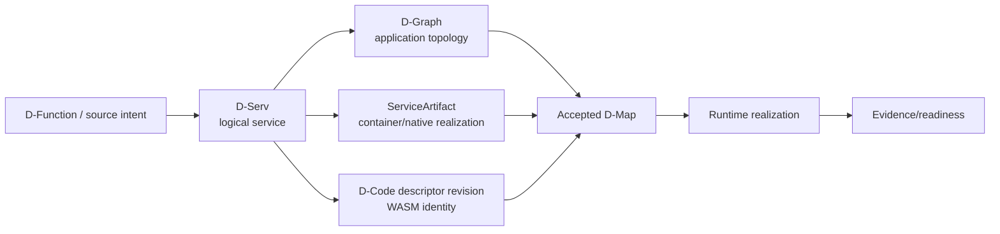
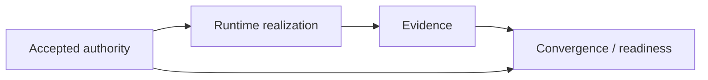

# Software component model

DATUM v1 keeps a logical service, its deployable realization and its observed runtime state as different objects.

## One logical service, several representations



These objects answer different questions:

| Object | Question |
|---|---|
| D-Function / D-Script | what functionality did the author describe? |
| D-Serv | what logical service exists? |
| D-Graph | how do logical services communicate? |
| ServiceArtifact | how may an existing long-running service be realized? |
| D-Code descriptor | what exact WASM content/ABI describes an application-code revision? |
| D-Map | where is the service currently accepted to run? |
| runtime realization | what is actually running/executing on a node? |
| DMonitor/evidence | what was observed? |

## D-Serv is host-independent

A canonical D-Serv contains logical identity, required D-Node ABI and declared resource requirement. It does not contain:

- node ID;
- Docker image;
- process PID;
- IP address;
- broker URI;
- runtime health.

This keeps application topology portable across the continuum.

## Operational realization: ServiceArtifact

For existing containers and native executables, `ServiceArtifact` carries the operational realization model.

A container artifact can describe:

- image and immutable resolved OCI identity;
- container name;
- ports/network aliases;
- volumes and configuration mounts;
- dependencies, bindings and secrets;
- probes;
- node eligibility;
- governed lifecycle allowlist keys.

A native-process artifact describes:

- process name;
- relative managed entrypoint;
- arguments/working directory;
- exact source executable SHA-256;
- absolute source acquisition path.

Native package-manager acquisition is not implemented yet; the current native path begins from an already-present executable whose bytes are frozen by content identity.

## Application-code realization: D-Code

`datum.dserv-artifact/1` describes canonical content-addressed WASM. It includes:

- logical application/D-Serv identity;
- module content digest;
- ABI and required exports;
- ports/payload schemas;
- resource/execution limits;
- safety/state/instantiation declarations.

Multiple immutable descriptor revisions can coexist for one logical D-Serv:

```text
D-Serv probe
├─ descriptor D1 → module H1
├─ descriptor D2 → module H2
└─ descriptor D3 → module H3
```

The active revision is not “the newest file”. Current accepted D-Deploy authority binds the exact descriptor digest used by fresh D-Code authorization.

## Placement does not contain runtime state

D-Map says where a logical entity is accepted to run. Runtime realization says what a node actually did.

```text
D-Map placement: mqtt → fog-01
```

is not equivalent to:

```text
Docker container datum-mosquitto is running and healthy on fog-01
```

The second statement needs runtime evidence.

## Exact-content identity

DATUM uses content identity to prevent mutable names from silently changing execution semantics.

For containers, server-owned OCI resolution can bind platform-specific manifest/config digests.

For native executables, the acquisition SHA-256 binds exact bytes.

For D-Code, the module SHA-256 binds exact WASM bytes and the descriptor digest binds the complete canonical execution descriptor.

## Realization authority

Operational container/native mutation requires a finite reconciliation authorization bound to current node/resource/graph and exact artifact snapshot.

D-Code invocation requires fresh authorization plus exact descriptor fetch and local module digest verification.

Neither path treats local byte presence as permission to execute.

## Migration

When a service moves between nodes, current placement authority changes first. The target realizes current desired state; the former source may receive a separate governed cleanup obligation derived from accepted placement history/current absence.

Cleanup is intentionally distinct from rollback.

## Evidence closes the loop



A dashboard can render this lifecycle, but should not invent a single persisted `service_status` that competes with these owners.

## What is not implemented yet

- automatic D-Code distribution;
- native package-manager acquisition;
- a new consolidated management dashboard;
- a packaged end-user deployment workflow that hides all current governance steps.

## Sources

See [Sources and provenance](../reference/sources.md), [Entity encyclopedia](../concepts/entities.md), [Model an existing service](../tutorials/model-existing-service.md) and [DServer → D-Node execution flow](dserver-dnode-dcode-flow.md).
