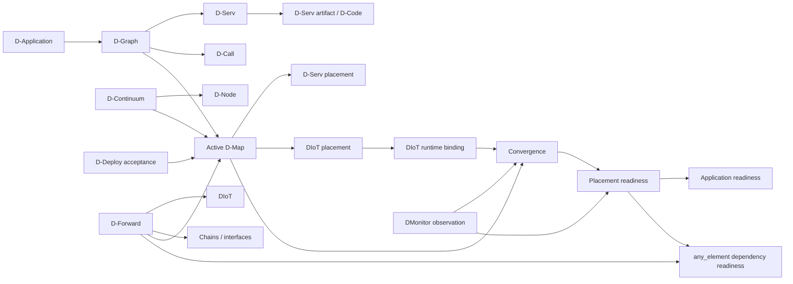

# Entity encyclopedia

This page describes the main DATUM entities as **claims with ownership boundaries**. For each entity, ask: what does it mean, who owns its truth, how is it identified, who consumes it, and what must never be inferred from it?

!!! note "Model versus implementation"
    Some names come from the DATUM architectural model; others are concrete v0.1 implementation records. The tables below say which role each object serves at the documented Phase 114D2 baseline.

## Scope entities

### Project

A project is an operational/control-plane scope used by several server-owned domains. `project_id` scopes D-Continuum wire identity, D-Map, DForward, DMonitor ingestion, runtime bindings and other operational state.

A project is **not** the same thing as a D-Application. The canonical D-Graph deliberately has no `project_id`; its identity is application-plane.

### D-Application

A D-Application is the placement-independent application concept. In canonical artifacts, `application_id` binds the D-Graph and related placement/execution records to the same application semantics.

One project may govern multiple applications. An application can therefore be discussed independently of the project that currently deploys it.

## Application-plane entities

### D-Graph (`datum.dgraph/1`)

**Purpose:** canonical application topology `G = (V, E)` where vertices are D-Servs and edges are D-Calls.

**Identity:** `application_id`, `dgraph_id`, `revision`, plus canonical digest when referenced.

**Contains:** `services[]` and `calls[]`.

**Does not contain:** node placement, runtime address, container identity, health, broker URI or project scope.

A D-Graph is the answer to *what application services exist and which semantic calls connect them?* It is not the answer to *where do they run?*

### D-Serv

**Purpose:** one logical application service vertex in D-Graph.

**Identity:** `service_id`, interpreted within its D-Graph/application context.

**Declares:** a D-Node ABI requirement and static resource requirement (`cpu_cores`, `memory_bytes`).

**Does not declare:** a target node, container runtime, live usage or host kind.

The canonical D-Serv stays host-independent. Its executable is represented separately by a D-Serv artifact/D-Code identity.

### D-Call

**Purpose:** semantic invocation edge from one D-Serv to another.

**Identity:** `call_id` within a D-Graph.

**Declares:** `source_service_id` and `target_service_id`.

**Does not declare:** TCP/HTTP/MQTT address, port, broker topic or destination node.

Canonical D-Graph accepts cycles and self-calls because a communication graph is not an installation dependency DAG.

### D-Code

**Purpose:** executable application code of a D-Serv. The v0.1 implementation targets WebAssembly under the `datum-dnode/0` ABI.

**Identity:** content-addressed module identity inside a canonical D-Serv artifact.

**Important boundary:** D-Code is application code. It is not the legacy Controlled/Management WASM mechanism used by older agent-management paths.

### D-Serv artifact (`datum.dserv-artifact/1`)

**Purpose:** canonical, host-independent descriptor of a D-Serv's D-Code.

**Identity:** `artifact_id`, `version`, `application_id`, `dserv_id`, module content digest and descriptor digest.

**Carries:** module URI/content identity, ABI exports/import policy, typed ports, execution limits, safety declarations, state/instantiation model and optional metadata.

**Storage boundary:** DServer stores canonical metadata/digest identity; the module bytes live in the node-local content-addressed module store.

**v0.1 immutability:** the DCode registry allows one immutable artifact per `(application_id, dserv_id)`; a different descriptor at the same key conflicts rather than silently replacing it.

### D-Serv artifact port

A D-Serv artifact port is an input or output declaration with `port`, `payload_schema` and `external`. D-Call route derivation uses payload-schema compatibility to resolve a unique destination input port from a source output; D-Graph itself intentionally contains no port field.

## Continuum and execution entities

### D-Continuum (`datum.dcontinuum/1`)

**Purpose:** canonical structural inventory of continuum resources known to DATUM.

**Identity:** `project_id`, `dcontinuum_id`, `revision`, canonical digest.

**Contains:** D-Nodes and optional D-Links.

**Capacity semantics:** node CPU/memory values are declared structural capacity, not current free capacity or live utilization.

### D-Node

**Purpose:** structural/runtime abstraction capable of hosting governed application D-Code when it advertises the required D-Node ABI.

**Identity:** `node_id`.

**Structural declaration:** platform (`os`, `architecture`), static capacity and supported D-Node ABI versions.

**Not the same as:** a physical machine identity, a Sentinel registration, a Sentinel process instance or a telemetry record. Those objects can correlate operationally but have different authority.

At the baseline, DServer keeps a global structural D-Node registry keyed by `node_id` and derives authoritative project-scoped D-Continuum documents from that registry.

### D-Link

**Purpose:** structural relationship between two declared continuum nodes.

**Identity:** `link_id` with `from_node_id` and `to_node_id`.

The current DServer-derived authoritative D-Continuum path produces an empty link set; therefore links in the canonical type should not be confused with a fully implemented network-topology authority in this baseline.

### D-Engine

Architectural grouping of D-Nodes that support a D-Application. It is useful as a conceptual responsibility boundary, but this documentation does not claim a single first-class `DEngine` runtime object exists in the Phase 114D2 implementation.

## Placement and deployment entities

### D-Map (`datum.dmap/1` and `datum.dmap/2`)

**Purpose:** canonical placement authority once accepted.

A D-Map is not a planner and not a proposal. It is the authoritative result that says where required logical entities are placed.

**DMap/1** maps D-Servs to D-Nodes and binds exact D-Graph/D-Continuum references.

**DMap/2** retains D-Serv placement and adds exact DForward reference, DIoT placements, D-Call realizations and external port bindings.

### D-Serv placement

A D-Serv placement binds one `service_id` to one `node_id`. In the v0.1 DMap model, one service has one canonical placement. It is desired/accepted authority, not proof that a corresponding runtime process currently exists.

### DIoT placement

A DMap/2 DIoT placement has its own `placement_id`, the logical `diot_id`, `node_id` and artifact binding. The placement ID is essential because one logical middleware identity and one concrete realization placement are distinct concepts.

### D-Deploy proposal

**Purpose:** immutable candidate placement plus the exact source contracts/snapshots it was validated against.

**Lifecycle:** `pending` → explicit acceptance. A proposal is **never** a D-Map and cannot become authority merely by existing.

**Source:** operator, deterministic planner or AI provenance can be recorded, but source type never bypasses validation/acceptance.

### D-Deploy acceptance

**Purpose:** audit/governance record for the explicit transition that materializes and activates canonical placement authority.

DServer owns authoritative D-Map identity/revision at acceptance. The accepted D-Map becomes the placement source of truth; eligibility hints in service artifacts do not become a parallel placement authority afterward.

### Active placement authority

An implementation-level view used by DServer consumers to access the currently accepted placement regardless of DMap/1 versus DMap/2. D2 readiness, runtime binding and D-Call realization consumers use this shared authority rather than accepting replacement topology from callers.

## D-Forward and middleware entities

### D-Forward (`datum.dforward/1`)

**Purpose:** logical IoT-middleware composition and data paths.

**Identity:** `project_id`, `dforward_id`, `revision`, canonical digest.

**Contains:** DIoTs, external endpoints, chains/hops and support jobs.

**Does not contain:** live broker connection state or evidence-derived health.

### D-IoT / DIoT

**Purpose:** one logical middleware component in D-Forward, such as a broker/bridge-like role.

**Identity:** `diot_id`.

**Declares:** `diot_kind`, required artifact, provided interfaces and required interfaces.

A DIoT is not a D-Serv. It belongs to the middleware/data-path plane rather than the D-Graph application-service plane.

### DForward interface

A named logical interface offered or required by a DIoT. Interface compatibility is checked across DForward hops.

### DForward requirement scope

`same_element` means the requirement is local to the same element semantics and does not enter the Phase 114D2 cross-node dynamic gate.

`any_element` allows the provider to be another element. Phase 114D2 resolves the exact provider through current accepted topology and evaluates that provider placement's readiness.

### DForward chain and hop

A chain groups ordered/related middleware hops. Each hop names `from`, `to` and `interface`. Endpoints can be DIoTs or declared external endpoints, subject to interface/direction compatibility.

### External endpoint

Represents a logical DForward ingress/egress boundary with `endpoint_id`, `direction` (`input` or `output`) and interface. It is not a network address by itself.

### Support job

A DForward support job carries a job identity, artifact requirement and desired state for middleware-support work. It remains distinct from D-Graph D-Serv execution semantics.

### DIoT runtime binding

**Purpose:** server-owned operational record mapping one governed DIoT placement to a concrete transport/broker URI.

**Key:** `(project_id, application_id, placement_id)`.

**Derived identity:** DIoT/node, DMap, DForward and artifact-execution authority are derived from current accepted authority; the caller supplies the placement context and broker URI, not replacement authority.

**Transport:** `mqtt` in v0.1; broker URI accepts `mqtt`/`mqtts` structural forms. Credentials are not embedded in the URI.

**Important:** the binding performs no MQTT I/O and proves no liveness. It is operational configuration/identity. DMonitor evidence is what can later support liveness/readiness.

## D-Call runtime entities

### D-Call route

**Purpose:** server-derived operational route for a canonical D-Call.

The source identity is authorized; destination service/node/port are derived from active D-Map, D-Graph and D-Serv artifact compatibility. A caller cannot choose a different destination to bypass placement authority.

The route is classified as `local` or `remote`. Under DMap/2 it can additionally carry the exact DIoT pub/sub realization authority.

### D-Call realization

DMap/2 can state that a D-Call is realized `via_diot_pubsub`, binding the call to a DIoT placement, logical interface and concrete channel. Wildcard channels are rejected in the canonical v2 contract.

### D-Call delivery grant

**Purpose:** short-lived, single-use authorization to perform a delivery under a specific authority chain.

At the baseline the fixed grant lifetime is 30 seconds. Only a hash of the grant token is persisted. Redemption is one-time and durable. This is an authorization artifact, not the D-Call itself.

## D-Monitor and evidence entities

### Canonical DMonitor observation (`datum.dmonitor-observation/1`)

**Purpose:** one typed observation of runtime reality by one monitor instance at one point in time.

**Identity/provenance:** `observation_id`, `node_id`, `monitor_instance_id`, monotonic `sequence`, `observed_at_utc`, collector and typed subject.

**Condition:** `health` plus JSON `facts`.

**Authority boundary:** an observation describes what was seen. It never contains or creates desired placement state.

### Monitor instance and sequence epoch

`monitor_instance_id` identifies the monotonic sequence epoch. Reusing the same instance ID requires continuing the sequence; a lower sequence is stale/out-of-order rather than a restart. A genuinely new monitor instance ID starts a new epoch.

### DMonitor subject

The observation subject is typed rather than being inferred from names. Supported subject kinds at the baseline include:

| Subject kind | Meaning |
|---|---|
| `dnode` | Structural/runtime node itself |
| `runtime_process` | Collector-local process/container identity; not canonical authority |
| `dserv_realization` | Observed realization of a D-Serv placement |
| `dcode_execution` | Observed D-Code invocation behavior |
| `dcall_delivery` | Observed D-Call delivery outcome |
| `diot_realization` | Observed governed DIoT placement/realization |
| `network_reachability` | Reachability fact to an operational target |
| `unbound` | Honest evidence for which exact canonical correlation was unavailable |

Using `unbound` is preferable to fabricating a canonical identity from a container name, hostname or port.

### DMonitor health

Observation-time health values are `unknown`, `healthy`, `degraded` and `unhealthy`. Health answers *what did the collector believe at observation time?* It does not answer *is that evidence fresh now?*

### Freshness

A server-side policy decision over observation/receipt time. It is intentionally separate from the health enum. Healthy-but-stale evidence does not establish readiness.

### Convergence

A derived interpretation of whether admitted evidence matches current desired authority/realization. Exact DMap/DForward/runtime-binding identity matters. Convergence can remain `Converged` while a fresh exact-current observation reports `Unhealthy`.

### Placement readiness

A D1 governance result. A required placement is Ready only when the required convergence/evidence conditions hold and admitted current health is Healthy under the server-owned policy.

### Application readiness

Aggregate D1 result over required D-Serv and DIoT placements. It can be NotReady because an unrelated required placement is missing or unhealthy even when a particular DIoT provider is Ready.

### DForward dependency readiness

Phase 114D2 result for `scope = any_element`. It resolves the provider from **current accepted DForward/DMap/2 authority** and consumes the exact provider placement's D1 readiness. States are `satisfied` or `blocked`.

This is deliberately not whole-application readiness, raw health, convergence alone or static DForward projection.

## Agent and operational entities

### SmartSentinel / D-Agent responsibility

SmartSentinel is the node-side project agent used for observation, reporting and governed interactions. Its responsibilities can include preventive governance, detective observation and explicitly authorized corrective execution paths. A Sentinel registration or heartbeat is not a canonical D-Node structural declaration.

### Sentinel registration and heartbeat

Operational agent-lifecycle records. They represent agent presence/lease-like state, not structural node capacity/capability authority and not canonical placement.

### ServiceArtifact

An older/operational service artifact domain used by deployment/executor paths. It can contain container/runtime information and eligibility constraints. It is **not** `datum.dserv-artifact/1` and must never be treated as D-Code identity.

### OperationalDGraph

An operational/derived desired-state projection used by older/executor-oriented subsystems. It is not the canonical application-plane `datum.dgraph/1`. Similar names do not imply interchangeable authority.

## Entity relationship snapshot

## Sources

[Canonical DGraph](https://github.com/dnredson/datum/blob/3e0baa8f415b822f69eef86c0cbfe2a3681e3a65/DATUM/src/agent/canonical_dgraph.rs), [DContinuum](https://github.com/dnredson/datum/blob/3e0baa8f415b822f69eef86c0cbfe2a3681e3a65/DATUM/src/agent/canonical_dcontinuum.rs), [DMap/1](https://github.com/dnredson/datum/blob/3e0baa8f415b822f69eef86c0cbfe2a3681e3a65/DATUM/src/agent/canonical_dmap.rs), [DForward](https://github.com/dnredson/datum/blob/3e0baa8f415b822f69eef86c0cbfe2a3681e3a65/DATUM/src/agent/canonical_dforward.rs), [DMap/2](https://github.com/dnredson/datum/blob/3e0baa8f415b822f69eef86c0cbfe2a3681e3a65/DATUM/src/agent/canonical_dmap_v2.rs), [DMonitor observation](https://github.com/dnredson/datum/blob/3e0baa8f415b822f69eef86c0cbfe2a3681e3a65/DATUM/src/agent/canonical_dmonitor.rs), [D-Deploy](https://github.com/dnredson/datum/blob/3e0baa8f415b822f69eef86c0cbfe2a3681e3a65/dserver/src/core/ddeploy.rs), [D-Node registry](https://github.com/dnredson/datum/blob/3e0baa8f415b822f69eef86c0cbfe2a3681e3a65/dserver/src/core/dnode_registry.rs), [D-Serv artifact](https://github.com/dnredson/datum/blob/3e0baa8f415b822f69eef86c0cbfe2a3681e3a65/dserver/src/core/dserv_artifact.rs), [D-Call](https://github.com/dnredson/datum/blob/3e0baa8f415b822f69eef86c0cbfe2a3681e3a65/dserver/src/core/dcall.rs), [DIoT runtime binding](https://github.com/dnredson/datum/blob/3e0baa8f415b822f69eef86c0cbfe2a3681e3a65/dserver/src/core/diot_runtime_binding.rs).
