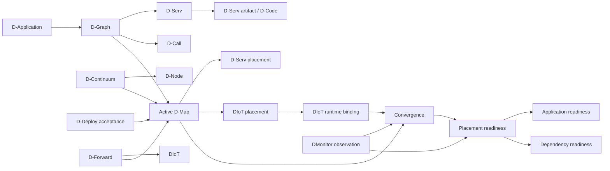

# Entity encyclopedia

This page describes the main DATUM v1 entities as **claims with ownership boundaries**. For each entity, ask: what does it mean, who owns its truth, how is it identified, who consumes it, and what must never be inferred from it?

!!! note "Architecture versus implementation"
    Some names come from the DATUM architectural model and others are concrete implementation records. The descriptions below state the role each object serves in DATUM v1. If an architectural concept is not implemented as a first-class runtime object, the text says so directly.

## Scope entities

### Project

A project is an operational/control-plane scope used by several server-owned domains. `project_id` scopes D-Continuum wire identity, D-Map, DForward, DMonitor ingestion, runtime bindings and other operational state.

A project is **not** the same thing as a D-Application. The canonical D-Graph deliberately has no `project_id`; its identity is application-plane.

### D-Application

A D-Application is the placement-independent application concept. `application_id` binds the D-Graph and related placement/execution records to the same application semantics. One project may govern multiple applications.

## Application-plane entities

### D-Graph (`datum.dgraph/1`)

**Purpose:** canonical application topology `G = (V, E)` where vertices are D-Servs and edges are D-Calls.

**Identity:** `application_id`, `dgraph_id`, `revision`, plus canonical digest when referenced.

**Contains:** `services[]` and `calls[]`.

**Does not contain:** node placement, runtime address, container identity, health, broker URI or project scope.

A D-Graph answers *what application services exist and which semantic calls connect them?* It does not answer *where do they run?*

### D-Serv

One logical application service vertex in a D-Graph. `service_id` identifies it within its application context. It declares a D-Node ABI requirement and static CPU/memory requirements, but not a target node, container identity or live utilization.

### D-Call

A semantic invocation edge from one D-Serv to another. It declares `call_id`, `source_service_id` and `target_service_id`, but no TCP/HTTP/MQTT address, broker topic, port or destination node. Cycles and self-calls are valid because the communication graph is not an installation dependency DAG.

### D-Code

Executable application code of a D-Serv. DATUM v1 uses WebAssembly with the `datum-dnode/0` ABI. D-Code is application code; it is separate from management/controlled-WASM mechanisms used by older operational paths.

### D-Serv artifact (`datum.dserv-artifact/1`)

Canonical, host-independent descriptor of a D-Serv's D-Code. It carries module content identity, ABI, ports, execution limits, safety declarations, state/instantiation model and metadata.

The registry is versioned and immutable by exact descriptor identity. Multiple descriptor revisions can coexist for the same logical `(application_id, dserv_id)`; governed execution selects the exact descriptor digest bound by current authority. DServer stores descriptor metadata, not the WASM bytes themselves.

### D-Serv artifact port

An input or output declaration with `port`, `payload_schema` and `external`. D-Call route derivation can use payload-schema compatibility while the D-Graph itself remains port-free.

## Continuum and execution entities

### D-Continuum (`datum.dcontinuum/1`)

Canonical structural inventory of continuum resources known to DATUM. It carries `project_id`, `dcontinuum_id`, `revision`, nodes, links and canonical digest when referenced.

Node CPU/memory values are declared structural capacity, not current free capacity or live utilization.

### D-Node

Structural/runtime abstraction identified by `node_id`. Its declaration contains platform, static capacity and supported D-Node ABI versions.

A D-Node is not automatically the same thing as a physical machine identity, Sentinel registration, Sentinel process instance or telemetry record. Those may correlate operationally but have different authority.

DServer keeps structural D-Node declarations and derives the authoritative project-scoped D-Continuum from them.

### D-Link

Structural relationship between two declared D-Nodes. The canonical type exists, but a complete network-topology authority is not implemented yet in the server-derived continuum path.

### D-Engine

Architectural grouping of D-Nodes that support a D-Application. It is useful conceptually. A single first-class `DEngine` runtime object is not currently exposed as an independent authority surface.

## Placement and deployment entities

### D-Map (`datum.dmap/1` and `datum.dmap/2`)

Canonical placement authority once explicitly accepted.

DMap/1 maps D-Servs to D-Nodes and binds exact D-Graph/D-Continuum references. DMap/2 additionally binds DForward, DIoT placements, D-Call realizations and external port bindings.

A D-Map is neither a planner nor a proposal. It answers *where is this logical entity currently accepted to run?*

### D-Serv placement

Binds one `service_id` to one `node_id`. It is desired/accepted authority, not evidence that a runtime process currently exists.

### DIoT placement

Binds a logical `diot_id` to a concrete `placement_id`, `node_id` and artifact binding. Logical middleware identity and concrete realization identity remain distinct.

### D-Deploy proposal

Immutable candidate placement plus the exact source contracts/snapshots used to validate it. A proposal is never active authority merely because it exists.

### D-Deploy acceptance

Explicit governance transition that materializes and activates canonical placement authority. DServer owns authoritative D-Map identity/revision at acceptance.

### Active placement authority

Implementation view used by server consumers to read the currently accepted placement independently of whether the active contract is DMap/1 or DMap/2.

## D-Forward and middleware entities

### D-Forward (`datum.dforward/1`)

Logical IoT-middleware composition. It carries DIoTs, external endpoints, chains/hops and support jobs. It does not contain live broker health.

### D-IoT / DIoT

Logical middleware component identified by `diot_id`. It declares a middleware kind, required artifact, provided interfaces and required interfaces. A DIoT is not a D-Serv; it belongs to the middleware/data-path plane.

### DForward interface

Named logical interface provided or required by a DIoT. Interface compatibility is checked across DForward hops.

### DForward requirement scope

`same_element` keeps the requirement local to the same element semantics. `any_element` permits a provider elsewhere in the accepted topology; DATUM resolves the exact provider from current authority and evaluates that provider placement's readiness.

### DForward chain and hop

A chain groups middleware hops. Each hop names `from`, `to` and `interface`; endpoints can be DIoTs or declared external endpoints subject to interface/direction compatibility.

### External endpoint

Logical DForward ingress/egress boundary identified by `endpoint_id`, direction and interface. It is not a network address by itself.

### Support job

Middleware-support work with job identity, artifact requirement and desired state. It remains distinct from D-Graph D-Serv execution semantics.

### DIoT runtime binding

Server-owned operational record mapping one governed DIoT placement to a concrete transport/broker URI.

The key is `(project_id, application_id, placement_id)`. DMap, DForward, node and artifact identities are derived from current accepted authority. A runtime binding is operational identity/configuration; it does not prove broker liveness.

## D-Call runtime entities

### D-Call route

Server-derived operational route for a canonical D-Call. Destination service/node/port are derived from active D-Map, D-Graph and artifact compatibility rather than trusted from a caller.

### D-Call realization

DMap/2 can bind a D-Call to a DIoT pub/sub realization, interface and channel.

### D-Call delivery grant

Short-lived, single-use delivery authorization under one exact authority chain. It is an authorization artifact, not the D-Call itself.

## DMonitor and evidence entities

### Canonical DMonitor observation (`datum.dmonitor-observation/1`)

One typed observation of runtime reality by one monitor instance at one time. It carries `observation_id`, `node_id`, `monitor_instance_id`, sequence, observation time, collector, typed subject, health and facts.

An observation never creates desired placement authority.

### Monitor instance and sequence epoch

`monitor_instance_id` identifies a monotonic sequence epoch. Reusing an instance ID requires continuing the sequence; a genuinely new instance starts a new epoch.

### DMonitor subject

Supported subject families include D-Node, runtime process, D-Serv realization, D-Code execution, D-Call delivery, DIoT realization, network reachability and `unbound` evidence.

Use `unbound` when exact canonical correlation is unavailable instead of fabricating identity from container names, hostnames or ports.

### DMonitor health

Observation-time condition such as `unknown`, `healthy`, `degraded` or `unhealthy`. Health does not imply freshness.

### Freshness

Server-side interpretation of whether an observation is still timely enough to support a current decision.

### Convergence

Derived interpretation of whether admitted evidence matches current desired authority/realization. A realization may be converged while a fresh observation reports it unhealthy.

### Placement readiness

D1 governance result. A required placement is Ready only when required convergence/evidence conditions hold and admitted current health satisfies server policy.

### Application readiness

Aggregate D1 result over required placements.

### DForward dependency readiness

D2 result for provider-specific `scope = any_element` requirements. It resolves the provider from current accepted DForward/DMap/2 authority and consumes the exact provider placement's D1 readiness. It is not whole-application readiness, raw health or convergence alone.

## Agent and operational entities

### SmartSentinel / D-Agent responsibility

Node-side agent responsible for observation, reporting and governed interactions. Sentinel lifecycle state does not replace structural D-Node authority.

### Sentinel registration and heartbeat

Operational agent-lifecycle records. They represent agent presence/lease-like state, not structural capacity, canonical placement or DMonitor readiness.

### ServiceArtifact

Project-scoped operational deployment descriptor used for container/native-process realization and current D-Deploy eligibility. It is **not** `datum.dserv-artifact/1` and must not be treated as D-Code identity.

### OperationalDGraph

Operational/derived desired-state projection consumed by reconciliation/executor paths. It is not the canonical application-plane `datum.dgraph/1`.

## Entity relationship snapshot

```mermaid
flowchart LR
    APP["D-Application"] --> DG["D-Graph"]
    DG --> DS["D-Serv"]
    DG --> DC["D-Call"]
    DS --> DA["D-Serv artifact / D-Code"]
    CONT["D-Continuum"] --> DN["D-Node"]
    DEP["D-Deploy acceptance"] --> DM["Active D-Map"]
    DG --> DM
    CONT --> DM
    DM --> SP["D-Serv placement"]
    DF["D-Forward"] --> DI["DIoT"]
    DM --> DP["DIoT placement"]
    DF --> DM
    DP --> RB["DIoT runtime binding"]
    OBS["DMonitor observation"] --> CONV["Convergence"]
    DM --> CONV
    RB --> CONV
    CONV --> READY["Placement readiness"]
    OBS --> READY
    READY --> APPREADY["Application readiness"]
    READY --> DEPREADY["Dependency readiness"]
```

## Sources

See [Canonical contracts](../reference/contracts.md), [Core control-plane API](../reference/core-api.md) and [Sources and provenance](../reference/sources.md) for the current source-grounded definitions.
