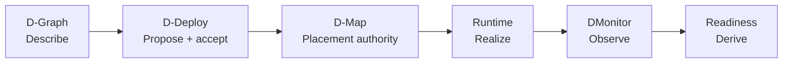
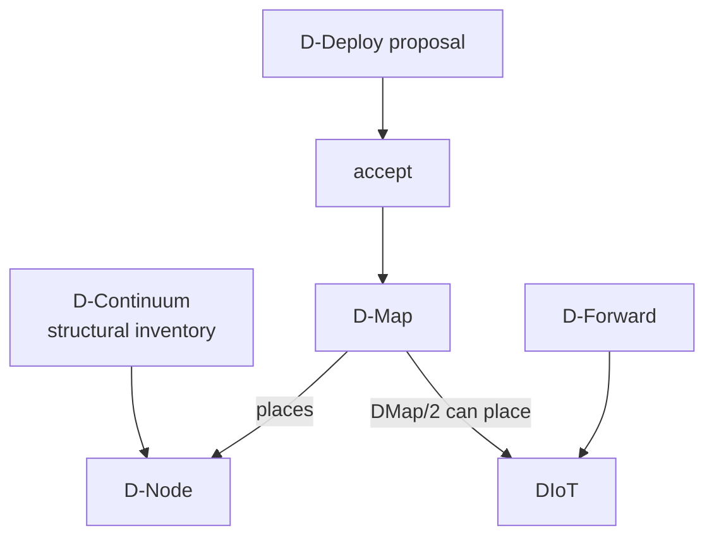
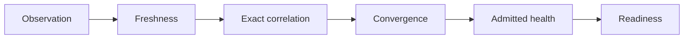

# Concepts and vocabulary

DATUM names responsibilities very deliberately. Two objects can refer to the same application or machine and still represent fundamentally different claims. This page is the quick vocabulary; the [visual guide](visual-guide.md) gives the picture-first version, the [entity encyclopedia](entities.md) gives the detailed version, and [identity and references](identities-and-references.md) explains how objects are correlated safely.

## Start with this mental model

If you remember only one thing at first, remember that these boxes are **different claims**. Description is not placement; placement is not execution; execution is not evidence; evidence is not automatically readiness.

[Open the full visual guide](visual-guide.md) for diagrams of entities, artifacts, DForward/DIoT, DMonitor and the complete source-to-deploy journey.

## Application and execution

| Concept | Meaning | Example | Not the same as |
|---|---|---|---|
| D-Application | Placement-independent application logic | A sensor-processing application | A running deployment |
| D-Script / D-Function | Source representation and function units in the reference model | Source functionality before distribution | D-Code bytes |
| D-Compile | Reference-model compilation into D-Graph and D-Code | Source-to-service mapping | D-Deploy |
| D-Graph | Application graph with D-Serv vertices and D-Call edges | Decoder calls alerting | Operational graph or placement |
| D-Serv | Logical application service that executes D-Code | Decoder service | Container/service artifact |
| D-Code | Executable of a D-Serv; WebAssembly is the v0.1 prototype target | Module implementing `datum-dnode/0` | Management WASM |
| D-Call | Semantic invocation between D-Servs | Decoder invokes alerting | Network socket or broker topic |
| D-Node | Runtime capable of executing D-Code | Governed application-code host | Physical machine or Sentinel instance |
| D-Engine | Set of D-Nodes supporting an application | Application runtime hosts | D-Continuum |

Defining a reference-model concept does not prove that its complete implementation exists. The glossary is a semantic map, not a product feature checklist.

## Placement, continuum and middleware

| Concept | Meaning | What it establishes | What it does not establish |
|---|---|---|---|
| D-Continuum | Structural continuum inventory and constraints | Declared nodes/capabilities/capacity | Current utilization or liveness |
| D-Element | Concrete continuum participant | A logical element identity | Necessarily a D-Node runtime |
| D-Map | Accepted mapping onto the continuum | Placement authority when accepted | Runtime health |
| D-Deploy | Proposal, validation and explicit acceptance responsibility | How a D-Map becomes active | Observation or health |
| D-Controller | Logically centralized control-plane role; DServer implements it | Governance and derived views | Node-local execution |
| D-Forward | Logical IoT-middleware composition and data paths | DIoTs/interfaces/chains | Broker liveness or resolved URI by itself |
| D-IoT | Middleware element in D-Forward | Logical middleware identity | Application D-Serv |
| DIoT placement | A DMap/2 placement of one DIoT | Which node realizes the DIoT | A live broker connection |
| DIoT runtime binding | Server-owned operational binding for a placed DIoT | Concrete transport/broker URI under exact authority | Liveness evidence |

DMap/2 extends placement authority with DForward/DIoT realization semantics. Logical identity, placement identity and runtime-binding identity intentionally remain separate.

## Observation and governance

| Concept | Question answered |
|---|---|
| D-Monitor observation | What did one collector observe about one typed subject at one time? |
| Freshness | Is that observation recent enough under current policy? |
| Correlation | Does the evidence refer to the exact current authority/realization? |
| Convergence | Does admitted evidence match the desired/current realization? |
| Health | What condition did admitted current observations report? |
| Placement readiness | Is this exact required placement positively usable under governance now? |
| Application readiness | Are all required application realizations usable now? |
| DForward dependency readiness | Is the exact current provider placement for this `any_element` requirement usable now? |

**D-Monitor is detective, not placement authority.** Evidence can cause a derived readiness result to change; it cannot itself move a D-Serv or DIoT to another node.

## Project extensions and implementation terms

**D-Agent** is a project extension rather than a term from the original DATUM reference model. SmartSentinel implements node-local observation/reporting and governed interaction paths. It should not be equated with D-Node: one is an agent responsibility, the other is the application-code runtime abstraction.

**D-Platform** groups D-Engine, D-Forward and D-Monitor responsibilities. This grouping should not be assumed to be one first-class runtime object.

**DServer** is the current D-Controller implementation. It contains canonical control-plane subsystems as well as older/operational/auxiliary surfaces; therefore the existence of an HTTP endpoint does not make that endpoint a canonical DATUM contract.

## Naming traps worth memorizing

- Canonical D-Graph is placement-free. `OperationalDGraph`, observed graphs and legacy graph snapshots serve different purposes.
- `project_id` and `application_id` are different scopes. Canonical D-Graph carries `application_id` but no `project_id`.
- A D-Call cycle is communication topology, not an installation dependency cycle; cycles and self-calls are valid in canonical D-Graph.
- A D-Serv is logical application structure; a `datum.dserv-artifact/1` describes its D-Code artifact; a legacy `ServiceArtifact` is a different domain.
- Management WASM is not application D-Code.
- A D-Node structural declaration is not Sentinel liveness and not live resource telemetry.
- A broker URI/runtime binding is operational identity, not evidence that the broker is healthy.
- `Healthy` is not synonymous with `Ready`: freshness, exact authority correlation and convergence also matter.
- `pending_fresh_evidence` in static DForward projection is not a live readiness result.
- An `any_element` dependency consumes provider-placement readiness, not whole-application readiness.

## Where to continue

Read the [visual guide](visual-guide.md) for picture-first explanations, the [entity encyclopedia](entities.md) for entity-by-entity detail, [identity and references](identities-and-references.md) for correlation rules, [lifecycle and authority flow](../architecture/lifecycle.md) for the end-to-end model, and [canonical contracts](../reference/contracts.md) for field-level reference.

## Sources

[Canonical vocabulary](https://github.com/dnredson/datum/blob/3e0baa8f415b822f69eef86c0cbfe2a3681e3a65/documentation/adr/ADR-0001-canonical-datum-vocabulary.md), [glossary](https://github.com/dnredson/datum/blob/3e0baa8f415b822f69eef86c0cbfe2a3681e3a65/documentation/reference/glossary.md), [canonical DGraph](https://github.com/dnredson/datum/blob/3e0baa8f415b822f69eef86c0cbfe2a3681e3a65/DATUM/src/agent/canonical_dgraph.rs), [DForward and DMap/2](https://github.com/dnredson/datum/blob/3e0baa8f415b822f69eef86c0cbfe2a3681e3a65/documentation/adr/ADR-0023-canonical-dforward-diot-dmap-v2.md).
