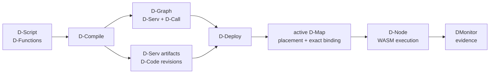

# Concepts and vocabulary

DATUM names responsibilities deliberately. Two objects can refer to the same application or machine and still represent fundamentally different claims. Start with the [visual guide](visual-guide.md); then read [WebAssembly and D-Code](webassembly-and-dcode.md) when you want to understand the executable layer.

## Current source-to-execution mental model

```mermaid
flowchart LR
    DS["D-Script\nD-Functions"] --> DC["D-Compile"]
    DC --> DG["D-Graph\nD-Serv + D-Call"]
    DC --> DA["D-Serv artifacts\nD-Code revisions"]
    DG --> DD["D-Deploy"]
    DA --> DD
    DD --> DM["active D-Map\nplacement + exact binding"]
    DM --> DN["D-Node\nWASM execution"]
    DN --> MON["DMonitor\nevidence"]
```

If you remember only one thing, remember that each arrow crosses a responsibility boundary. **Compile is not deploy. Registered is not active. Installed is not authorized. Running is not Ready.**

## Application and executable vocabulary

| Concept | Meaning | Not the same as |
|---|---|---|
| D-Application | placement-independent application identity/semantics | a running deployment |
| D-Script | canonical compile-time source representation | source-language parser, D-Graph or binary |
| D-Function | named functionality unit inside D-Script | D-Serv runtime process |
| D-Compile | pure deterministic lowering from canonical source/mapping into candidates | registration or D-Deploy |
| D-Graph | logical D-Serv/D-Call topology | placement |
| D-Serv | logical application service | container or artifact revision |
| D-Code | governed executable of a D-Serv; Wasm in v0.1 | arbitrary `.wasm` file |
| D-Serv artifact | exact host-independent D-Code descriptor revision | the `.wasm` bytes themselves |
| module digest | SHA-256 identity of exact executable bytes | descriptor digest |
| descriptor digest | identity of whole artifact policy/metadata contract | module digest |
| D-Call | semantic invocation between D-Servs | socket/topic selected by caller |

## Placement and continuum

| Concept | Meaning |
|---|---|
| D-Continuum | structural inventory of D-Nodes/capabilities/capacity |
| D-Node | governed runtime abstraction able to host supported D-Code ABI |
| D-Deploy proposal | immutable candidate; never authority merely by existing |
| D-Deploy acceptance | explicit transition that activates placement authority |
| D-Map | accepted placement authority; newer flows can bind an exact D-Code descriptor revision |
| D-Engine | conceptual set of D-Nodes supporting an application |

## Observation and governance

| Concept | Question answered |
|---|---|
| DMonitor observation | what did a collector observe? |
| freshness | is that evidence recent enough? |
| convergence | does admitted evidence match current desired authority? |
| health | what condition was observed? |
| readiness | is the exact required realization positively usable now? |

## Naming traps worth memorizing

- `project_id` and `application_id` are different scopes.
- D-Script is source meaning, not executable content.
- D-Graph is placement-free.
- A D-Serv is logical; a D-Serv artifact is an executable descriptor revision; module bytes are a third object.
- Module SHA-256 and descriptor SHA-256 are deliberately separate identities.
- Registering a D-Code revision does not activate it.
- Installing `.wasm` bytes on a D-Node does not activate them.
- The logical D-Code GET is not safe for governed multi-revision selection; the exact descriptor-digest GET is.
- Management WASM is not application D-Code.
- A D-Node structural declaration is not Sentinel liveness.
- Healthy is not synonymous with Ready.

## Where to continue

- [WebAssembly and D-Code](webassembly-and-dcode.md) — executable technology, ABI and sandbox.
- [Software component model](../architecture/software-components.md) — how one component changes representation through the lifecycle.
- [DServer → D-Node execution](../architecture/dserver-dnode-dcode-flow.md) — exact messages and verification flow.
- [Entity encyclopedia](entities.md) — entity-by-entity detail.
- [Identity and references](identities-and-references.md) — correlation rules.
- [DCompile and D-Code API](../reference/dcompile-dcode-api.md) — wire/API reference.

## Current sources

[Canonical D-Script](https://github.com/dnredson/datum/blob/c08ccc4d715d9eb76644e3f1bd7d80a7945265c4/dserver/src/core/canonical_dscript.rs), [DCompile submission](https://github.com/dnredson/datum/blob/c08ccc4d715d9eb76644e3f1bd7d80a7945265c4/dserver/src/core/dcompile_submission.rs), [D-Code authorization](https://github.com/dnredson/datum/blob/c08ccc4d715d9eb76644e3f1bd7d80a7945265c4/dserver/src/core/dcode_authorization.rs).
