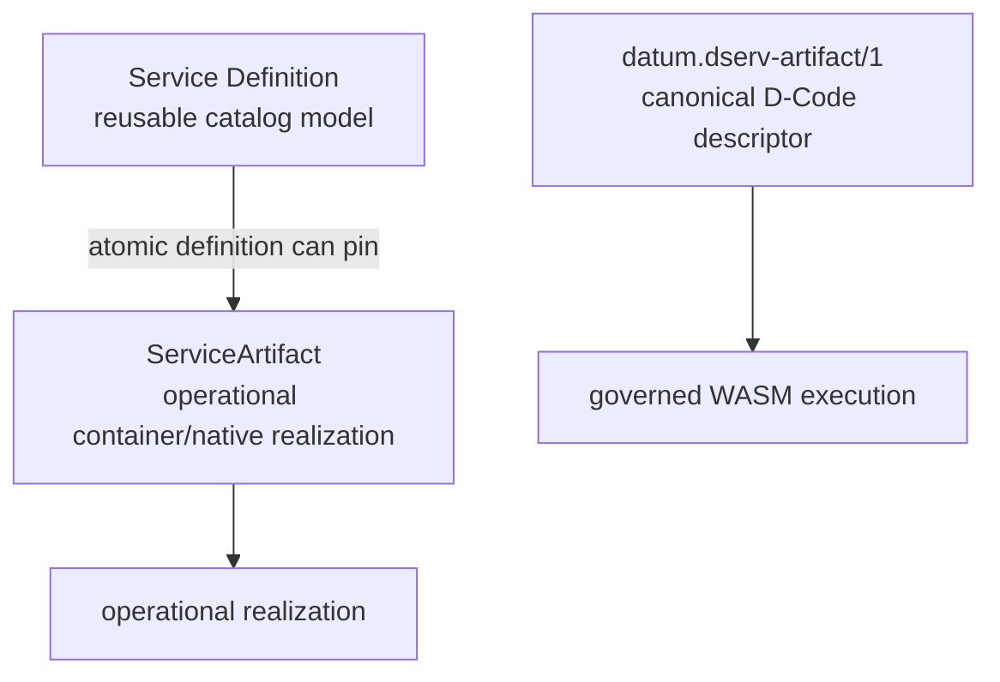
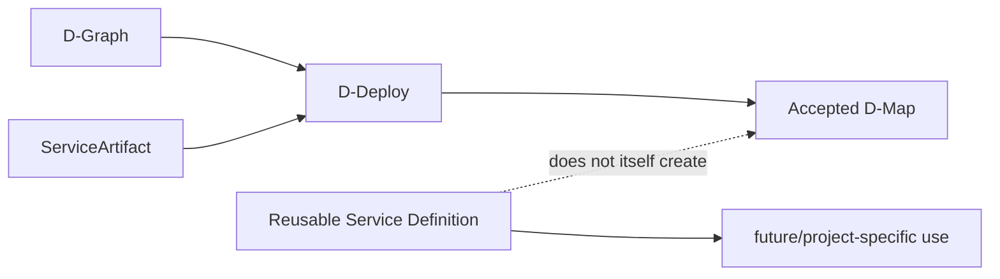

# Service catalog

DATUM v1 has a reusable **service-definition catalog** in addition to operational `ServiceArtifact` records and canonical D-Code artifacts. The three objects solve different problems and must not be collapsed into one generic “service artifact”.

## The three layers



| Object | Main question |
|---|---|
| Service Definition | What reusable service do we want to describe for operators/composition? |
| `ServiceArtifact` | How can a container/native process be realized operationally? |
| `datum.dserv-artifact/1` | What exact D-Code/WASM revision implements a D-Serv? |

A catalog definition is modeling data. It does not become placement or execution authority by being saved.

## Immutable revisions

Each catalog entry has a stable `service_definition_id` and immutable numeric revisions. Revising a definition creates a new revision instead of mutating the previous one.

Conceptually:

```text
mqtt-broker
├── revision 1
├── revision 2
└── revision 3
```

Dependencies and static composite members refer to **exact revisions**, not “latest”. This keeps the meaning of a stored definition stable over time.

## Atomic definitions

An atomic definition represents one service directly backed by one pinned operational artifact snapshot.

The pin contains exact source identity:

```text
project_id
artifact_id
execution_generation
execution_projection_digest
```

It also seals the execution content identity needed for that runtime kind:

- container → resolved OCI image identity/platform execution references;
- native process → exact executable SHA-256.

The source project in the pin is provenance. It does not make the reusable catalog definition “owned” by that project.

## Composite definitions

A composite definition describes expected multi-service structure and has no single root runtime artifact.

### Static composition

Static composition contains component keys pointing to exact service-definition IDs and revisions.

```text
edge-stack revision 4
├── broker      → mqtt-broker revision 2
├── database    → postgres revision 5
└── application → telemetry-api revision 7
```

This is expected composition, not an observed runtime graph and not deployment order.

### Discovered composition metadata

The catalog can also describe a composite whose expected structure is associated with Docker Compose metadata and immutable repository provenance.

The model can contain:

- credential-free HTTPS repository URL;
- exact 40-character source commit;
- safe repository-relative Compose paths;
- a bounded command argv declaration.

These values are **descriptive metadata** in the current implementation. DServer does not clone the repository, run the command or parse/execute the Compose workload as part of catalog save.

## Tenancy capability

A definition declares one tenancy capability:

| Value | Meaning |
|---|---|
| `dedicated` | modeled for dedicated use |
| `shared_tenant_aware` | explicitly supports tenant-aware sharing |
| `shared_stateless` | modeled as shareable/stateless |
| `system_global` | modeled as a system/global service |

Tenant-aware definitions can additionally name a tenant unit such as domain, namespace, vhost, schema or organization.

These are capabilities/intent. Saving a shared definition does not create a shared runtime instance or tenant binding.

## Resource and physical capability requirements

A definition can declare CPU, memory and storage requirements together with capability requirements such as:

- network interface;
- device;
- P4 port;
- GPU.

A capability can be marked exclusive, but **exclusive requirement is not allocation**. Resource assignment still belongs to the appropriate planning/placement authority.

## Service capabilities

Physical/resource capabilities and service capabilities are intentionally separate.

A definition may:

- `provides` named service capabilities;
- `requires` named service capabilities.

A requirement describes an unresolved need. It does not choose a provider, node or instance.

## Health and monitoring intent

The catalog can carry:

- HTTP or TCP health-check intent;
- D-Serv-realization monitoring cadence intent.

Saving those fields does not automatically install a health probe, collector or scheduler. They remain declarative until a later governed mechanism consumes them.

## Secrets are references only

Catalog secret entries contain reference/version/target metadata, not secret values.

```text
secret_ref
version
target_environment_variable
```

The catalog should never become a plaintext secret store merely because it models how a service expects secrets to be supplied.

## Catalog versus project/application models



The catalog is global reusable modeling. D-Graph describes application structure. D-Deploy/D-Map own placement. Runtime reconciliation owns concrete host realization. DMonitor owns observations.

## Fail-closed behavior

The catalog protects exact identity in several ways:

- stale expected revisions conflict instead of overwriting;
- changed artifact execution identity conflicts instead of silently repinning;
- exact dependency revisions are required;
- invalid or unsafe repository metadata is rejected;
- container snapshots require resolved execution identity;
- native-process snapshots require exact executable digest;
- persistence failure is reported instead of replaced by a transient in-memory store.

## Current limitation

The published DATUM v1 source provides an operator-authored catalog editor. A live external AI provider for guided service modeling is not part of this pinned source revision. Repository inspection/provisioning is also not executed by the catalog.

Continue with the [DATUM Console tutorial](../tutorials/datum-console.md), [model an existing service](../tutorials/model-existing-service.md), and [Console/catalog API reference](../reference/console-api.md).

## Sources

- [catalog core model](https://github.com/dnredson/datum/blob/7a79bd84bc05a1ea18870715cc033567ff472afc/dserver/src/core/service_catalog.rs)
- [catalog HTTP API](https://github.com/dnredson/datum/blob/7a79bd84bc05a1ea18870715cc033567ff472afc/dserver/src/api/service_catalog.rs)
- [catalog Console view](https://github.com/dnredson/datum/blob/7a79bd84bc05a1ea18870715cc033567ff472afc/console/src/pages/catalog.ts)
