# Visual guide to DATUM

This page is a **picture-first introduction** to the Phase 114D2 DATUM model. Use it before the detailed [entity encyclopedia](entities.md) when you want the mental model first and the field-level details second.

!!! tip "How to use this page"
    Read the diagrams from top to bottom. Each picture answers one question. When a term becomes familiar, follow the links to the detailed concept, tutorial or reference page.

## The five verbs

The easiest way to remember DATUM is as five different responsibilities:

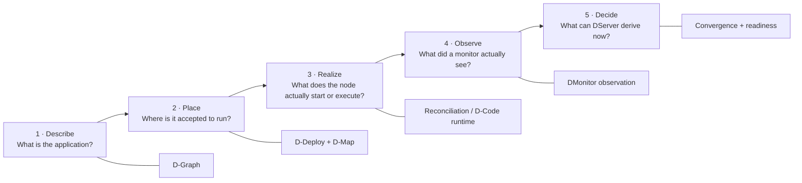

The most important rule is that **each step is a different claim**. A D-Map can authorize placement without proving the software is running. A running process can exist without fresh canonical evidence. A Healthy observation can become stale and stop supporting readiness.

## The model as layers

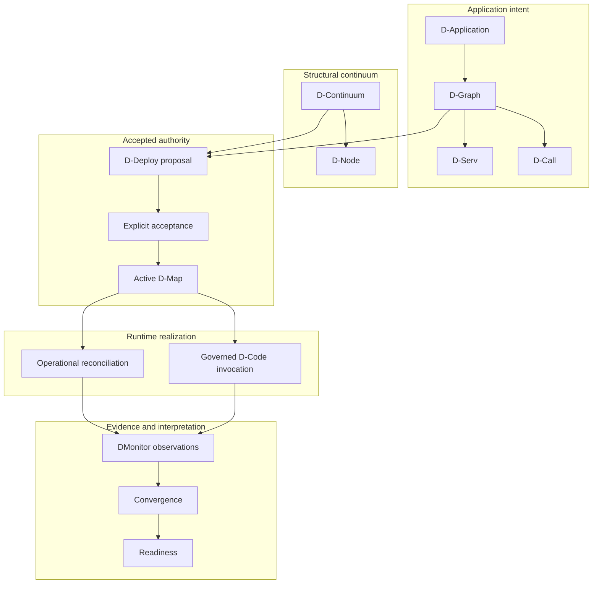

Think of these as **layers of meaning**, not five processes that must live in five different binaries.

## D-Graph: what the application is

A D-Graph is placement-free application topology.

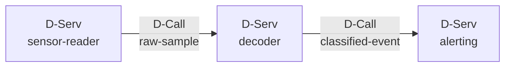

This picture means:

- three logical D-Servs exist;
- two semantic D-Calls connect them;
- no node, IP, container, PID or broker address has been chosen yet.

A useful test is: **if moving the service to another host changes the D-Graph, placement has leaked into the wrong contract.**

## D-Continuum + D-Map: where things are accepted to run

The D-Continuum describes structural runtime capacity. D-Map binds application entities to that structure after explicit D-Deploy acceptance.

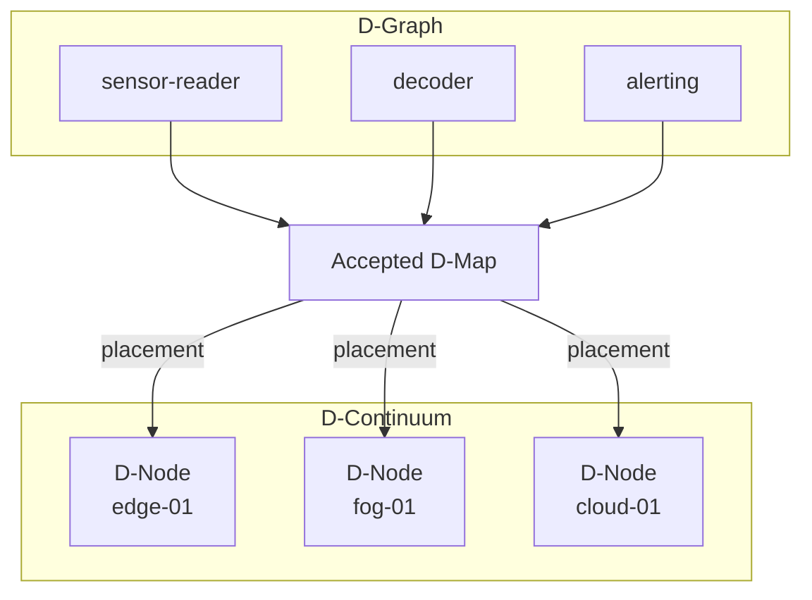

The arrows from D-Map are **authority**, not observations. They answer “where is this accepted to run?” rather than “what is running right now?”.

## Proposal is not placement authority

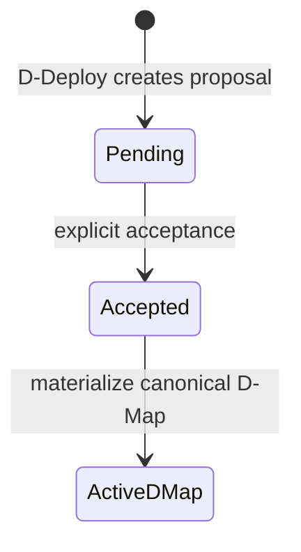

A planner can recommend a placement. It cannot silently turn that recommendation into active authority.

## Two artifact families at this baseline

This is one of the easiest parts of the current implementation to confuse.

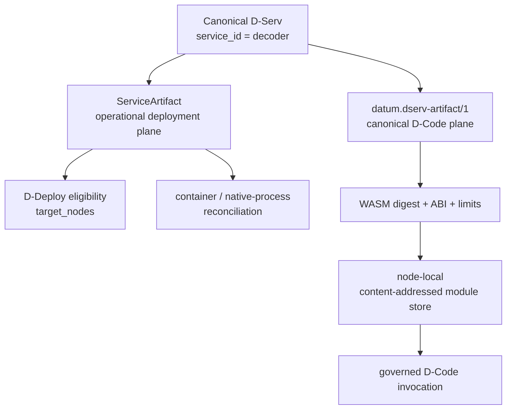

`ServiceArtifact` and `datum.dserv-artifact/1` **are not aliases**. The first currently serves operational deployment/reconciliation and D-Deploy eligibility. The second describes canonical content-addressed D-Code.

See [Author software artifacts](../tutorials/artifacts.md) for the concrete JSON examples.

## D-Node is not the machine, agent or heartbeat

Several identities may refer to the same physical environment without meaning the same thing.

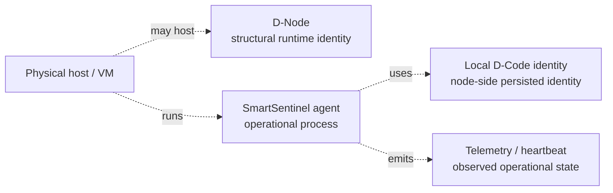

Only the D-Node structural registry contributes the structural node facts used to derive the authoritative D-Continuum. A heartbeat cannot invent structural capacity; a hostname cannot be guessed into a canonical node identity.

## Project scope versus application identity

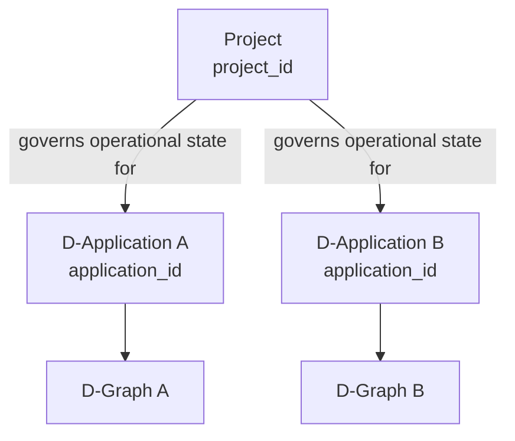

A project can govern multiple applications. The canonical D-Graph carries `application_id`; it deliberately does not carry `project_id`.

## D-Call: semantic edge first, transport later

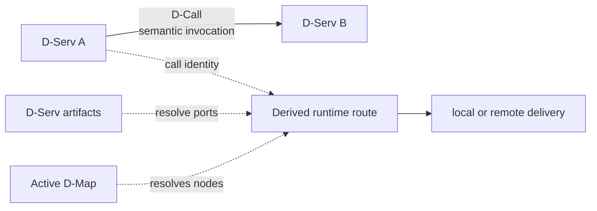

The D-Call does not contain a socket address, destination node or broker URI. Runtime routing is derived later from current accepted authority and artifact compatibility.

## D-Forward and DIoT: middleware plane

D-Forward is deliberately separate from the D-Graph application-service plane.

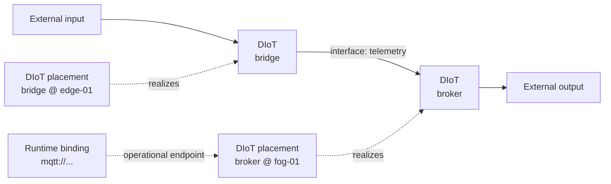

Logical middleware identity, placement identity and concrete broker binding are intentionally distinct.

## DMonitor: observation is evidence, not authority

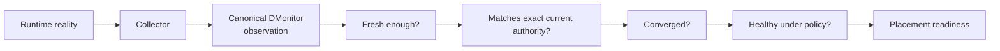

This explains why `Healthy` and `Ready` are different words:

- `Healthy` is part of what an observation reported;
- readiness is a **current server-derived governance result** over freshness, exact authority correlation, convergence and admitted health.

## Application readiness versus dependency readiness

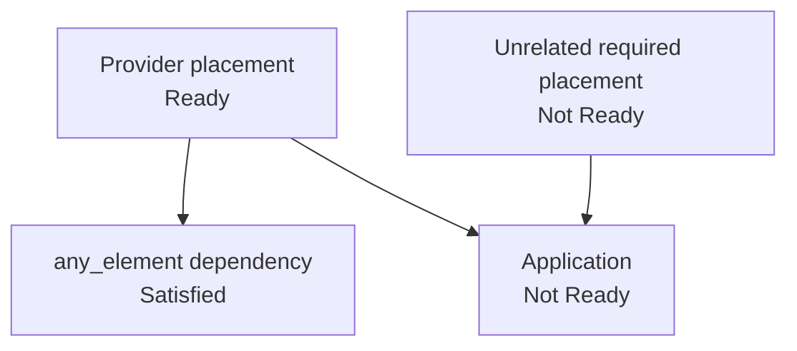

A specific provider dependency can be satisfied while the overall application is still NotReady because another required placement is missing or unhealthy. Phase 114D2 intentionally evaluates these questions separately.

## One complete journey

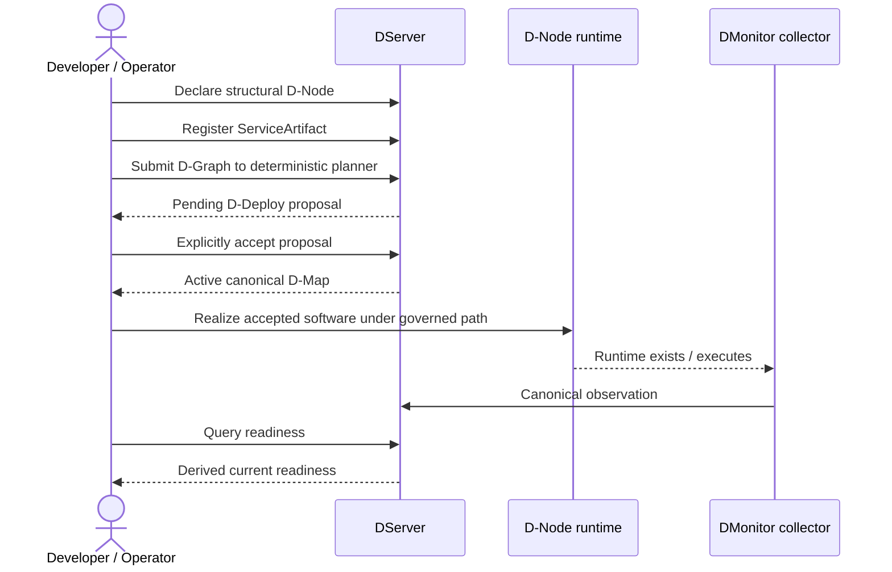

The sequence is intentionally explicit because DATUM does not collapse governance, execution and observation into one opaque “deploy” operation.

## Common false equivalences

| Tempting shortcut | Correct mental model |
|---|---|
| D-Graph = deployment | D-Graph describes application structure; D-Map establishes accepted placement. |
| proposal = D-Map | A proposal is pending candidate state until explicit acceptance. |
| D-Node = machine | D-Node is a structural logical runtime identity. |
| D-Node = Sentinel | Structural node authority and agent lifecycle are separate domains. |
| container running = Ready | Runtime state still needs fresh, exactly-correlated canonical evidence. |
| Healthy = Ready | Healthy is an observation condition; Ready is a derived governance result. |
| broker URI = broker healthy | Runtime binding gives operational identity, not liveness evidence. |
| ServiceArtifact = D-Code artifact | They are separate artifact families at the current baseline. |
| D-Call = TCP/HTTP endpoint | D-Call is semantic application communication; transport is derived later. |
| `target_nodes` = placement authority | It constrains proposal eligibility; accepted D-Map becomes placement authority. |

## Where to continue

- Want the precise meaning of every object? Read the [entity encyclopedia](entities.md).
- Want IDs, digests and correlation rules? Read [identity and references](identities-and-references.md).
- Want to build and deploy something? Start the [tutorial path](../tutorials/index.md).
- Want the exact contract fields? Open [canonical contracts](../reference/contracts.md).
- Want the end-to-end authority transition? Read [lifecycle and authority flow](../architecture/lifecycle.md).

!!! note "Baseline boundary"
    The pictures summarize the documented Phase 114D2 model. They do not imply that Phase 114E live multinode validation or the canonical production DServ evidence emitter has already closed.
