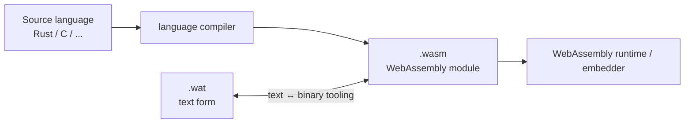
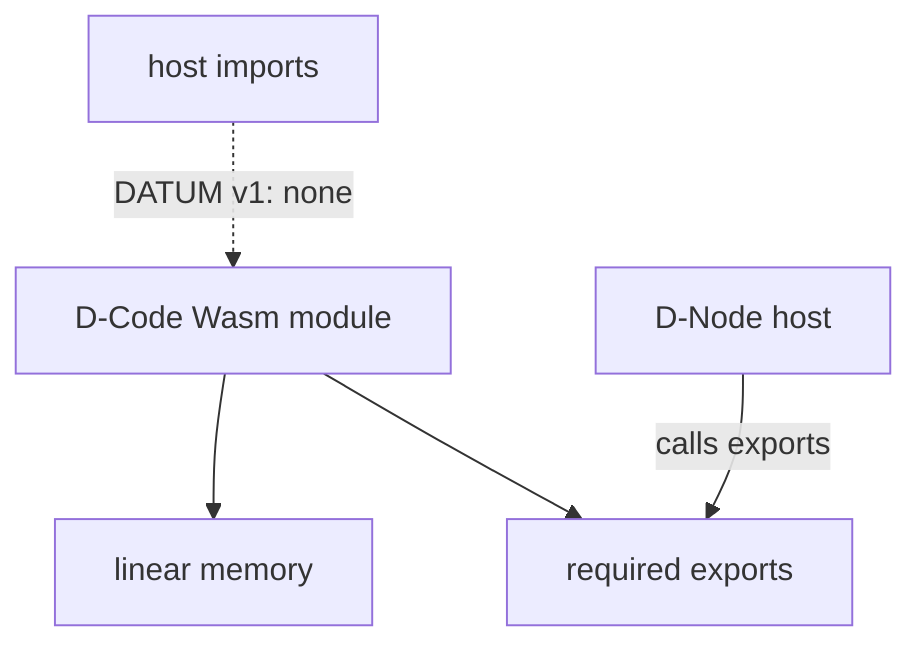
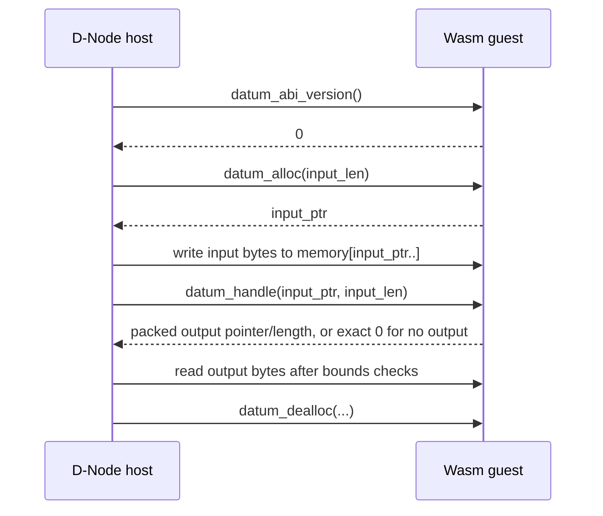
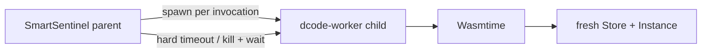
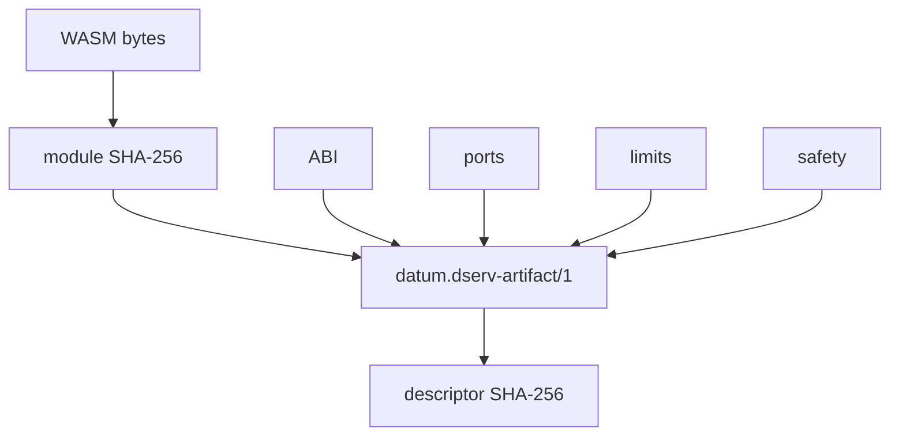
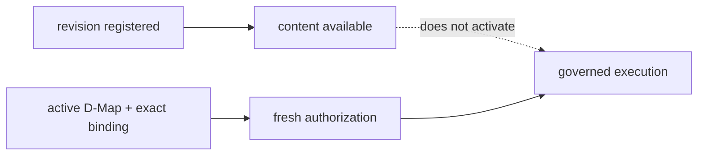

# WebAssembly and D-Code

WebAssembly — normally abbreviated **Wasm** — is the executable format used by canonical DATUM **D-Code in v1**. This page separates the WebAssembly standard from DATUM's governance model so that “WASM”, “D-Code”, “artifact”, “module”, “deployment” and “authorization” never become accidental synonyms.

## What WebAssembly is

The official [WebAssembly website](https://webassembly.org/) describes Wasm as a binary instruction format for a stack-based virtual machine and a portable compilation target for programming languages. The normative model lives in the [WebAssembly specifications](https://webassembly.github.io/spec/), including the [Core Specification](https://webassembly.github.io/spec/core/).

A WebAssembly program is packaged as a **module**. A module can define functions, globals, tables and linear memories, declare imports from its host environment, and expose selected definitions as exports. The binary form is normally stored as a `.wasm` file. WebAssembly also has a human-readable text representation commonly called **WAT** (`.wat`), useful for learning, debugging and small examples.



!!! note "WebAssembly is not inherently a browser technology"
    WebAssembly is also usable in non-browser environments. DATUM executes application D-Code on D-Nodes through Wasmtime; this path does not require a browser or JavaScript.

## The four Wasm ideas that matter most in DATUM

### Module

The module is the compiled executable unit. DATUM identifies the exact module **by SHA-256 content digest**, not by a mutable filename such as `latest.wasm`.

### Linear memory

A Wasm module can expose linear memory: a byte-addressed region used by DATUM to exchange invocation input and output with the guest. Pointer and length accesses are bounds-checked before host reads or writes.

### Exports

Exports are functions or other objects made visible by the module to its host. DATUM does not invoke arbitrary exports. DATUM v1 uses one explicit D-Node ABI surface.

### Imports

Imports are capabilities supplied by the host to the module. DATUM v1 deliberately permits **no host imports** for application D-Code. No WASI filesystem, sockets, clock, environment or host-command API is exposed to the guest.



## WebAssembly is not D-Code

A valid `.wasm` file is **not automatically valid DATUM D-Code**. D-Code is WebAssembly plus a DATUM-specific execution contract and governance chain.

```text
WebAssembly module bytes
        +
content identity
        +
canonical D-Serv artifact descriptor
        +
datum-dnode/0 ABI
        +
resource and safety limits
        +
active placement and exact-revision authority
        +
fresh server authorization
        =
governed D-Code execution material
```

The WebAssembly standard defines executable semantics. DATUM defines **which module implements which logical D-Serv, which node may execute it, which immutable descriptor revision is active, which limits apply, and how execution relates to accepted authority**.

## The `datum-dnode/0` ABI

DATUM v1 currently supports one concrete D-Node ABI for D-Code: `datum-dnode/0`.

A valid module must expose:

```text
memory
datum_abi_version
datum_alloc
datum_dealloc
datum_handle
```

The runtime resolves the functions with these signatures:

```text
datum_abi_version: () -> i32
datum_alloc:       i32 -> i32
datum_dealloc:     (i32, i32) -> ()
datum_handle:      (i32, i32) -> i64
```

`datum_abi_version()` must return `0`. The zero belongs to the ABI contract name `datum-dnode/0`; it is not a DATUM product-version label.

### Invocation data flow



The return value from `datum_handle` is an `i64` packing output pointer and output length. Exact `0` means “no output”; it is distinct from a nonzero pointer paired with an output length of zero.

## Why zero host imports matters

A sandbox is only as narrow as the capabilities exposed to code inside it. DATUM v1 rejects an application D-Code module that declares host imports. As a result, application D-Code cannot directly request:

- filesystem access;
- sockets or generic networking;
- environment variables;
- host clocks;
- shell or host-command execution;
- Docker access;
- generic WASI services.

This is a property of **DATUM's embedding**, not a universal WebAssembly restriction. Other Wasm runtimes can expose such capabilities; DATUM v1 intentionally does not expose them to application D-Code.

## Runtime resource boundaries

The canonical D-Serv artifact carries execution limits such as:

| Limit | Meaning |
|---|---|
| `fuel_per_invocation` | Wasmtime fuel budget used to bound guest CPU work |
| `timeout_ms` | whole isolated invocation wall-clock deadline enforced by the parent process |
| `max_memory_pages` | maximum allowed Wasm linear-memory growth |
| `max_message_bytes` | cap for invocation input/output bytes |
| `max_emits_per_invocation` | declared emission bound in the D-Code contract |

The runtime creates a **fresh Wasmtime `Store` and `Instance` for each invocation**. The engine and compiled module may be cached by content digest, but mutable guest instance state is not reused between calls.

## Process isolation is another boundary

Actual Wasmtime execution runs in a short-lived `smartsentinel-dcode-worker` child process.



This process boundary prevents a native runtime failure, panic or hang from sharing the long-lived SmartSentinel process directly. The parent enforces the whole-invocation timeout; fuel, memory limits, ABI validation and guest-memory bounds are enforced inside the execution layer.

## `.wasm` bytes versus descriptor

DATUM deliberately keeps two different identities.

**Module content digest** answers: *which exact executable bytes?*

**Descriptor digest** answers: *which exact complete execution contract?*

The descriptor includes module identity plus ABI, ports, limits, safety policy, state/instantiation model, constraints and metadata. Therefore changing `fuel_per_invocation` while keeping `.wasm` bytes unchanged changes the **descriptor digest** but not the **module digest**.



Both identities are used in governed execution. This prevents the same executable bytes from silently acquiring different limits or safety semantics without changing descriptor identity.

## Where the bytes live

DServer stores canonical descriptor and authority state, **not the `.wasm` bytes**. Each D-Node uses a local content-addressed module store:

```text
<dnode-root>/dcode/sha256/<64-lowercase-hex>.wasm
```

Installation verifies the bytes before writing the digest-addressed path. Loading recomputes the digest and rejects corruption. The filesystem path is operational storage; the digest is content identity.

**Automatic D-Code module distribution is not implemented yet in DATUM v1.** A successful server authorization therefore does not imply that the node already possesses the corresponding module bytes. Distribution will require a separate governed mechanism when implemented.

## Registration is not activation

Multiple immutable descriptor/module revisions can coexist:

```text
logical D-Serv: probe

D1 → module H1
D2 → module H2
D3 → module H3
```

Registering D2 or installing H2 on a node does not make H2 active. The currently accepted D-Deploy/D-Map authority selects the exact descriptor revision that fresh D-Code authorization may use.



## What WebAssembly does not decide

WebAssembly itself does not decide:

- which D-Serv a module implements;
- which D-Application owns it;
- which D-Node should run it;
- which descriptor revision is active;
- whether a deployment proposal was accepted;
- whether another revision may coexist locally;
- whether the runtime is Healthy or Ready.

Those decisions and interpretations belong to DATUM's D-Script/D-Compile, D-Graph, D-Serv artifact, D-Deploy/D-Map, D-Code authorization and evidence/readiness domains.

## Implementation sources

- [WebAssembly official site](https://webassembly.org/)
- [WebAssembly Core Specification](https://webassembly.github.io/spec/core/)
- [DATUM D-Code ABI](https://github.com/dnredson/datum/blob/c08ccc4d715d9eb76644e3f1bd7d80a7945265c4/DATUM/src/dcode/abi.rs)
- [DATUM D-Code runtime](https://github.com/dnredson/datum/blob/c08ccc4d715d9eb76644e3f1bd7d80a7945265c4/DATUM/src/dcode/runtime.rs)
- [D-Code worker isolation](https://github.com/dnredson/datum/blob/c08ccc4d715d9eb76644e3f1bd7d80a7945265c4/DATUM/src/dcode/worker.rs)
- [D-Node local module store](https://github.com/dnredson/datum/blob/c08ccc4d715d9eb76644e3f1bd7d80a7945265c4/DATUM/src/dcode/module_store.rs)
- [canonical D-Serv artifact](https://github.com/dnredson/datum/blob/c08ccc4d715d9eb76644e3f1bd7d80a7945265c4/dserver/src/core/dserv_artifact.rs)
