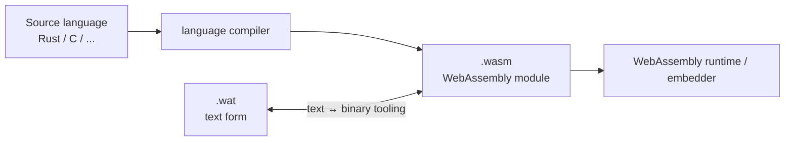
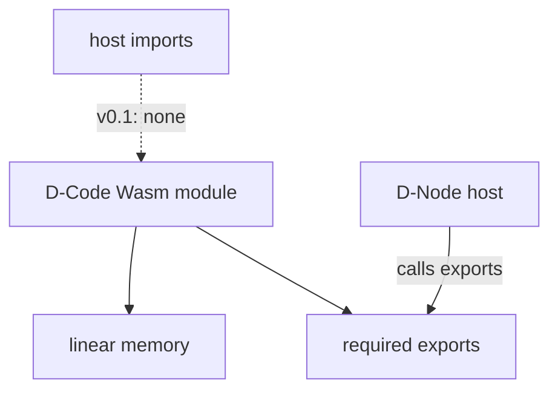
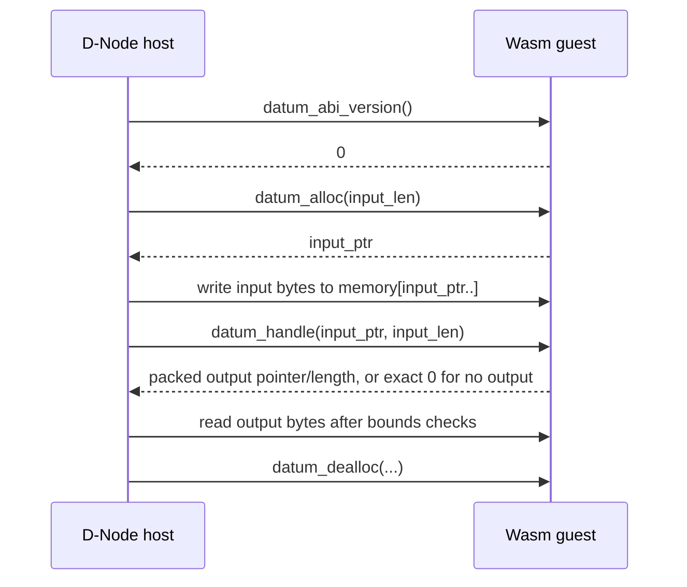
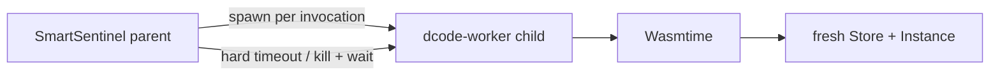
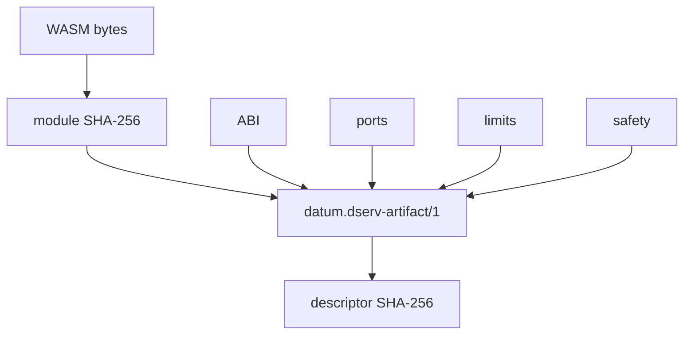

# WebAssembly and D-Code

WebAssembly — normally abbreviated **Wasm** — is the executable format used by canonical DATUM **D-Code v0.1**. This page separates the standard technology from DATUM's own governance model so that “WASM”, “D-Code”, “artifact”, “module”, “deployment” and “authorization” never become accidental synonyms.

## What WebAssembly is

The official [WebAssembly website](https://webassembly.org/) defines Wasm as a binary instruction format for a stack-based virtual machine and a portable compilation target for programming languages. The normative model lives in the [WebAssembly specifications](https://webassembly.github.io/spec/), including the [Core Specification](https://webassembly.github.io/spec/core/).

A WebAssembly program is packaged as a **module**. A module can define functions, globals, tables and linear memories, declare imports from its host environment, and expose selected definitions as exports. The binary form is normally stored as a `.wasm` file. WebAssembly also defines a human-readable text representation commonly called **WAT** (`.wat`), useful for learning, debugging and small hand-authored examples.



!!! note "WebAssembly is not inherently a web-browser technology"
    WebAssembly was designed for the Web, but the standard explicitly supports non-browser embeddings. DATUM runs application D-Code on D-Nodes through the Wasmtime runtime; there is no browser or JavaScript requirement in this path.

## The four Wasm ideas that matter most in DATUM

### Module

The module is the compiled executable unit. DATUM identifies the exact module **by SHA-256 content digest**, not by a mutable filename such as `latest.wasm`.

### Linear memory

A Wasm module can expose linear memory: a byte-addressed region used here to exchange invocation input/output with the host. DATUM validates every pointer/length access before reading or writing guest memory.

### Exports

Exports are functions or other module objects made visible to the host. DATUM does not call arbitrary exported functions. D-Code v0.1 defines one exact ABI surface.

### Imports

Imports are capabilities supplied by the host to the module. In DATUM D-Code v0.1 the permitted set is deliberately **empty**. No WASI filesystem, sockets, clock, environment or host command API is exposed to the guest.



## WebAssembly is not D-Code

A random valid `.wasm` file is **not** automatically valid D-Code. D-Code is WebAssembly plus a DATUM-specific contract and governance chain.

```text
WebAssembly module bytes
        +
content identity
        +
canonical D-Serv artifact descriptor
        +
datum-dnode/0 ABI
        +
resource/safety limits
        +
active placement and exact-revision authority
        +
fresh server authorization
        =
governed D-Code execution material
```

The WebAssembly standard defines executable semantics. DATUM defines **which module belongs to which logical D-Serv, which node may execute it, which exact immutable revision is active, which capabilities it receives, and what evidence is produced around the execution**.

## The `datum-dnode/0` ABI

D-Code v0.1 supports one concrete D-Node ABI: `datum-dnode/0`.

A valid module must expose the exact semantic export set:

```text
memory
datum_abi_version
datum_alloc
datum_dealloc
datum_handle
```

The runtime resolves these functions with exact signatures:

```text
datum_abi_version: () -> i32
datum_alloc:       i32 -> i32
datum_dealloc:     (i32, i32) -> ()
datum_handle:      (i32, i32) -> i64
```

`datum_abi_version()` must return `0`.

### Invocation data flow



The return value from `datum_handle` is an `i64` packing output pointer and output length. The exact value `0` is the canonical “no output” representation. This is distinct from a nonzero pointer with zero output length.

## Why zero host imports matters

A sandbox is only as narrow as the capabilities exposed to code inside it. D-Code v0.1 rejects any module that declares a host import. As a result, application D-Code cannot directly ask Wasmtime for:

- filesystem access;
- sockets/networking;
- environment variables;
- host clocks;
- shell/host command execution;
- Docker access;
- generic WASI services.

That does not mean WebAssembly itself universally forbids these capabilities; many Wasm runtimes can expose them. It means **DATUM's v0.1 embedding chooses not to expose them**.

## Runtime resource boundaries

The canonical D-Serv artifact carries execution limits including:

| Limit | Meaning |
|---|---|
| `fuel_per_invocation` | Wasmtime instruction/fuel budget used to bound guest CPU work |
| `timeout_ms` | whole isolated invocation wall-clock deadline enforced by the parent process |
| `max_memory_pages` | maximum allowed Wasm linear-memory growth |
| `max_message_bytes` | cap for invocation input/output bytes |
| `max_emits_per_invocation` | canonical declared emission limit for the D-Code contract |

The in-process runtime creates a **fresh Wasmtime `Store` and `Instance` for each invocation**. The engine and compiled module may be cached by content digest, but mutable guest instance state is not reused between calls.

## Process isolation is a second boundary

The actual Wasmtime execution runs in a short-lived `smartsentinel-dcode-worker` child process. This matters because a native runtime failure must not be able to crash the long-lived SmartSentinel parent.



The parent enforces `timeout_ms` at the OS-process boundary. Fuel, memory limits, ABI validation and guest-memory bounds are enforced inside the runtime layer.

## `.wasm` bytes versus descriptor

DATUM deliberately keeps two identities separate.

**Module content digest** answers: *which exact executable bytes?*

**Descriptor digest** answers: *which exact complete execution contract?*

The descriptor includes not only module identity but ABI, ports, limits, safety policy, state/instantiation model, constraints and other metadata. Therefore changing `fuel_per_invocation` while keeping the `.wasm` bytes unchanged changes the **descriptor digest** but not the **module digest**.



Both identities are carried in governed authorization. This prevents a caller from silently changing limits or safety policy while presenting the same executable bytes.

## Where the bytes live

DServer stores the canonical descriptor/authority state, **not the `.wasm` bytes**. Each D-Node has an operational local content-addressed module store:

```text
<dnode-root>/dcode/sha256/<64-lowercase-hex>.wasm
```

Install verifies the bytes before atomically writing the digest-addressed path. Load recomputes the digest again and rejects corruption. The filesystem path is not canonical identity; the digest is.

Automatic distribution is still outside D-Code v0.1. “The server authorized digest X” therefore does not imply “the node already possesses bytes X”.

## What WebAssembly does not decide

WebAssembly does not decide:

- which D-Serv a module implements;
- which D-Application owns it;
- which D-Node should run it;
- which revision is active;
- whether deployment was accepted;
- whether another revision may coexist locally;
- whether the current runtime is healthy or Ready.

Those are DATUM responsibilities expressed through D-Script/D-Compile, D-Graph, D-Serv artifacts, D-Deploy/D-Map, D-Code authorization and DMonitor.

## Implementation sources

- [WebAssembly official site](https://webassembly.org/)
- [WebAssembly Core Specification](https://webassembly.github.io/spec/core/)
- [DATUM D-Code ABI](https://github.com/dnredson/datum/blob/c08ccc4d715d9eb76644e3f1bd7d80a7945265c4/DATUM/src/dcode/abi.rs)
- [DATUM D-Code runtime](https://github.com/dnredson/datum/blob/c08ccc4d715d9eb76644e3f1bd7d80a7945265c4/DATUM/src/dcode/runtime.rs)
- [D-Code worker isolation](https://github.com/dnredson/datum/blob/c08ccc4d715d9eb76644e3f1bd7d80a7945265c4/DATUM/src/dcode/worker.rs)
- [D-Node local module store](https://github.com/dnredson/datum/blob/c08ccc4d715d9eb76644e3f1bd7d80a7945265c4/DATUM/src/dcode/module_store.rs)
- [canonical D-Serv artifact](https://github.com/dnredson/datum/blob/c08ccc4d715d9eb76644e3f1bd7d80a7945265c4/dserver/src/core/dserv_artifact.rs)
