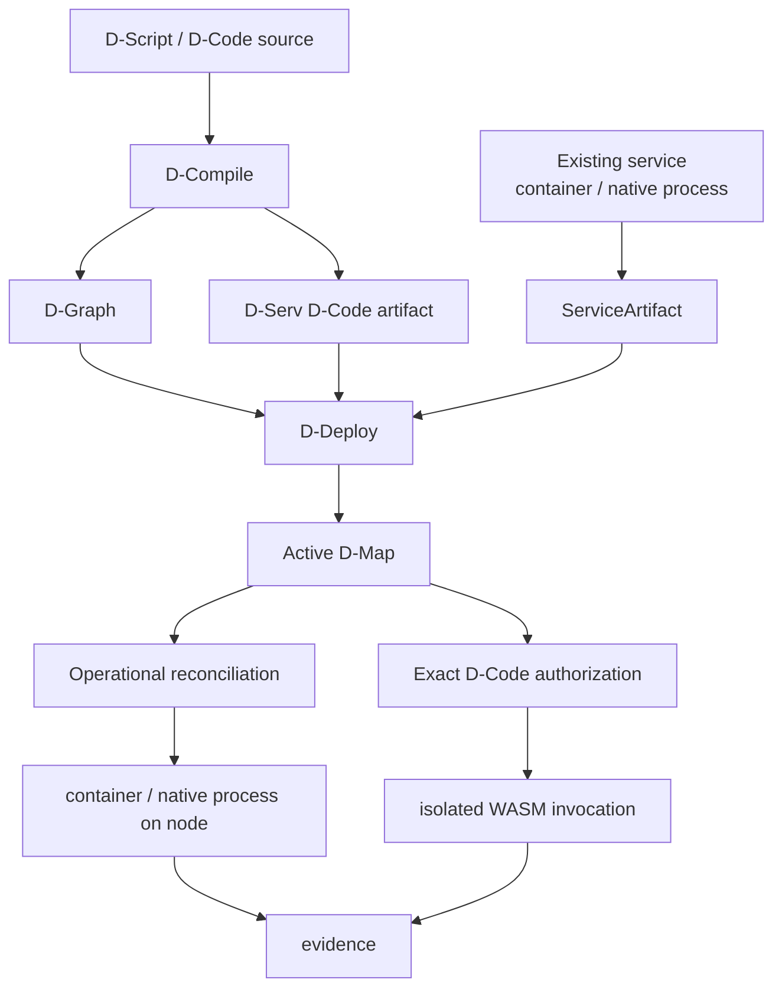

# DATUM

**Describe software. Govern where it runs. Execute exact content. Observe what really happened.**

DATUM is an architectural framework and information model for distributed applications across the **IoTinuum**: heterogeneous resources spanning devices, edge, fog and cloud environments.

!!! info "DATUM v1 · development documentation"
    This edition documents the current DATUM v1 implementation and is grounded in source revision `c08ccc4d715d9eb76644e3f1bd7d80a7945265c4`. See [status and limitations](overview/status.md).

## From source or existing software to governed execution

Compilation is not deployment. Registration is not activation. Accepted placement is not runtime realization. Installed content is not execution authority. Running is not automatically Ready.

- **Model an existing service**

    Turn real software facts into a DATUM operational model.

    [Model an existing service](tutorials/model-existing-service.md)

- **Deploy Mosquitto end to end**

    Follow a real catalog artifact through registration, D-Graph, placement acceptance, reconciliation authorization and node execution.

    [Mosquitto end-to-end tutorial](tutorials/mosquitto-end-to-end.md)

- **Use the reusable service lifecycle**

    Learn Model → Register → Propose → Accept → Authorize → Realize → Observe.

    [Service model to node execution](tutorials/service-to-node.md)

- **Understand WebAssembly and D-Code**

    Learn modules, imports/exports, the `datum-dnode/0` ABI, sandboxing and runtime limits.

    [WebAssembly and D-Code](concepts/webassembly-and-dcode.md)

- **See the visual model first**

    Learn application structure, continuum, placement, artifacts, DIoT, DMonitor and authority-to-evidence flow through diagrams.

    [Open the visual guide](concepts/visual-guide.md)

- **Read the technical reference**

    Inspect contracts, APIs, readiness semantics and immutable source provenance.

    [Technical reference](reference/index.md)

## The core rule

DATUM keeps different questions in different authority/evidence domains:

| Question | Primary representation |
|---|---|
| What functionality did the author describe? | D-Script / D-Functions |
| What logical application exists? | D-Graph / D-Serv / D-Call |
| How can an existing long-running service be realized? | project-scoped `ServiceArtifact` |
| What exact application-code content describes a D-Serv revision? | `datum.dserv-artifact/1` + WASM content digest |
| Where and which exact revision is currently authorized? | accepted D-Map/D-Deploy authority and exact bindings |
| May this node mutate the host now? | finite operational reconciliation authorization + local policy |
| What actually happened at runtime? | runtime reports/evidence and DMonitor observations |
| Is the required realization usable now? | readiness derived from admitted current evidence |

This separation is also the foundation for the planned dashboard: the UI should combine these facts without creating a second source of truth.

Source links are immutable and [provenance is explicit](reference/sources.md).
