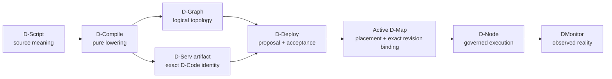

# DATUM

**Describe software. Govern where it runs. Execute exact content. Observe what really happened.**

DATUM is an architectural framework and information model for distributed applications across the **IoTinuum**: heterogeneous resources spanning devices, edge, fog and cloud environments.

!!! info "Development documentation · Phase 119I baseline"
    This edition is anchored at `c08ccc4d715d9eb76644e3f1bd7d80a7945265c4`, the independent Phase 119 migration closure commit. It is a development checkpoint, not a stable release. See [status and limitations](overview/status.md).

## From source meaning to governed execution

The arrows do **not** collapse these concepts. Compilation is not deployment. Registration is not activation. Having WASM bytes on a node is not authorization to execute them. A running module is not automatically Ready.

- **Understand WebAssembly and D-Code**

    Learn what `.wasm` actually is, modules/imports/exports/linear memory, why DATUM uses WebAssembly, the `datum-dnode/0` ABI, sandboxing and runtime limits.

    [WebAssembly and D-Code](concepts/webassembly-and-dcode.md)

- **See how software is represented**

    Follow one software component through D-Function, D-Serv, D-Code module bytes, immutable descriptor revision, D-Map binding, execution and evidence.

    [Software component model](architecture/software-components.md)

- **See what DServer sends to a D-Node**

    Step through fresh authorization, exact descriptor fetch, local content-addressed module loading and isolated Wasmtime execution.

    [DServer → D-Node execution flow](architecture/dserver-dnode-dcode-flow.md)

- **Read the production API contract**

    Inspect `POST /api/v1/dcompile/compile`, versioned D-Code registration, exact-revision fetch and authorization fields.

    [DCompile and D-Code API](reference/dcompile-dcode-api.md)

- **See the visual model first**

    Learn DATUM through diagrams: application structure, continuum, placement, artifacts, DIoT, DMonitor and the authority-to-evidence journey.

    [Open the visual guide](concepts/visual-guide.md)

- **Follow the tutorials**

    Work through installation, identities, artifacts, D-Graph, governed deployment and runtime realization.

    [Start the tutorials](tutorials/index.md)

## The core rule

DATUM keeps five questions separate:

| Question | Primary representation |
|---|---|
| What functionality did the author describe? | D-Script / D-Functions |
| What logical application was compiled? | D-Graph / D-Serv / D-Call |
| What exact executable content describes a D-Serv revision? | `datum.dserv-artifact/1` + WASM content digest |
| Where and which exact revision is currently authorized? | accepted D-Map/D-Deploy authority + D-Code revision binding |
| What actually happened at runtime? | D-Node execution evidence and DMonitor observations |

This separation is why two immutable WASM revisions can coexist on one node without either becoming executable merely because its bytes are present. Current authority selects the exact revision; the governed client fetches that exact descriptor and verifies the local bytes against its content digest before execution.

Source links are immutable and [provenance is explicit](reference/sources.md). Historical pages may intentionally link to their original evidence checkpoint rather than pretending they were produced at Phase 119I.
