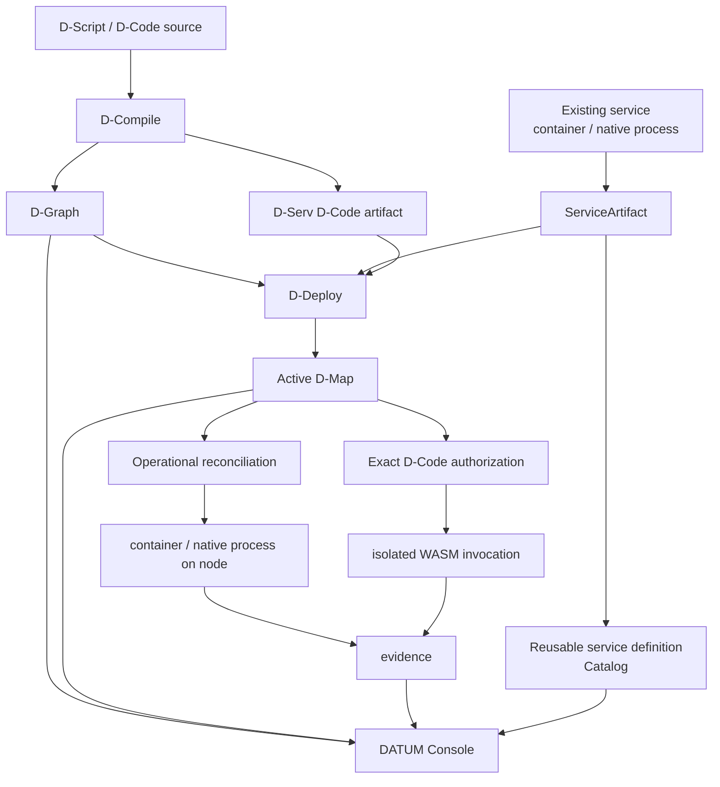

# DATUM

**Describe software. Govern where it runs. See what is happening. Execute exact content. Observe what really happened.**

DATUM is an architectural framework and information model for distributed applications across the **IoTinuum**: heterogeneous resources spanning devices, edge, fog and cloud environments.

!!! info "DATUM v1"
    This edition documents the current DATUM v1 implementation and is grounded in source revision `7a79bd84bc05a1ea18870715cc033567ff472afc`. See [status and limitations](overview/status.md).

## From software model to governed execution and graphical operations

Compilation is not deployment. Registration is not activation. Accepted placement is not runtime realization. Installed content is not execution authority. Evidence is not placement. The Console visualizes these domains without becoming a second source of truth.

- **Use the DATUM Console**

    Start the graphical interface, browse projects, inspect accepted logical graphs and runtime evidence, and work with the reusable service catalog.

    [DATUM Console tutorial](tutorials/datum-console.md)

- **Understand the service catalog**

    Learn the difference between reusable service definitions, operational `ServiceArtifact` records and canonical D-Code artifacts.

    [Service catalog](concepts/service-catalog.md)

- **Model an existing service**

    Turn real software facts into a DATUM operational model.

    [Model an existing service](tutorials/model-existing-service.md)

- **Deploy Mosquitto end to end**

    Follow a real artifact through registration, D-Graph, placement acceptance, reconciliation authorization and node execution.

    [Mosquitto end-to-end tutorial](tutorials/mosquitto-end-to-end.md)

- **Understand WebAssembly and D-Code**

    Learn modules, imports/exports, the `datum-dnode/0` ABI, sandboxing and runtime limits.

    [WebAssembly and D-Code](concepts/webassembly-and-dcode.md)

- **Read the technical reference**

    Inspect contracts, Console/catalog APIs, readiness semantics and immutable source provenance.

    [Technical reference](reference/index.md)

## What the Console adds

The Console provides a graphical operator view over server-owned read projections and catalog data. The published interface includes:

- a global operational overview;
- project navigation and scoped project workspaces;
- project attention, discovered application references, accepted D-Map summaries, recent events and monitoring context;
- a Cytoscape-based logical D-Graph view;
- expandable admitted D-Serv realization evidence kept visually distinct from logical software;
- a reusable Artifact & Service Catalog with immutable definition revisions and exact artifact pins.

Dedicated project pages for placement planning, deploy actions, runtime management and history are not implemented yet. The current Console exposes relevant facts through the overview/graph while preserving their owning authority domains.

## The core rule

DATUM keeps different questions in different authority/evidence domains:

| Question | Primary representation |
|---|---|
| What functionality did the author describe? | D-Script / D-Functions |
| What logical application exists? | D-Graph / D-Serv / D-Call |
| How can an existing long-running service be realized? | project-scoped `ServiceArtifact` |
| What reusable service definition do operators want to catalog? | versioned service catalog definition |
| What exact application-code content describes a D-Serv revision? | `datum.dserv-artifact/1` + WASM content digest |
| Where and which exact revision is currently authorized? | accepted D-Map/D-Deploy authority and exact bindings |
| May this node mutate the host now? | finite operational reconciliation authorization + local policy |
| What actually happened at runtime? | runtime reports/evidence and DMonitor observations |
| What can an operator see graphically? | Console projections derived from the domains above |
| Is the required realization usable now? | readiness derived from admitted current evidence |

Source links are immutable and [provenance is explicit](reference/sources.md).
