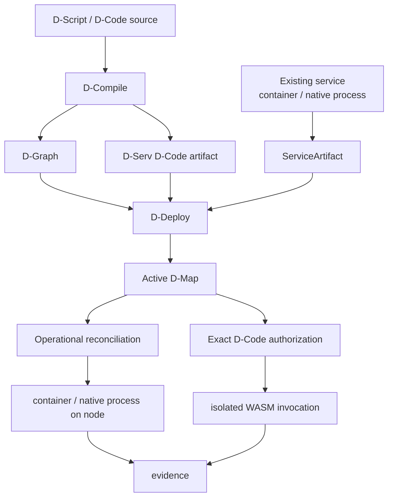

# DATUM

**Describe software. Govern where it runs. Execute exact content. Observe what really happened.**

DATUM is an architectural framework and information model for distributed applications across the **IoTinuum**: heterogeneous resources spanning devices, edge, fog and cloud environments.

!!! info "Development documentation · Phase 119I baseline"
    This edition is anchored at `c08ccc4d715d9eb76644e3f1bd7d80a7945265c4`, the independent Phase 119 migration closure commit. It is a development checkpoint, not a stable release. See [status and limitations](overview/status.md).

## From source or existing software to governed execution

The arrows do **not** collapse these concepts. Compilation is not deployment. Registration is not activation. Accepted placement is not runtime realization. Installed content is not execution authority. Running is not automatically Ready.

- **Model an existing service**

    Turn real software facts into a DATUM operational model. Examples include Mosquitto, PostgreSQL, locally built simulators and repository-installed native executables.

    [Model an existing service](tutorials/model-existing-service.md)

- **Deploy Mosquitto end to end**

    Follow the real catalog artifact through registration, OCI identity, D-Graph, D-Deploy acceptance, finite reconciliation authorization and a running node container.

    [Mosquitto end-to-end tutorial](tutorials/mosquitto-end-to-end.md)

- **Use the reusable service lifecycle**

    Learn the generic Model → Register → Propose → Accept → Authorize → Realize → Observe flow for the services that will later need to appear coherently in a dashboard.

    [Service model to node execution](tutorials/service-to-node.md)

- **Understand WebAssembly and D-Code**

    Learn what `.wasm` actually is, modules/imports/exports/linear memory, the `datum-dnode/0` ABI, sandboxing and runtime limits.

    [WebAssembly and D-Code](concepts/webassembly-and-dcode.md)

- **See how software is represented**

    Follow one software component through D-Function, D-Serv, executable bytes, immutable descriptor, D-Map authority, execution and evidence.

    [Software component model](architecture/software-components.md)

- **See what DServer sends to a D-Node**

    Step through fresh D-Code authorization, exact descriptor fetch, local content-addressed module loading and isolated Wasmtime execution.

    [DServer → D-Node execution flow](architecture/dserver-dnode-dcode-flow.md)

- **Read the production D-Code API**

    Inspect DCompile, versioned D-Code registration, exact-revision fetch and authorization fields.

    [DCompile and D-Code API](reference/dcompile-dcode-api.md)

- **See the visual model first**

    Learn DATUM through diagrams: application structure, continuum, placement, artifacts, DIoT, DMonitor and authority-to-evidence flow.

    [Open the visual guide](concepts/visual-guide.md)

## The core rule

DATUM keeps different questions in different authority/evidence domains:

| Question | Primary representation |
|---|---|
| What functionality did the author describe? | D-Script / D-Functions |
| What logical application exists? | D-Graph / D-Serv / D-Call |
| How can an existing long-running service be realized? | project-scoped `ServiceArtifact` |
| What exact application-code content describes a D-Serv revision? | `datum.dserv-artifact/1` + WASM content digest |
| Where and which exact revision is currently authorized? | accepted D-Map/D-Deploy authority and exact bindings |
| May this node mutate the host now? | finite operational reconciliation authorization + local policy |
| What actually happened at runtime? | runtime reports/evidence and DMonitor observations |
| Is the required realization usable now? | readiness derived from admitted current evidence |

This separation is also a strong foundation for a future dashboard. A UI can show these facts together without inventing a single ambiguous “deployed” state that hides whether the service is merely accepted, physically running, healthy, stale, migrating or awaiting cleanup.

Source links are immutable and [provenance is explicit](reference/sources.md). Historical pages may intentionally link to their original evidence checkpoint rather than pretending they were produced at Phase 119I.
