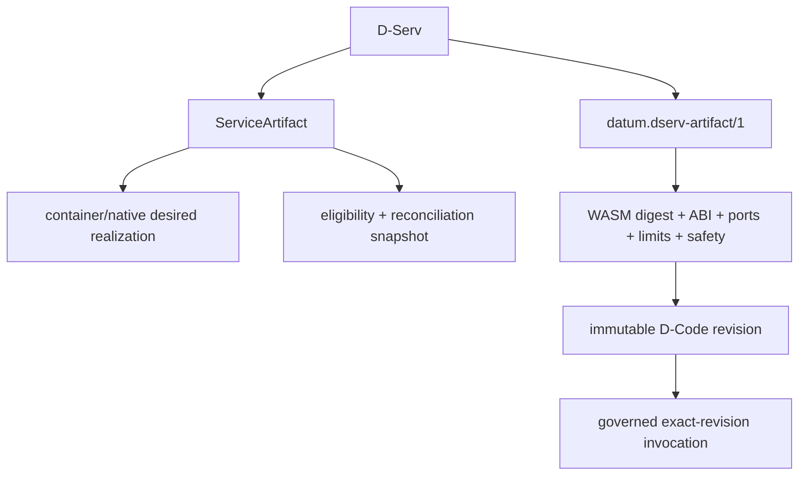
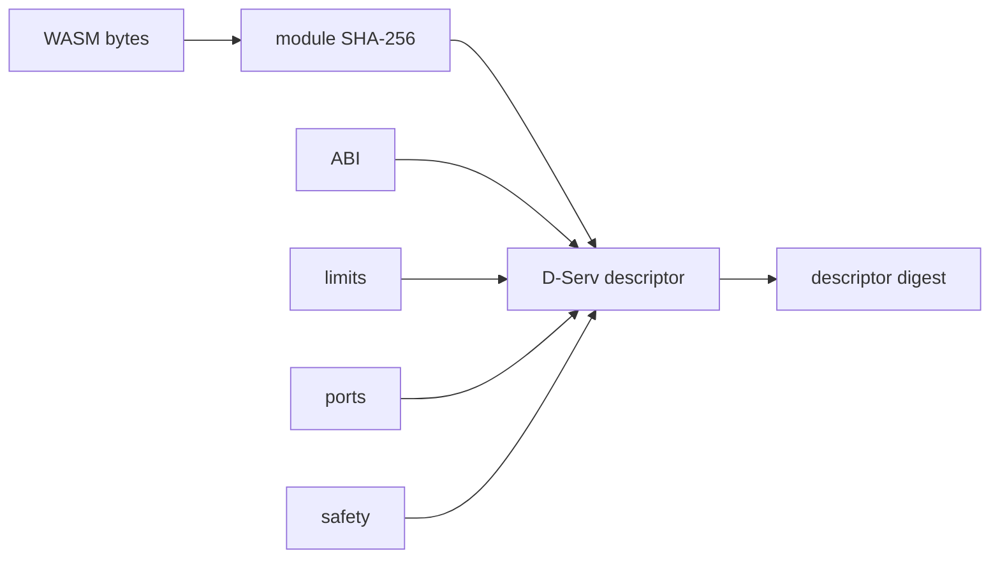

# Author software artifacts

DATUM v1 has two artifact families with different responsibilities. Keeping them separate avoids one of the easiest DATUM mistakes: treating an operational deployment descriptor and an application D-Code descriptor as interchangeable.

## Quick comparison

| Question | `ServiceArtifact` | `datum.dserv-artifact/1` |
|---|---|---|
| Primary role | Operational deployment/reconciliation descriptor | Canonical host-independent D-Code descriptor |
| Scope | Project-scoped | Application + D-Serv |
| Runtime form | container or native process | WebAssembly D-Code |
| Executable identity | OCI/platform identity or native source SHA-256 | WASM module SHA-256 |
| Full execution descriptor identity | execution projection generation/digest | immutable descriptor digest |
| Placement interaction | current D-Deploy resolution/eligibility and operational reconciliation | exact D-Code revision can be explicitly bound by D-Deploy |
| Stores executable bytes in DServer | No | No |
| Runtime bytes live | container runtime / managed native artifact root | D-Node local D-Code store |

## One logical service, different representations



For a hands-on walkthrough of translating existing software, start with [Model an existing service](model-existing-service.md). For a real deployment example, see [Mosquitto end to end](mosquitto-end-to-end.md).

## ServiceArtifact anatomy

A current `ServiceArtifact` contains:

```text
schema_version
artifact_id
service_id
runtime
probes
metadata
control_plane
```

### Container runtime

Important container fields include:

- `container_name`;
- `image`;
- `image_source_kind` (`registry`, `local_build`, or `legacy_unclassified`);
- optional server-owned `resolved_image_identity`;
- ports;
- network and aliases;
- volumes;
- read-only configuration mounts;
- container command arguments.

### Native-process runtime

A native runtime carries desired-state-only fields:

```text
process_name
entrypoint
args
working_directory
```

The executable content identity lives separately in:

```text
control_plane.acquisition.kind   = native_process_executable
control_plane.acquisition.source = POSIX absolute local path
control_plane.acquisition.sha256 = 64 lowercase hex
```

The source path names the local file to acquire. The `entrypoint` is a safe relative path under DATUM's managed materialized artifact directory.

### Probes

Supported execution probes include:

```text
docker_container_running
process_running
systemd_active
```

Health/availability probes use supported network/runtime checks such as TCP, HTTP, MQTT or Docker health according to the owning dimension.

### Control-plane fields

The control-plane section carries:

- human-readable name/version;
- `target_nodes` / `target_stages` eligibility;
- dependencies;
- acquisition;
- lifecycle allowlist commands;
- health checks;
- reconciliation WASM-decision policy;
- ordinary bindings;
- secret references/bindings;
- server-owned `execution_generation` and `execution_projection_digest`.

`lifecycle.program` is an allowlist key, **not a host path or shell command**.

## Register a ServiceArtifact

```sh
curl -fsS -X POST \
  "$DSERVER_URL/api/v1/service-artifacts" \
  -H "X-Datum-Project: $PROJECT_ID" \
  -H 'content-type: application/json' \
  --data-binary @service-artifact.json \
  | tee registered-service-artifact.json
```

DServer normalizes project ownership/timestamps and computes server-owned execution generation/projection identity.

### Container image identity

A client must not fabricate `resolved_image_identity`. For registry-backed containers, use:

```text
POST /api/v1/service-artifacts/:artifact_id/image-identity/resolve
```

The resolver records platform-specific OCI identity through a server-owned compare-and-swap update.

### `target_stages` constraint caveat

The canonical D-Continuum currently has no authoritative node-to-stage mapping. Therefore do not assume a free-text `target_stages` value can be verified during canonical D-Deploy planning. For portable tutorial flows, prefer explicit `target_nodes` and an empty `target_stages` list. An authoritative node classification model can be implemented later without turning free-text labels into current placement truth.

## Canonical D-Code artifact

`datum.dserv-artifact/1` describes one immutable application-code revision. Important areas are:

| Area | Examples |
|---|---|
| identity | artifact id/version, application id, D-Serv id |
| executable content | `datum-blob://sha256/...`, module SHA-256, content ID, size |
| ABI | `datum-dnode/0`, exact required exports, zero allowed imports |
| ports | input/output port names and payload schemas |
| limits | fuel, timeout, memory pages, message bytes, emits |
| safety | filesystem/network/host command/Docker/side-effect declarations |
| execution model | stateless, fresh instance per invocation |
| constraints | currently including allowed stages |

See [WebAssembly and D-Code](../concepts/webassembly-and-dcode.md) for the ABI/runtime details.

## Prefer DCompile when starting from D-Script

The production compile endpoint is:

```text
POST /api/v1/dcompile/compile
```

It accepts canonical source/mapping inputs and produces deterministic candidate data including:

- D-Script reference/digest;
- canonicalized compile mapping and digest;
- generated D-Graph and digest;
- one D-Serv artifact candidate per D-Code service;
- each whole-descriptor digest;
- a service→descriptor-digest authority handoff map.

DCompile is pure. A successful compile does **not** register the artifact, create/accept a D-Deploy proposal, place a service or install module bytes.

## Register immutable D-Code revisions

Submit the returned canonical artifact directly to:

```text
POST /api/v1/dcode/artifacts
```

The DATUM v1 registry is **versioned and immutable per descriptor revision**. The effective key is:

```text
(application_id, dserv_id, descriptor_digest)
```

Consequences:

- redeclaring the identical descriptor revision is idempotent;
- declaring a different descriptor digest adds another immutable revision;
- older revisions remain retrievable;
- registering D2 does not replace or activate D1;
- a logical service lookup becomes ambiguous when multiple revisions exist and fails closed instead of guessing “latest”.

Governed execution fetches the exact descriptor revision named by a fresh authorization.

## Module digest versus descriptor digest

Keep these identities separate:



Changing limits/ports/safety can change the descriptor digest without changing the module bytes. Current authorization carries **both** identities.

## Install exact WASM bytes on the D-Node

DServer stores metadata/authority, not module bytes. On a node:

```sh
SHA256=$(sha256sum build/service.wasm | awk '{print $1}')

cargo run --locked --manifest-path DATUM/Cargo.toml \
  --bin smartsentinel-dcode-install -- \
  --module-path build/service.wasm \
  --declared-sha256 "$SHA256" \
  --store-root "$DNODE_ROOT"
```

The local content-addressed store verifies bytes during install and again during load. Automatic D-Code module distribution is not implemented yet; it will be added as a separate governed capability.

## Registration and installation are not activation

The live revision-switching proof demonstrates the intended model:

```text
register D2/H2
+ install H2 on the real D-Node
≠ switch execution to H2
```

Only a new explicitly accepted D-Deploy authority bound to D2 changes governed revision selection. D1 can remain historically retrievable while D2 is active.

## Current overlap between artifact families

The repository contains an operational `ServiceArtifact` domain and a canonical D-Code artifact domain. Do not force one to impersonate the other.

For an operational container/native service, follow:

```text
ServiceArtifact → D-Deploy → operational reconciliation
```

For canonical application D-Code, follow:

```text
D-Script/DCompile → datum.dserv-artifact/1 → exact D-Deploy binding
→ local WASM store → fresh authorization → isolated invocation
```

Some current D-Deploy paths still consult the project-scoped ServiceArtifact domain for operational eligibility/context even while canonical D-Code identity is governed separately. Document the path you are actually exercising rather than claiming the transition is already collapsed into one artifact type.

## Sources

- [ServiceArtifact registry/model](https://github.com/dnredson/datum/blob/c08ccc4d715d9eb76644e3f1bd7d80a7945265c4/dserver/src/core/service_artifact_registry.rs)
- [ServiceArtifact API](https://github.com/dnredson/datum/blob/c08ccc4d715d9eb76644e3f1bd7d80a7945265c4/dserver/src/api/service_artifacts.rs)
- [DCompile production submission](https://github.com/dnredson/datum/blob/c08ccc4d715d9eb76644e3f1bd7d80a7945265c4/dserver/src/core/dcompile_submission.rs)
- [Canonical D-Serv artifact](https://github.com/dnredson/datum/blob/c08ccc4d715d9eb76644e3f1bd7d80a7945265c4/dserver/src/core/dserv_artifact.rs)
- [D-Code HTTP API](https://github.com/dnredson/datum/blob/c08ccc4d715d9eb76644e3f1bd7d80a7945265c4/dserver/src/api/dcode.rs)
- [D-Code local store](https://github.com/dnredson/datum/blob/c08ccc4d715d9eb76644e3f1bd7d80a7945265c4/DATUM/src/dcode/module_store.rs)
