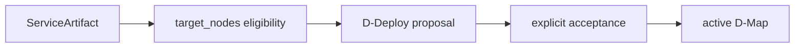
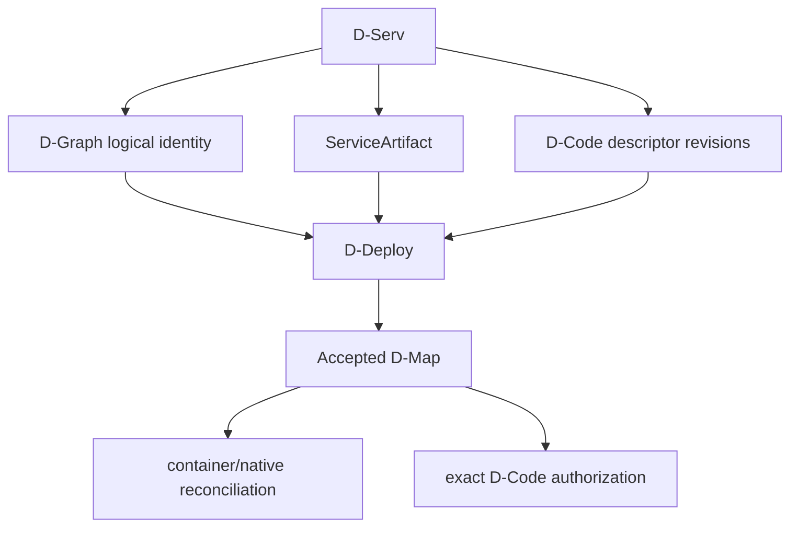

# Author software artifacts

DATUM v1 has two artifact families with different responsibilities. They are related, but they are **not interchangeable representations of the same authority**.

## Quick comparison

| Question | `ServiceArtifact` | `datum.dserv-artifact/1` |
|---|---|---|
| Primary role | Operational deployment/reconciliation descriptor | Canonical host-independent D-Code descriptor |
| Runtime form | Container or native process | Content-addressed WASM |
| Project-scoped | Yes | Application/D-Serv scoped |
| Used by current D-Deploy operational eligibility | Yes | Exact D-Code revision binding participates in governed code execution |
| Stores executable bytes in DServer | No | No |

## Path A — operational `ServiceArtifact`

A ServiceArtifact describes how long-running software can be realized on a node.

Typical container fields include:

- `artifact_id` and `service_id`;
- `runtime.kind = container`;
- container name and image;
- `image_source_kind`;
- ports, network aliases, volumes and read-only configuration mounts;
- execution/health/availability probes;
- `target_nodes` eligibility;
- dependencies, bindings and secret references;
- lifecycle allowlist keys;
- server-owned execution generation/projection identity.

### Register

```sh
curl -fsS -X POST \
  "$DSERVER_URL/api/v1/service-artifacts" \
  -H "X-Datum-Project: $PROJECT_ID" \
  -H 'content-type: application/json' \
  --data-binary @service-artifact.json
```

### Image identity

For registry-backed images, resolve immutable OCI identity through the server-owned operation:

```text
POST /api/v1/service-artifacts/:artifact_id/image-identity/resolve
```

Do not fabricate `resolved_image_identity` in the normal create/update payload.

### `target_nodes` is eligibility, not placement



Once placement is accepted, the active D-Map is the placement source of truth.

### Native process

A native-process ServiceArtifact uses:

```text
runtime.kind = native_process
control_plane.acquisition.kind = native_process_executable
control_plane.acquisition.source = absolute Linux source path
control_plane.acquisition.sha256 = exact lowercase content digest
```

The managed runtime verifies/materializes exact content before execution. Package-manager acquisition itself is not implemented yet.

## Path B — canonical D-Code artifact

`datum.dserv-artifact/1` binds one D-Serv revision to exact WASM content and the current `datum-dnode/0` ABI.

### Required ABI exports

```text
memory
datum_abi_version
datum_alloc
datum_dealloc
datum_handle
```

The current runtime expects no host imports. Guest code is isolated and receives resource limits such as fuel, timeout, memory-page, message-size and emit-count bounds.

### Content identity

The descriptor carries matching forms of the module identity:

```text
datum-blob://sha256/<hex>
sha256:<hex>
sha256:<hex>
```

for URI, SHA-256 and content ID respectively.

Compute exact module bytes:

```sh
SHA256=$(sha256sum build/hello.wasm | awk '{print $1}')
SIZE_BYTES=$(wc -c < build/hello.wasm | tr -d ' ')
```

### Register immutable descriptor revisions

```sh
curl -fsS -X POST \
  "$DSERVER_URL/api/v1/dcode/artifacts" \
  -H 'content-type: application/json' \
  --data-binary @hello-dcode-artifact.json
```

Registry identity is:

```text
(application_id, dserv_id, descriptor_digest)
```

That means multiple immutable revisions can coexist:

```text
logical D-Serv
├─ descriptor D1 → module H1
├─ descriptor D2 → module H2
└─ descriptor D3 → module H3
```

Registering D3 does not activate D3. Current D-Deploy/D-Map authority selects the exact revision used for governed execution.

### Exact versus logical lookup

Logical lookup:

```text
GET /api/v1/dcode/artifacts/:application_id/:dserv_id
```

fails closed with an ambiguity response when multiple revisions exist.

Governed execution uses exact lookup:

```text
GET /api/v1/dcode/artifacts/:application_id/:dserv_id/:descriptor_digest
```

There is no implicit “latest” selection.

### Install module bytes on the D-Node

```sh
cargo run --locked --manifest-path DATUM/Cargo.toml \
  --bin smartsentinel-dcode-install -- \
  --module-path build/hello.wasm \
  --declared-sha256 "$SHA256" \
  --store-root "$DNODE_ROOT"
```

The installer verifies actual bytes before content-addressed installation.

Automatic D-Code module distribution is **not implemented yet**. Registration in DServer and local byte installation are deliberately separate.

## How the two paths meet placement



A service can need both operational artifact information and canonical D-Code identity because placement, host realization and application-code identity are separate concerns.

## Practical recommendation

If you are onboarding an existing daemon/container, start with [Model an existing service](model-existing-service.md).

If you are building application D-Code, use the D-Script/D-Compile/D-Code path and the [DCompile/D-Code API reference](../reference/dcompile-dcode-api.md).

## Sources

See [Sources and provenance](../reference/sources.md) for current ServiceArtifact, D-Code descriptor, registry, ABI and runtime source anchors.
