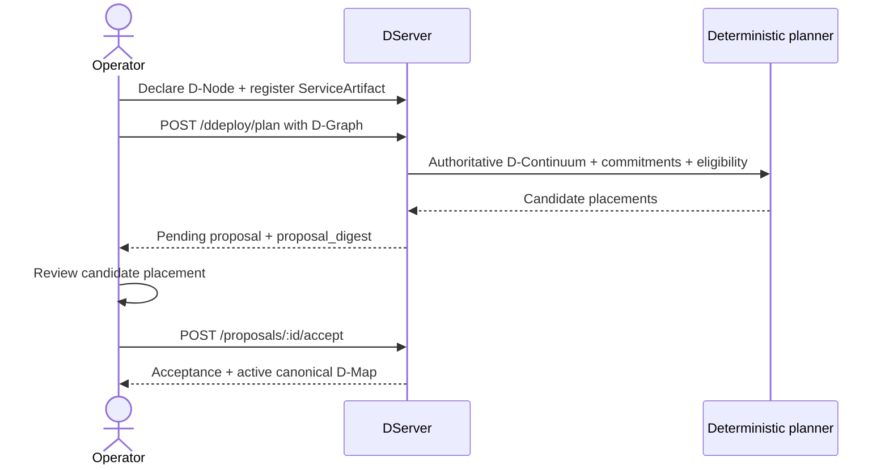
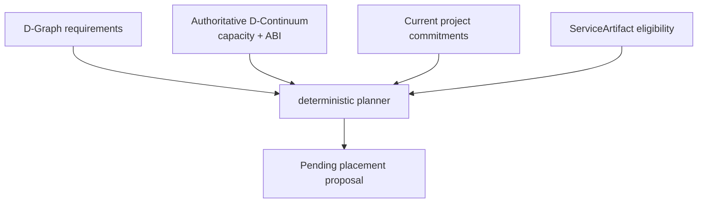
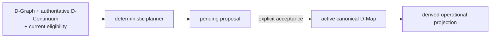
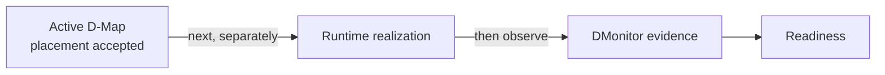

# Basic governed deploy

This tutorial creates a real **accepted placement authority** using the current D-Deploy v1 workflow. It starts from one structural D-Node, one matching `ServiceArtifact` and one canonical D-Graph.

!!! important
    Completing this page means DServer has accepted a canonical D-Map. It does **not** mean the target container/process/WASM is already running. Runtime realization is the next tutorial.

## See the whole control-plane exchange



The review/accept step is deliberately visible. Planning is not authority.

## Prerequisites

Complete these first:

- [install from source](install.md);
- [configure identities and declare `tutorial-node`](configure.md);
- [register `artifact:hello-service`](artifacts.md);
- [create `tutorial-dgraph.json`](dgraph.md).

Then set:

```sh
export DSERVER_URL=http://127.0.0.1:8080
export PROJECT_ID=tutorial-project
export APPLICATION_ID=app:tutorial
```

## 1. Check the inputs

Structural node:

```sh
curl -fsS "$DSERVER_URL/api/v1/dnodes/tutorial-node"
```

Authoritative D-Continuum:

```sh
curl -fsS \
  "$DSERVER_URL/api/v1/dcontinuum/authoritative" \
  -H "X-Datum-Project: $PROJECT_ID"
```

Project artifact:

```sh
curl -fsS \
  "$DSERVER_URL/api/v1/service-artifacts" \
  -H "X-Datum-Project: $PROJECT_ID"
```

Before planning, verify mentally that:

- D-Graph `service_id == hello-service`;
- exactly one ServiceArtifact resolves `hello-service`;
- its `target_nodes` includes `tutorial-node`;
- `target_stages` is empty;
- `tutorial-node` supports `datum-dnode/0`;
- the service's declared CPU/memory requirement fits the node's structural capacity.

## 2. Build the planning request

The deterministic planner endpoint deliberately has a small caller-controlled surface. It accepts `application_id` and the D-Graph; it derives structural D-Continuum, current commitments, eligibility and placement itself.

Create `plan-request.json`:

```json
{
  "application_id": "app:tutorial",
  "dgraph": {
    "schema": "datum.dgraph/1",
    "application_id": "app:tutorial",
    "dgraph_id": "dgraph:tutorial",
    "revision": 1,
    "services": [
      {
        "service_id": "hello-service",
        "execution_requirement": {
          "dnode_abi": "datum-dnode/0"
        },
        "resource_requirement": {
          "cpu_cores": 1,
          "memory_bytes": 134217728
        }
      }
    ],
    "calls": []
  }
}
```

## 3. Ask DServer to plan

```sh
curl -fsS -X POST \
  "$DSERVER_URL/api/v1/ddeploy/plan" \
  -H "X-Datum-Project: $PROJECT_ID" \
  -H 'content-type: application/json' \
  --data-binary @plan-request.json \
  | tee plan-response.json
```

A successful response creates a **pending** proposal. Important fields include:

- `proposal.proposal_id` — immutable proposal identity;
- `proposal_digest` — server-owned digest of immutable proposal semantics;
- `proposal.placements` — candidate D-Serv placements;
- `placement_provenance` — deterministic planner/policy provenance;
- `state` — `pending` at this point.

## What the deterministic planner did



The current planner is a pure deterministic structural planner. It does not read live CPU usage, DMonitor health, randomness or AI output.

It considers:

1. D-Graph service resource requirements;
2. authoritative D-Continuum structural capacity/ABI support;
3. structural capacity already committed by other active applications in the project;
4. current ServiceArtifact node eligibility.

It orders services deterministically and selects from feasible candidates using the implemented residual-capacity policy and deterministic tie-breaking. The output is a proposal candidate, never authority.

## 4. Review before accepting

Pretty-print the proposal if `jq` is available:

```sh
jq '.proposal, .placement_provenance' plan-response.json
```

For this one-node tutorial you should expect `hello-service` to be proposed on `tutorial-node` if all constraints match.

Do not automate acceptance merely because planning returned 201. The architecture intentionally makes proposal and acceptance separate state transitions.

## 5. Capture proposal identity

With `jq`:

```sh
PROPOSAL_ID=$(jq -r '.proposal.proposal_id' plan-response.json)
PROPOSAL_DIGEST=$(jq -r '.proposal_digest' plan-response.json)
```

Without `jq`, copy those two values manually.

You can re-read the pending proposal:

```sh
curl -fsS \
  "$DSERVER_URL/api/v1/ddeploy/proposals/$PROPOSAL_ID" \
  -H "X-Datum-Project: $PROJECT_ID"
```

## 6. Explicitly accept the proposal

Create the acceptance request:

```sh
jq -n --arg digest "$PROPOSAL_DIGEST" \
  '{accepted_by:"tutorial-operator", expected_proposal_digest:$digest}' \
  > accept-request.json
```

Or create equivalent JSON manually:

```json
{
  "accepted_by": "tutorial-operator",
  "expected_proposal_digest": "sha256:..."
}
```

Then accept:

```sh
curl -fsS -X POST \
  "$DSERVER_URL/api/v1/ddeploy/proposals/$PROPOSAL_ID/accept" \
  -H "X-Datum-Project: $PROJECT_ID" \
  -H 'content-type: application/json' \
  --data-binary @accept-request.json \
  | tee acceptance.json
```

`accepted_by` is a caller-supplied audit label. The baseline does not provide application-layer authentication that turns it into a cryptographically verified operator identity.

## 7. What changed at acceptance

Only explicit acceptance materializes and activates canonical placement. The response includes the acceptance record and materialized D-Map.



The accepted D-Map becomes the placement authority. `ServiceArtifact.target_nodes` no longer overrides an already-accepted placement.

## 8. Read the active authority

```sh
curl -fsS -G \
  "$DSERVER_URL/api/v1/ddeploy/active" \
  -H "X-Datum-Project: $PROJECT_ID" \
  --data-urlencode "application_id=$APPLICATION_ID" \
  | tee active-deployment.json
```

Inspect:

- `active_dmap`;
- D-Map revision/digest;
- proposal/acceptance identity;
- accepted timestamp;
- operational projection identity/revision.

## 9. Understand fail-closed acceptance

Acceptance revalidates current authority. A pending proposal can fail later if the structural D-Node registry changed, its expected active D-Map revision became stale, current ServiceArtifact eligibility changed, or project-wide structural commitments would exceed current capacity.

This is intentional: a proposal says “this candidate was valid under these captured/derived facts,” not “activate me regardless of what changed afterward.”

## 10. You have not started the software yet



At this point the basic deployment is **accepted**, but runtime realization remains separate.

For a container/native process, continue with [runtime realization](runtime-realization.md) and the operational reconciliation path.

For canonical D-Code, you additionally need the canonical D-Serv artifact, node-local WASM bytes and governed invocation path described there.

## Source trail

- [D-Deploy API](https://github.com/dnredson/datum/blob/3e0baa8f415b822f69eef86c0cbfe2a3681e3a65/dserver/src/api/ddeploy.rs)
- [D-Deploy core](https://github.com/dnredson/datum/blob/3e0baa8f415b822f69eef86c0cbfe2a3681e3a65/dserver/src/core/ddeploy.rs)
- [Deterministic placement](https://github.com/dnredson/datum/blob/3e0baa8f415b822f69eef86c0cbfe2a3681e3a65/dserver/src/core/canonical_placement.rs)