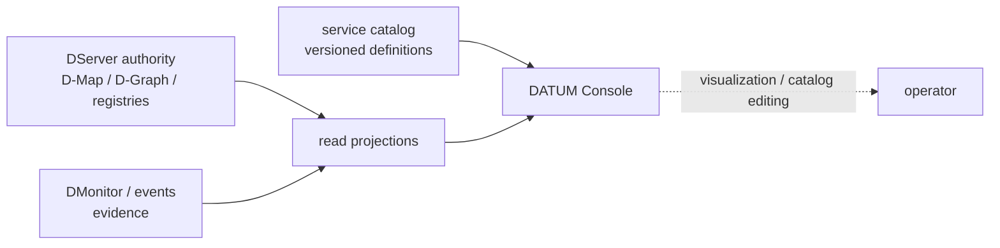

# DATUM Console tutorial

DATUM Console is the graphical operator interface for DATUM v1. It combines **read projections**, accepted logical application structure, admitted runtime evidence and reusable catalog definitions without replacing the DServer domains that own those facts.

This tutorial shows how to start the Console and how to read each implemented screen correctly.

## 1. Understand the boundary first



The Console does **not** infer placement from a drawn node, health from a color, or execution from the existence of a service definition. Project navigation identifies a requested scope; it is not itself authorization.

## 2. Prerequisites

You need:

- a DATUM source checkout at the documented source revision;
- Node.js `>=22.12.0`;
- npm;
- a reachable DServer for live data.

The current frontend uses TypeScript, Vite, Bootstrap, Bootstrap Icons and Cytoscape.

For a reproducible checkout:

```sh
git clone https://github.com/dnredson/datum.git
cd datum
git checkout --detach 7a79bd84bc05a1ea18870715cc033567ff472afc
```

## 3. Install Console dependencies

```sh
cd console
npm ci
```

Useful commands are:

```sh
npm run dev
npm run build
npm run preview
npm test
```

`npm run build` performs TypeScript checking before the Vite build.

## 4. Point the Console at DServer

The development server listens on `127.0.0.1:5173` and proxies `/api` requests to DServer.

If DServer runs on the default local address `http://127.0.0.1:8080`, no extra setting is required.

If it runs elsewhere, set `DATUM_DEV_API_TARGET` before starting the frontend.

Linux/macOS:

```sh
export DATUM_DEV_API_TARGET=http://127.0.0.1:8134
npm run dev
```

Windows PowerShell:

```powershell
$env:DATUM_DEV_API_TARGET = "http://127.0.0.1:8134"
npm run dev
```

Then open:

```text
http://127.0.0.1:5173/
```

The Vite preview server is a local integration tool, not a production hosting recommendation.

## 5. Learn the current route map

| Console route | Purpose |
|---|---|
| `/` | global operational overview |
| `/projects` | project navigation/discovery |
| `/projects/:project_id` | scoped project workspace |
| `/projects/:project_id/graph` | accepted logical graph plus separately presented runtime evidence |
| `/catalog` | global reusable Artifact & Service Catalog |

Dedicated routed pages for project Placement, Deploy, Runtime and History are not implemented yet. Some facts from those domains already appear in the project overview and graph projections.

## 6. Read the global overview

The global overview is an operator summary, not a canonical global-health object. Treat its counts and attention items as bounded projections over the sources available to DServer.

When a source is unavailable or corrupt, the UI is expected to preserve that distinction rather than silently turning missing data into zero or healthy state.

From the overview, use **Projects** to move into a narrower project context.

## 7. Browse projects

The project list is a navigation/discovery surface. A discovered project reference can come from operational sources; the route does not prove that there is one canonical project registry record.

This distinction matters:

```text
project appears in Console
        ≠
route grants authority
        ≠
all project sources are complete
```

Select a project to enter its workspace.

## 8. Read the project workspace

The project workspace is explicitly a **read-only operational context**. It can include:

- known application references with provenance;
- active alerts/attention;
- resolved-but-pending-close alert context;
- recent events;
- monitoring subjects/temporal context;
- accepted D-Map references;
- source/read issues;
- source coverage and completeness information.

### Known applications are discovered references

A listed application is not automatically a canonical application-registry row. Inspect the provenance shown by the UI: accepted placement, operational graph, DMonitor evidence, event/alert references and other sources remain independent.

### Attention is not a project health score

An active-alert count answers “how much active attention is represented in this loaded projection?” It does not answer “is this whole project unhealthy?” Likewise, zero loaded alerts is not proof that every runtime is healthy.

### Accepted placement is not runtime

An accepted D-Map reference means placement authority exists. It does not prove that the required process/container/WASM currently exists on the node.

## 9. Open the project graph

Navigate to:

```text
/projects/<project_id>/graph
```

The graph page presents two deliberately separated layers:

1. **accepted logical structure** from active accepted D-Graph snapshots;
2. **admitted D-Serv realization evidence** from DMonitor, when available.

The page is not a complete runtime topology, application registry or placement editor.

## 10. Understand the graph language

The graphical vocabulary is presentation semantics, not new domain authority.

### Entity categories

| Visual category | Meaning |
|---|---|
| Logical software | D-Serv or another explicitly mapped logical software entity; not a runtime instance |
| Runtime realization | observed/realized runtime evidence kept distinct from logical software |
| Infrastructure | execution resource; not ownership of the project/application |
| Data / storage | explicitly modeled storage entity |
| IoT / device | explicitly modeled device entity |

Only categories actually backed by the loaded typed sources should appear as active legend entries.

### Relationship categories

| Relation | Meaning |
|---|---|
| D-Call / logical | directed logical invocation; cycles, reciprocal calls and self-calls are legal |
| realization | logical service → realization evidence |
| placement | workload/runtime → resource when an explicit placement source is being shown |
| physical/network | explicit physical relationship only |
| observation/monitoring | observational provenance, never logical invocation |

A logical arrow does not imply deployment order or physical connectivity.

## 11. Expand a service into runtime evidence

When admitted D-Serv realization evidence is available, the graph can associate it with a logical service using exact project/application/service identity from the loaded accepted snapshot.

The evidence view can expose:

- project/application/service/node identity;
- observation ID and digest;
- collector;
- source observation time;
- server receipt time;
- monitor epoch;
- reporting node;
- health claim at observation time;
- optional observed D-Map reference;
- temporal quality/freshness interpretation where available.

Do not reinterpret these fields:

- `monitor_instance_id` is a monitor epoch, **not** a canonical execution-instance ID;
- an observed D-Map reference is not a convergence verdict;
- health reported at observation time is not current readiness;
- evidence associated with a D-Serv does not create placement authority;
- no loaded evidence does not mean stopped, failed or healthy.

### Partial evidence previews

Runtime evidence is bounded. The current projection can report partial completeness and the UI surfaces that condition explicitly. If the budget is reached, absence from the preview must not be treated as absence from reality.

## 12. Filter and inspect the logical graph

The graph workspace supports:

- application-snapshot filtering;
- Fit graph;
- reset selection/view;
- entity/D-Call selection;
- a details pane with canonical IDs, D-Graph identity/revision/digest and acceptance reference;
- an accessible keyboard-oriented structure list as an alternative to the canvas.

Application grouping on the canvas is presentation-only. It is not an extra canonical graph vertex.

## 13. Open the Artifact & Service Catalog

Navigate to:

```text
/catalog
```

The catalog is global reusable modeling data. It is **not** a list of running services, project usage or deployment authority.

The current editor supports reusable service definitions with:

- atomic or composite service shape;
- exact pinned operational artifact identity for atomic definitions;
- container or native-process runtime identity inherited from that artifact;
- dedicated/shared/system tenancy capability;
- optional tenant unit for tenant-aware services;
- CPU, memory and storage requirements;
- hardware/resource capability requirements such as network interface, device, P4 port or GPU;
- health-check intent;
- DMonitor realization-evidence cadence intent;
- secret references and versions, never secret values;
- exact dependency definition revisions;
- required/provided service capabilities;
- static composite component references; or
- declarative Docker Compose/repository metadata for discovered composite structure.

## 14. Create an atomic service definition

For an atomic service:

1. choose **Create service definition**;
2. set a stable Definition ID and human-readable name;
3. keep Service shape = **Atomic**;
4. select a currently pinned artifact reference;
5. inspect the read-only artifact identity shown by the editor;
6. choose tenancy/resource/health/monitoring metadata as appropriate;
7. add exact dependencies/capabilities/secrets by reference when needed;
8. review the definition;
9. save it.

The artifact pin captures exact source identity such as project, artifact ID, execution generation and execution projection digest. For a container it also preserves resolved OCI execution identity; for a native process it preserves the executable SHA-256.

Saving the definition does **not** deploy the service.

## 15. Create a composite service definition

Composite definitions describe a reusable service made of other service definitions.

Two composition modes are modeled:

### Static composition

Reference component definitions by exact definition ID + exact revision.

### Discovered composition

Declare Docker Compose file paths together with immutable repository metadata and a command argv description.

The current catalog stores these as **declarations only**. It does not clone repositories, parse Compose files, execute commands or provision the composite workload.

## 16. Revise rather than mutate

Catalog definitions are versioned. Editing an existing service creates a **new immutable revision**. Exact historical revisions remain retrievable.

A save carries the expected current revision. If the source artifact or catalog revision changed underneath the editor, the server fails closed with a conflict instead of silently overwriting the newer state.

There is no delete operation in the current catalog API.

## 17. Understand catalog persistence

The service catalog has its own persistence boundary. DServer uses `DATUM_SERVICE_CATALOG_DB_PATH` for the catalog database. It must not silently reuse execution/control-state or event databases.

If catalog persistence is not configured or cannot be accessed, catalog routes return a safe unavailable response; there is no hidden in-memory persistence fallback.

## 18. What the Console does not do yet

The published Console does not currently provide dedicated routed pages for:

- placement proposal authoring/review;
- D-Deploy acceptance actions;
- node runtime mutation controls;
- migration/history workflows.

The service catalog does not create runtime instances, tenant bindings, requirement bindings or deployments.

A live external AI service-modeling provider is also not part of this pinned source revision. Service definitions in this version are operator-authored through the catalog editor.

## 19. Production mental model

```text
Console shows a graph         ≠ graph creates authority
Console shows evidence        ≠ evidence creates placement
Catalog definition saved      ≠ service deployed
Accepted D-Map shown          ≠ runtime proven
Observed health shown         ≠ Ready
Missing evidence              ≠ failure or success
```

That separation is the main rule for reading the DATUM Console correctly.

## Sources

- [Console package and runtime requirements](https://github.com/dnredson/datum/blob/7a79bd84bc05a1ea18870715cc033567ff472afc/console/package.json)
- [Vite proxy configuration](https://github.com/dnredson/datum/blob/7a79bd84bc05a1ea18870715cc033567ff472afc/console/vite.config.ts)
- [Console router](https://github.com/dnredson/datum/blob/7a79bd84bc05a1ea18870715cc033567ff472afc/console/src/app/router.ts)
- [project workspace](https://github.com/dnredson/datum/blob/7a79bd84bc05a1ea18870715cc033567ff472afc/console/src/pages/project-workspace.ts)
- [project graph](https://github.com/dnredson/datum/blob/7a79bd84bc05a1ea18870715cc033567ff472afc/console/src/pages/project-graph.ts)
- [graph visual semantics](https://github.com/dnredson/datum/blob/7a79bd84bc05a1ea18870715cc033567ff472afc/console/src/components/graph-visuals.ts)
- [catalog UI](https://github.com/dnredson/datum/blob/7a79bd84bc05a1ea18870715cc033567ff472afc/console/src/pages/catalog.ts)
