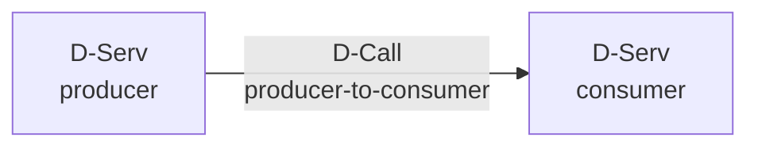
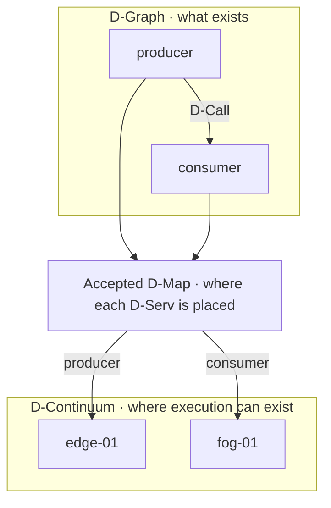
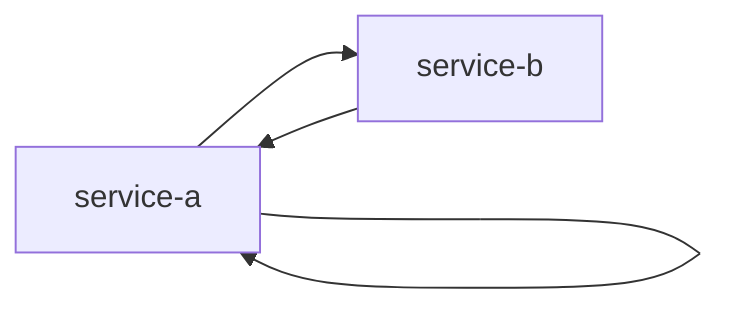

# Create a valid D-Graph

A D-Graph describes **what the application is**, not where it runs. In the canonical `datum.dgraph/1` model, vertices are D-Servs and edges are D-Calls. Placement belongs to D-Map/D-Deploy; host/runtime health belongs to DMonitor evidence.

## See the idea before the JSON



That is a complete conceptual D-Graph: services plus semantic calls. There is intentionally no node, container, IP address or process in the picture.

## The minimal contract

A D-Graph contains:

```text
schema
application_id
dgraph_id
revision
services[]
calls[]
```

Each service declares a host-independent D-Node ABI requirement and static resource requirements. Each call names a declared source and target service.

## 1. Create a single-service graph

Create `tutorial-dgraph.json`:

```json
{
  "schema": "datum.dgraph/1",
  "application_id": "app:tutorial",
  "dgraph_id": "dgraph:tutorial",
  "revision": 1,
  "services": [
    {
      "service_id": "hello-service",
      "execution_requirement": {
        "dnode_abi": "datum-dnode/0"
      },
      "resource_requirement": {
        "cpu_cores": 1,
        "memory_bytes": 134217728
      }
    }
  ],
  "calls": []
}
```

This is intentionally small. It says the application has one service requiring one CPU core, 128 MiB of structural memory capacity and the current `datum-dnode/0` ABI. It says nothing about Docker, process names, IP addresses, health, or which node must host the service.

## 2. Understand every identity

`application_id` identifies the application semantics. It is not a project ID.

`dgraph_id` identifies this graph lineage. `revision` is the graph revision and must be at least 1.

`service_id` is the canonical D-Serv identity used by placement and D-Call references. For the current D-Deploy v1 flow, exactly one project-scoped `ServiceArtifact` must resolve this service ID before a real proposal can validate/accept.

## 3. Add a second service and a call

For a two-service application:

```json
{
  "schema": "datum.dgraph/1",
  "application_id": "app:tutorial-pipeline",
  "dgraph_id": "dgraph:tutorial-pipeline",
  "revision": 1,
  "services": [
    {
      "service_id": "producer",
      "execution_requirement": {"dnode_abi": "datum-dnode/0"},
      "resource_requirement": {"cpu_cores": 1, "memory_bytes": 134217728}
    },
    {
      "service_id": "consumer",
      "execution_requirement": {"dnode_abi": "datum-dnode/0"},
      "resource_requirement": {"cpu_cores": 1, "memory_bytes": 134217728}
    }
  ],
  "calls": [
    {
      "call_id": "producer-to-consumer",
      "source_service_id": "producer",
      "target_service_id": "consumer"
    }
  ]
}
```

A canonical D-Call does not embed a destination node or container endpoint. Runtime routing is derived later from accepted placement and artifact/transport authority.

## D-Graph versus D-Map



The top graph does not change merely because the placement below changes.

## Validation rules that matter immediately

- `schema` must be exactly `datum.dgraph/1`.
- `application_id` and `dgraph_id` must be non-empty.
- `revision >= 1`.
- every `service_id` must be non-empty and unique;
- the current accepted D-Node ABI requirement is `datum-dnode/0`;
- each service needs at least one CPU core and one byte of declared memory requirement;
- every `call_id` must be non-empty and unique;
- every call source/target must name a declared service.

### Cycles are legal



Do not impose a DAG rule that the canonical contract does not have. A two-service cycle and even a self-call are legal D-Graph structures. Validation rejects dangling call endpoints, not cycles.

## Examples of invalid graphs

### Dangling call

```json
{
  "call_id": "bad",
  "source_service_id": "hello-service",
  "target_service_id": "does-not-exist"
}
```

The target is not a declared D-Serv, so validation fails.

### Placement leaked into the graph

A field such as `node_id`, `container_name` or `host` on a D-Serv is conceptually wrong even before considering deserialization rules. A D-Graph is placement-free. Put placement in D-Map, and put operational realization details in the appropriate artifact/runtime domain.

### Live capacity used as resource requirement

`resource_requirement` is the service's static requirement. Do not set it from current CPU utilization/free memory telemetry. Placement feasibility compares declared requirements against declared D-Node structural capacity.

## Digests and ordering

DATUM computes canonical contract identity using JCS + SHA-256. For D-Graph digest computation, `services` and `calls` are treated as unordered semantic sets keyed by their IDs: a deterministic sorted copy is hashed, so simply reordering the arrays does not change semantic digest identity.

Do not hand-author a digest inside this D-Graph: the D-Graph wire object has no self-referential digest field. D-Deploy computes exact references when it creates a proposal.

## How D-Deploy consumes the graph

The simplest current workflow is `POST /api/v1/ddeploy/plan`. The caller supplies only `application_id` and the D-Graph. DServer derives the authoritative D-Continuum, current project commitments, current `ServiceArtifact` eligibility and candidate placements itself. The resulting proposal remains pending until explicit acceptance.

Continue with [the basic deploy tutorial](basic-deploy.md) after registering the required artifact described in [authoring software artifacts](artifacts.md).

## Source trail

- [Canonical D-Graph model](https://github.com/dnredson/datum/blob/3e0baa8f415b822f69eef86c0cbfe2a3681e3a65/DATUM/src/agent/canonical_dgraph.rs)
- [DServer D-Graph mirror](https://github.com/dnredson/datum/blob/3e0baa8f415b822f69eef86c0cbfe2a3681e3a65/dserver/src/core/canonical_dgraph.rs)
- [D-Deploy planner API](https://github.com/dnredson/datum/blob/3e0baa8f415b822f69eef86c0cbfe2a3681e3a65/dserver/src/api/ddeploy.rs)