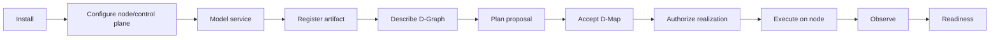
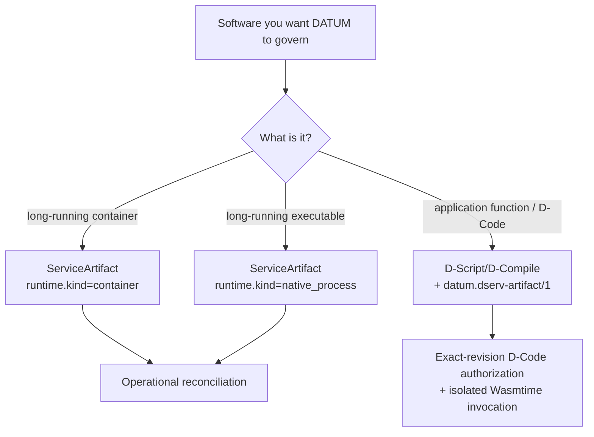
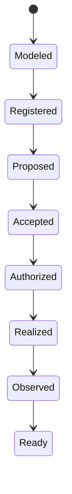

# Tutorials

These tutorials describe DATUM v1 and keep **modeling, authority, realization and evidence** as separate steps.

!!! important "What 'deploy' means"
    DATUM does not use one overloaded `deployed=true` fact. A service can be modeled, registered, proposed, accepted, authorized, realized, observed and Ready at different times. D-Deploy acceptance creates placement authority; it does not by itself copy a WASM module, pull/start a container, materialize a native executable or prove health.

## Start with the full journey

## Recommended path

1. [Install from source](install.md) — build DServer and DATUM/SmartSentinel tooling.
2. [Configure components](configure.md) — project scope, DServer state, structural D-Nodes and local identities.
3. [Model an existing service](model-existing-service.md) — translate container/native software facts into a `ServiceArtifact`; see Mosquitto, PostgreSQL, a local simulator and repository-installed native software.
4. [Author software artifacts](artifacts.md) — understand `ServiceArtifact` versus canonical `datum.dserv-artifact/1` and their current identity/governance roles.
5. [Create a D-Graph](dgraph.md) — describe logical D-Serv/D-Call structure without embedding placement.
6. [Perform a basic governed deploy](basic-deploy.md) — create/review a placement proposal and explicitly accept its D-Map.
7. [Follow Mosquitto end to end](mosquitto-end-to-end.md) — real catalog artifact → pinning → D-Graph → D-Deploy → finite reconcile authorization → running container.
8. [Use the reusable service-to-node lifecycle](service-to-node.md) — generic checklist for adding another service and understanding every state boundary.
9. [Understand runtime realization](runtime-realization.md) — compare operational container/native realization with governed D-Code execution, migration and cleanup.
10. [Troubleshoot common failures](troubleshooting.md) — map failures back to the authority/identity gate that refused them.

Need the architecture before commands? Start with the [Visual guide](../concepts/visual-guide.md), [WebAssembly and D-Code](../concepts/webassembly-and-dcode.md), or [software component model](../architecture/software-components.md).

## Pick the right software path

### Container/native operational software

A `ServiceArtifact` is project-scoped. It describes desired runtime realization, acquisition identity, configuration, ports/volumes, dependencies, probes, secrets and governed lifecycle metadata. D-Deploy also uses current artifact resolution/eligibility in the canonical placement workflow.

The node-side operational reconciler executes host mutations only after separate authorization/local enforcement gates succeed.

### Canonical D-Code

`datum.dserv-artifact/1` is host-independent application-code identity. DServer keeps immutable descriptor revisions; `.wasm` bytes remain in a D-Node-local content-addressed store. A fresh authorization selects the exact currently active descriptor revision immediately before invocation.

## Concrete catalog examples

The current implementation repository includes a versioned operational artifact catalog. Useful examples include:

| Artifact | What it teaches |
|---|---|
| Mosquitto | ports, config mount, execution/health/availability probes, registry image |
| ChirpStack PostgreSQL | persistent volume, init config, non-secret bindings, secret reference |
| LoRa device simulator | `local_build` image classification, dependency, secret references |
| ChirpStack/Gateway Bridge/Redis/etc. | larger multi-service dependency compositions |

The catalog is real implementation material, but its historical lab `target_nodes`/`target_stages` values are not automatically correct for your new continuum. Model the service facts, then adapt eligibility deliberately.

## One service can pass through many valid states

This diagram is a learning model, not a new persisted DATUM state machine. For example, a service can be Realized but later become NotReady because evidence becomes stale.

## Why this matters for the future dashboard

The architecture already offers better UI semantics than a single “running/not running” badge. The DATUM Console can show independent facts such as:

- artifact registered and execution identity complete;
- current proposal versus current accepted D-Map;
- assigned node;
- current reconciliation/D-Code authorization;
- runtime realization;
- observed health/evidence freshness;
- readiness;
- migration target realization and source cleanup.

The dashboard will be implemented separately. Its governing rule should be: **visualize existing authority/evidence; do not create a second competing source of truth in the UI.**

## Source and evidence boundary

Current-source additions in this tutorial set are pinned to DATUM v1 implementation commit `c08ccc4d715d9eb76644e3f1bd7d80a7945265c4`. Older pages may retain older immutable source links when they document evidence produced by that exact code. The documentation build validates links/navigation/rendering; it does not rerun the implementation test suite or physical-node proofs.

See [sources and provenance](../reference/sources.md) and [status and limitations](../overview/status.md).
