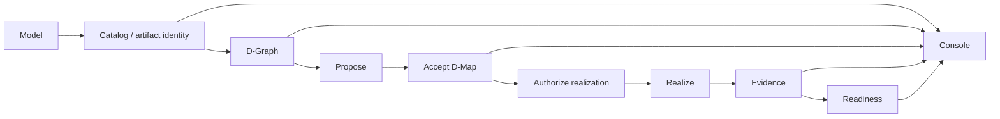
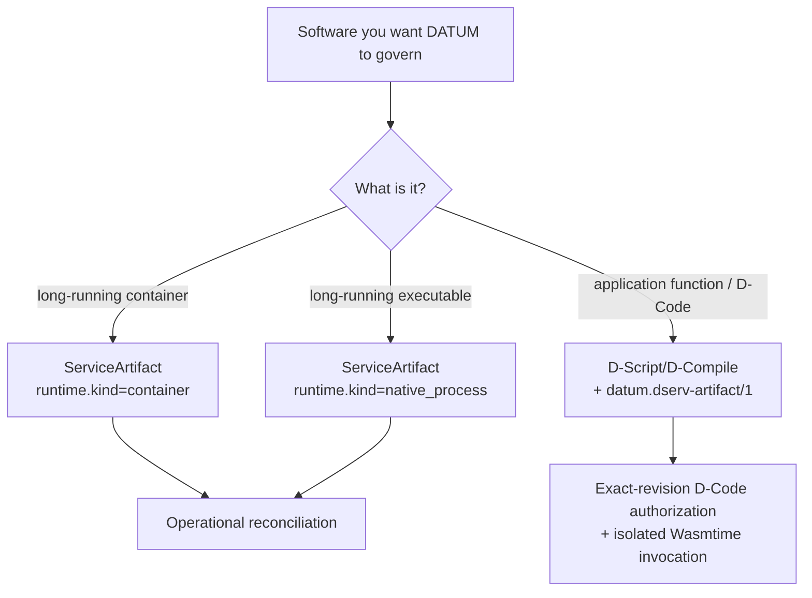

# Tutorials

These tutorials describe the current **DATUM v1** implementation and keep **modeling, authority, realization, evidence and presentation** as separate steps.

!!! important "What the graphical interface means"
    The DATUM Console is a presentation/composition layer. It can show accepted authority, catalog definitions and runtime evidence together, but it does not make a visual edge, badge or page into new canonical authority.

## Recommended paths

### Graphical operator path

1. [DATUM Console](datum-console.md) — run the interface, browse projects, inspect logical/runtime graph views and use the catalog.
2. [Model an existing service](model-existing-service.md) — understand the operational facts behind a service before cataloging or deploying it.
3. [Service model to node execution](service-to-node.md) — understand what must happen after modeling before software actually runs.
4. [Troubleshoot common failures](troubleshooting.md) — map failures to the authority/identity gate that refused them.

### Control-plane/runtime path

1. [Install from source](install.md).
2. [Configure components](configure.md).
3. [Author software artifacts](artifacts.md).
4. [Create a D-Graph](dgraph.md).
5. [Perform a basic governed deploy](basic-deploy.md).
6. [Follow Mosquitto end to end](mosquitto-end-to-end.md).
7. [Understand runtime realization](runtime-realization.md).

## Full lifecycle

The Console can visualize several boxes at once, but the boxes remain separate claims.

## Pick the right software path

## Source and evidence boundary

Current v1 material is grounded in implementation revision `7a79bd84bc05a1ea18870715cc033567ff472afc`. The documentation build validates links/navigation/rendering; it does not rerun the implementation test suite or physical-node validation.

See [sources and provenance](../reference/sources.md) and [status and limitations](../overview/status.md).
