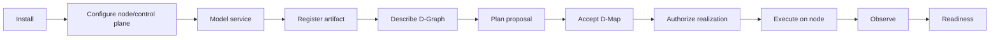
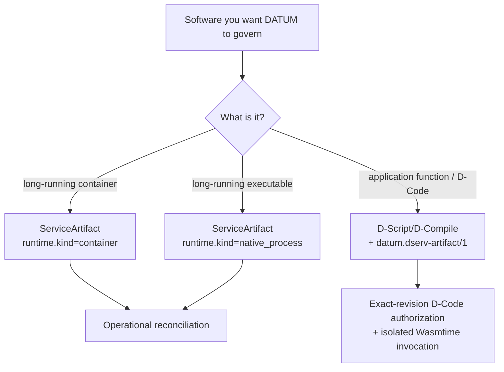
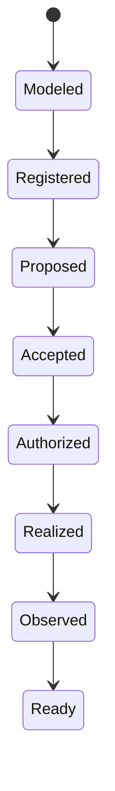

# Tutorials

These tutorials describe the current **DATUM v1** implementation and keep **modeling, authority, realization and evidence** as separate steps.

!!! important "What 'deploy' means"
    DATUM does not use one overloaded `deployed=true` fact. A service can be modeled, registered, proposed, accepted, authorized, realized, observed and Ready at different times. D-Deploy acceptance creates placement authority; it does not by itself copy a WASM module, pull/start a container, materialize a native executable or prove health.

## Start with the full journey

## Recommended path

1. [Install from source](install.md) — build DServer and DATUM/SmartSentinel tooling.
2. [Configure components](configure.md) — project scope, DServer state, structural D-Nodes and local identities.
3. [Model an existing service](model-existing-service.md) — translate container/native software facts into a `ServiceArtifact`.
4. [Author software artifacts](artifacts.md) — understand `ServiceArtifact` versus canonical `datum.dserv-artifact/1`.
5. [Create a D-Graph](dgraph.md) — describe logical D-Serv/D-Call structure without embedding placement.
6. [Perform a basic governed deploy](basic-deploy.md) — create/review a placement proposal and explicitly accept its D-Map.
7. [Follow Mosquitto end to end](mosquitto-end-to-end.md) — artifact → pinning → D-Graph → D-Deploy → finite reconciliation authorization → running container.
8. [Use the reusable service-to-node lifecycle](service-to-node.md) — generic checklist for another service.
9. [Understand runtime realization](runtime-realization.md) — compare container/native realization with governed D-Code execution, migration and cleanup.
10. [Troubleshoot common failures](troubleshooting.md) — map failures back to the authority/identity gate that refused them.

## Pick the right software path

## One service can pass through many valid states

This diagram is a learning/UI model, not a new persisted DATUM state machine. A service can be Realized but later become NotReady because evidence becomes stale.

## Dashboard direction

The management dashboard is not implemented yet. When implemented, it should visualize existing authority/evidence independently — artifact identity, proposal, accepted placement, authorization, realization, health, readiness and cleanup — rather than persist a second competing truth.

## Source and evidence boundary

Current v1 material is grounded in implementation revision `c08ccc4d715d9eb76644e3f1bd7d80a7945265c4`. Historical evidence links may remain at older immutable revisions when they document a specific earlier result. The documentation build validates links/navigation/rendering; it does not rerun the implementation test suite or physical-node validation.

See [sources and provenance](../reference/sources.md) and [status and limitations](../overview/status.md).
