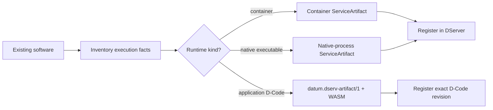
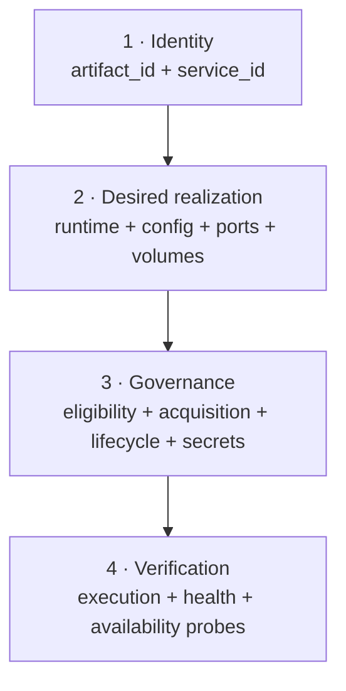
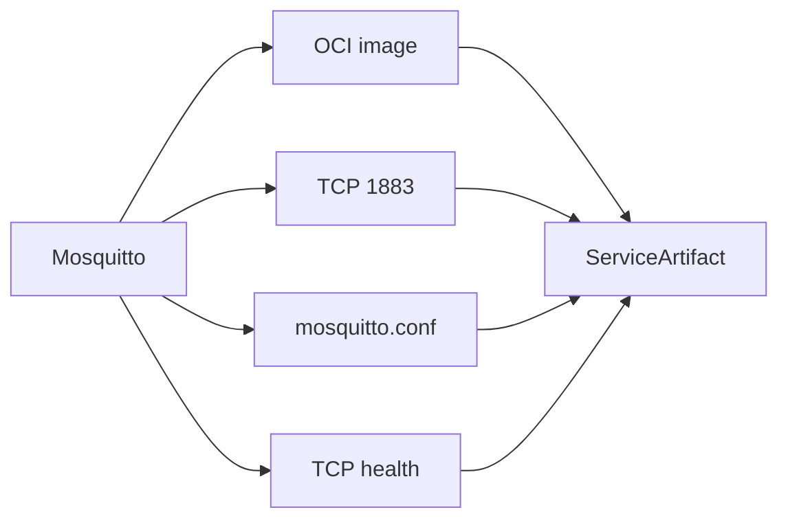
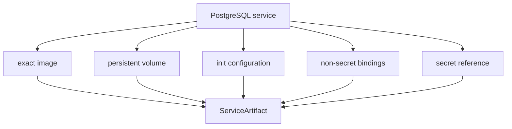
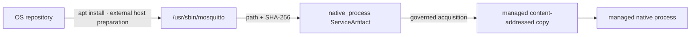

# Model an existing service

This tutorial starts before D-Deploy. The goal is to take software that already exists — a Docker image, a Linux daemon, a database, an MQTT broker, a simulator — and turn its execution requirements into a DATUM model that can later participate in governed deployment.

The key idea is simple:

> **Do not start by translating a `docker run` or an `apt install` command literally. Start by identifying the stable facts DATUM must govern.**

## From software to a model



For container/native operational software, the current deployment/reconciliation representation is a **`ServiceArtifact`**. Application D-Code uses the separate canonical **`datum.dserv-artifact/1`** contract.

## The modeling worksheet

Before writing JSON, answer these questions.

| Software fact | Question | DATUM representation |
|---|---|---|
| logical identity | What service is this? | `service_id`, `artifact_id`, metadata |
| runtime form | Container or managed native process? | `runtime.kind` |
| exact executable | Which image or binary bytes? | container image identity, or native `acquisition.source` + `sha256` |
| process/container identity | What is locally managed? | `container_name` or `process_name` |
| ports | What must be published? | `runtime.container.ports` |
| configuration | What files/arguments configure it? | container `configuration_mounts` / `command`, native `args` |
| state | Does it persist data? | container `volumes`; native state remains a host/runtime concern |
| dependencies | What should already exist? | `control_plane.dependencies` |
| non-secret settings | Which environment/config bindings are declared? | `control_plane.bindings` |
| secrets | Which values must never be embedded in the artifact? | `secret_refs` + `secret_bindings` |
| execution evidence | How do we know a process/container exists? | `probes.execution` |
| health | How do we know it is healthy? | `probes.health` / `health_checks` |
| availability | Can consumers reach it? | `probes.availability` |
| node eligibility | Which nodes are allowed candidates? | `target_nodes` |
| lifecycle | Which governed actions are required? | `control_plane.lifecycle` allowlist keys |
| mutation policy | May reconciliation mutate the host? | separate operational authorization + finite lease |

!!! important "Eligibility is not placement"
    `target_nodes` constrains which nodes may be considered while planning/validating. Once a D-Deploy proposal is explicitly accepted, the active D-Map is placement authority.

## A useful decomposition

Think of a `ServiceArtifact` as four layers:



This makes it easier to review an artifact. A JSON document can be structurally valid while still being operationally incomplete for a particular node or pinning mode.

## Example A — Mosquitto as a container

The implementation repository already contains a real Mosquitto artifact. Its important facts are:

```text
artifact_id: mosquitto
service_id: mqtt
runtime: container
container_name: datum-mosquitto
image: docker.io/library/eclipse-mosquitto@sha256:...
port: 1883/tcp -> 1883/tcp
network: datum-fog-net
configuration: mosquitto/mosquitto.conf -> /mosquitto/config/mosquitto.conf
execution probe: docker_container_running
health probe: tcp_connect 127.0.0.1:1883
availability probe: tcp_connect 127.0.0.1:1883
```

The modeling translation is therefore straightforward:



The checked-in artifact also defines governed lifecycle keys such as `verify_docker`, `pull_image`, `verify_configuration_mounts`, `start_container`, `verify_container_running`, and `remove_container`. These are **allowlist program keys**, not arbitrary host shell paths.

See the complete current source artifact: [Mosquitto catalog artifact](https://github.com/dnredson/datum/blob/c08ccc4d715d9eb76644e3f1bd7d80a7945265c4/artifacts/catalog/mosquitto.json).

## Example B — PostgreSQL adds persistent state and secrets

A database teaches two additional concepts that a stateless broker may not emphasize.

The current ChirpStack PostgreSQL artifact models:

- an OCI PostgreSQL image;
- a named writable Docker volume at `/var/lib/postgresql/data`;
- read-only initialization configuration;
- non-secret bindings for `POSTGRES_USER` and `POSTGRES_DB`;
- a secret reference for the database password.



This is a useful rule: **persistent data belongs in an explicit persistence model; credentials belong in secret references; neither should be hidden inside a container image or copied into ordinary metadata.**

See [ChirpStack PostgreSQL artifact](https://github.com/dnredson/datum/blob/c08ccc4d715d9eb76644e3f1bd7d80a7945265c4/artifacts/catalog/chirpstack-postgres.json).

## Example C — a locally built simulator

The LoRa device simulator artifact demonstrates another distinction. Its image is classified as:

```text
image_source_kind = local_build
```

That is deliberately different from `registry`. A locally built image cannot be made trustworthy merely by pretending it came from a registry and inspecting the local Docker daemon. In required pinning mode, the current implementation refuses to invent a registry identity for it.

The same artifact also shows:

- a dependency on `lora-packet-forwarder`;
- ordinary bindings such as target host/port and interval;
- secret references for LoRaWAN identities/keys.

See [LoRa device simulator artifact](https://github.com/dnredson/datum/blob/c08ccc4d715d9eb76644e3f1bd7d80a7945265c4/artifacts/catalog/lora-device-simulator.json).

## Example D — software installed by `apt`

Suppose a host is prepared with:

```sh
sudo apt update
sudo apt install mosquitto
```

In DATUM v1, **the `apt` transaction itself is not a native `ServiceArtifact` acquisition mechanism**. Native acquisition consumes one already-existing local Linux executable from an absolute source path and requires an exact lowercase SHA-256.

So the boundary is:



First identify the real executable and digest on the target Linux host:

```sh
MOSQUITTO_BIN=$(command -v mosquitto)
printf 'binary=%s\n' "$MOSQUITTO_BIN"
sha256sum "$MOSQUITTO_BIN"
```

The artifact then freezes that exact content identity. A current-compatible native shape looks like this conceptually:

```json
{
  "schema_version": "0.2.0",
  "artifact_id": "mosquitto-native",
  "service_id": "mqtt-native",
  "runtime": {
    "kind": "native_process",
    "native_process": {
      "process_name": "datum-mosquitto-native",
      "entrypoint": "mosquitto",
      "args": ["-c", "/etc/mosquitto/mosquitto.conf"],
      "working_directory": null
    }
  },
  "probes": {
    "execution": {
      "kind": "process_running",
      "params": {"process_name": "datum-mosquitto-native"},
      "vantage_point": "local_host"
    },
    "health": {
      "kind": "tcp_connect",
      "params": {"host": "127.0.0.1", "port": 1883},
      "vantage_point": "local_host"
    },
    "availability": {
      "kind": "tcp_connect",
      "params": {"host": "127.0.0.1", "port": 1883},
      "vantage_point": "local_host"
    }
  },
  "metadata": {"tutorial": "repository-installed-native-example"},
  "control_plane": {
    "project_id": "",
    "name": "Mosquitto native process",
    "version": "host-package-snapshot",
    "artifact_kind": "command_bundle",
    "target_nodes": ["tutorial-node"],
    "target_stages": [],
    "dependencies": [],
    "acquisition": {
      "kind": "native_process_executable",
      "source": "/usr/sbin/mosquitto",
      "revision": null,
      "sha256": "<64 lowercase hex from sha256sum>"
    },
    "lifecycle": {
      "pre_install": [], "install": [], "configure": [],
      "start": [], "stop": [], "post_install": [], "rollback": []
    },
    "health_checks": [
      {"kind": "tcp", "target": "127.0.0.1", "port": 1883, "path": null, "expected_status": null, "timeout_ms": 3000}
    ],
    "wasm_decision": {
      "explicit_invocation_required": true,
      "module_id": "reconcile_service",
      "function_name": "decide",
      "host_imports_allowed": false,
      "side_effects_allowed": false,
      "safe_to_auto_execute": false,
      "max_fuel": 1000000,
      "timeout_ms": 1000
    },
    "bindings": {},
    "secret_refs": [],
    "secret_bindings": [],
    "created_at_utc": "",
    "updated_at_utc": ""
  }
}
```

Replace both the source path and digest with values from the actual target host. `acquisition.source` must be a POSIX-absolute local path; the managed `entrypoint` must be a safe **relative** path inside DATUM's materialized artifact directory.

!!! warning "The package manager is still outside this artifact"
    If `apt upgrade` later replaces `/usr/sbin/mosquitto`, that does not silently mutate the already-materialized content identity. Model the new binary as a new artifact generation/digest and reconcile it explicitly. Native package-manager acquisition will require a separately governed mechanism when implemented.

!!! note "Native configuration is a separate reproducibility concern"
    The example passes `/etc/mosquitto/mosquitto.conf` as a process argument. Unlike the container shape, the current native-process payload does not expose the same `configuration_mounts` structure. Therefore this host configuration remains an external input unless you govern it through another supported mechanism. Do not call this example fully content-closed merely because the executable itself is pinned.

## Do not put host commands in `lifecycle.program`

A common mistake is:

```json
{"program": "/usr/bin/apt", "args": ["install", "mosquitto"]}
```

The current artifact validator rejects lifecycle program paths. `program` is an **allowlist key**, not arbitrary command execution. This is a security boundary, not a JSON inconvenience.

## `target_stages` caveat

Several catalog artifacts preserve labels such as `fog` or `cloud` in `target_stages`. The canonical D-Continuum used by current D-Deploy does not provide an authoritative node-to-stage mapping for this constraint. In the canonical planning path, a non-empty `target_stages` constraint therefore fails closed instead of being guessed from labels or telemetry.

For a current tutorial deploy, use an explicit `target_nodes` list and an empty `target_stages` list unless an authoritative node classification model is implemented.

## When should this be D-Code instead?

If the software is an application function intended to execute under DATUM's application-code ABI rather than as a long-running host/container service, use the D-Code path:

```text
source meaning / D-Script
    → D-Compile
    → D-Graph + datum.dserv-artifact/1
    → exact WASM revision registration
    → D-Deploy exact binding
    → node-local module bytes
    → fresh authorization
    → isolated invocation
```

See [WebAssembly and D-Code](../concepts/webassembly-and-dcode.md) and [DServer → D-Node execution](../architecture/dserver-dnode-dcode-flow.md).

## What “modeled” does and does not mean

| State | What is true | What is not yet true |
|---|---|---|
| JSON authored | desired software facts are described | DServer knows nothing yet |
| artifact registered | DServer stores normalized project-scoped descriptor | no placement authority |
| image/native content pinned | execution identity is sufficiently explicit for its path | service is not placed |
| proposal exists | a candidate placement was computed/supplied | not active |
| proposal accepted | D-Map is current placement authority | runtime may still be absent |
| reconciliation authorized | node has a leased governed mutation context | mutation may not have run yet |
| reconciliation executed | node performed/attempted host realization | health/readiness still separate |
| evidence admitted | runtime was observed under an identity | not necessarily Ready |

This state separation will also be useful when the DATUM Console is implemented: each row is a different fact and should not be collapsed into a single ambiguous “deployed” badge.

## Sources

- [ServiceArtifact model and validation](https://github.com/dnredson/datum/blob/c08ccc4d715d9eb76644e3f1bd7d80a7945265c4/dserver/src/core/service_artifact_registry.rs)
- [Native executable acquisition](https://github.com/dnredson/datum/blob/c08ccc4d715d9eb76644e3f1bd7d80a7945265c4/DATUM/src/agent/native_process_acquisition.rs)
- [Mosquitto artifact](https://github.com/dnredson/datum/blob/c08ccc4d715d9eb76644e3f1bd7d80a7945265c4/artifacts/catalog/mosquitto.json)
- [PostgreSQL artifact](https://github.com/dnredson/datum/blob/c08ccc4d715d9eb76644e3f1bd7d80a7945265c4/artifacts/catalog/chirpstack-postgres.json)
- [LoRa simulator artifact](https://github.com/dnredson/datum/blob/c08ccc4d715d9eb76644e3f1bd7d80a7945265c4/artifacts/catalog/lora-device-simulator.json)
