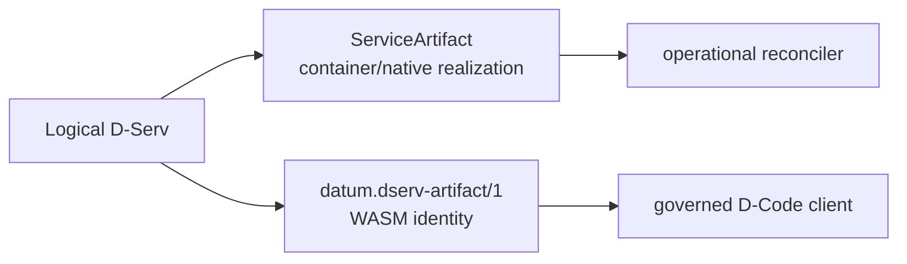

# Model an existing service

This tutorial answers a practical question: **I already have software — how does it become something DATUM v1 can model, place and realize?**

The key is to separate the software's logical identity from the details needed to realize it on a node.

## Start from facts, not JSON

Before authoring a `ServiceArtifact`, inventory the software:

| Question | Example | DATUM representation |
|---|---|---|
| What logical service is this? | MQTT broker | `service_id` |
| How does it run? | Docker container | `runtime.kind=container` |
| What exact executable content? | OCI image | container image + resolved OCI identity |
| Which ports does it expose? | TCP 1883 | `runtime.container.ports[]` |
| Does it need configuration? | `mosquitto.conf` | `configuration_mounts[]` |
| Does it need persistent state? | PostgreSQL data | `volumes[]` |
| Which non-secret settings? | database/user names | `bindings` |
| Which secrets? | password/token | `secret_refs` / `secret_bindings` |
| How do we know it exists? | container running | execution probe |
| How do we know it is usable? | TCP connect | health/availability probe |
| Where may it be proposed? | `fog-01` | `target_nodes[]` eligibility |

The artifact is a model of **desired operational realization**, not proof that the runtime already exists.

## Example 1 — Mosquitto as a container

The repository contains a real Mosquitto artifact. Its important facts are:

```text
logical service      mqtt
runtime              container
container name       datum-mosquitto
image                 eclipse-mosquitto, content-pinned
port                  1883/tcp
configuration         mosquitto.conf, read-only
execution probe       docker_container_running
health/availability   tcp_connect 127.0.0.1:1883
```

Those facts map naturally into a ServiceArtifact:

```json
{
  "schema_version": "0.2.0",
  "artifact_id": "mosquitto",
  "service_id": "mqtt",
  "runtime": {
    "kind": "container",
    "container": {
      "container_name": "datum-mosquitto",
      "image": "docker.io/library/eclipse-mosquitto@sha256:<digest>",
      "image_source_kind": "registry",
      "ports": [
        {"container_port": 1883, "host_port": 1883, "protocol": "tcp"}
      ],
      "configuration_mounts": [
        {
          "source": "mosquitto/mosquitto.conf",
          "target": "/mosquitto/config/mosquitto.conf",
          "read_only": true
        }
      ]
    }
  }
}
```

The full checked-in artifact additionally carries probes, lifecycle metadata, eligibility, bindings and governance fields.

### What DATUM learns

From this artifact DATUM can determine how a matching logical D-Serv **may be realized** as a container and which nodes are eligible during planning. It does not learn that the broker is currently running until node-side realization/evidence occurs.

## Example 2 — PostgreSQL

A database teaches different modeling concerns:

```text
container image       postgres
persistent state      named volume → /var/lib/postgresql/data
initialization        read-only init configuration
non-secret settings   POSTGRES_USER, POSTGRES_DB
secret                database password
execution probe       container running
```

Persistent state and secrets belong in the artifact's operational realization model, not in the D-Graph. The D-Graph should still say only that a logical database service exists and how it relates to other D-Servs.

## Example 3 — locally built software

The LoRa device simulator is modeled as a container with `image_source_kind = local_build`.

This classification matters because DATUM must not pretend a local image has a remotely resolvable trusted OCI provenance. Under strict execution-pinning policy, a local build remains ineligible until a governed build/attestation mechanism exists.

That build-attestation capability is **not implemented yet**.

## Example 4 — an executable installed by the OS package manager

Suppose Mosquitto was installed manually:

```sh
sudo apt install mosquitto
```

Today, `apt install` is **outside** DATUM's native-process acquisition path. DATUM v1 does not execute package-manager installation as a native acquisition primitive.

The current safe modeling boundary starts after the executable exists:

```text
package manager / operator preparation
        ↓
/usr/sbin/mosquitto
        ↓
SHA-256 of exact executable bytes
        ↓
ServiceArtifact runtime.kind=native_process
        ↓
verified managed materialization
        ↓
managed process realization
```

A native-process artifact declares an absolute acquisition source path and exact lowercase SHA-256, while the runtime `entrypoint` is a safe relative path inside the managed materialized artifact directory.

Conceptually:

```json
{
  "runtime": {
    "kind": "native_process",
    "native_process": {
      "process_name": "datum-mosquitto-native",
      "entrypoint": "bin/mosquitto",
      "args": ["-c", "/etc/mosquitto/mosquitto.conf"],
      "working_directory": null
    }
  },
  "control_plane": {
    "acquisition": {
      "kind": "native_process_executable",
      "source": "/usr/sbin/mosquitto",
      "sha256": "<64 lowercase hex>"
    }
  }
}
```

The node verifies and materializes the declared content before managed execution. It does not simply trust the original mutable host path forever.

## Why lifecycle commands are not arbitrary shell

`control_plane.lifecycle.*[].program` is an **allowlist key**, not an executable path and not a shell command. This prevents an artifact from turning a descriptive contract into unrestricted host command execution.

Therefore this is not valid modeling:

```text
program = /usr/bin/apt
```

A future governed package-manager feature will need an explicit contract for repository identity, package/version, trust, content/provenance and mutation boundaries. It should not be smuggled through lifecycle strings.

## ServiceArtifact versus canonical D-Code artifact

Use `ServiceArtifact` for operational container/native-process realization.

Use `datum.dserv-artifact/1` for canonical application D-Code (WASM) identity.



They can coexist for the same logical service because they answer different questions.

## Modeling checklist

Before registering a new operational service, answer:

1. What is the stable `service_id`?
2. Container or native process?
3. What exact executable content identity can be established?
4. Which configuration/volumes/ports are execution-relevant?
5. Which values are ordinary bindings versus secrets?
6. What proves process existence?
7. What proves health/availability?
8. Which nodes are eligible to host it?
9. Which dependencies must be modeled operationally?
10. Are any required capabilities not implemented yet?

Then register the artifact and continue to [Create a D-Graph](dgraph.md) and [Basic governed deploy](basic-deploy.md).

## Sources

See [Sources and provenance](../reference/sources.md) for the current ServiceArtifact schema, native runtime and concrete catalog artifacts.
