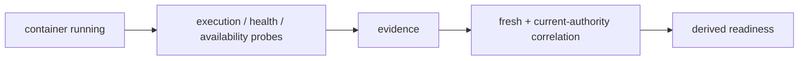

# Mosquitto end to end: artifact → D-Map → running node

This tutorial follows one concrete service all the way from an existing catalog entry to governed runtime realization. It uses Mosquitto because the repository already contains a real `ServiceArtifact`, configuration, probes and lifecycle metadata for it.

The example intentionally keeps the architecture boundaries visible:

```mermaid
flowchart LR
    CAT["catalog Mosquitto"] --> ART["project ServiceArtifact"]
    ART --> PIN["execution identity complete"]
    PIN --> DG["D-Graph service mqtt"]
    DG --> PROP["D-Deploy proposal"]
    PROP -->|"explicit accept"| DM["active D-Map"]
    DM --> SL["node operational slice"]
    ART --> CTX["reconciliation snapshot"]
    SL --> CTX
    CTX --> AUTH["finite reconcile authorization"]
    AUTH --> NODE["SmartSentinel on node"]
    NODE --> CNT["datum-mosquitto running"]
    CNT --> EV["runtime evidence"]
```



## What this tutorial assumes

The DServer and node-side DATUM/SmartSentinel binaries are built and configured. The target node already has:

- a structural D-Node declaration;
- Docker for the container example;
- an active Resource Registry binding usable by operational reconciliation;
- node configuration that can resolve the artifact's configuration files;
- network access to DServer and, for image pinning/pull, the configured OCI registry.

The [configure components](configure.md) tutorial covers the structural D-Node side. Operational host mutation has additional binding/lease prerequisites that are shown below rather than hidden.

Set a working context:

```sh
export DSERVER_URL=http://127.0.0.1:8080
export PROJECT_ID=tutorial-mqtt
export APPLICATION_ID=app:tutorial-mqtt
export NODE_ID=tutorial-node
```

## 1. Start from the real Mosquitto catalog artifact

The current catalog defines:

- `artifact_id = mosquitto`;
- `service_id = mqtt`;
- container `datum-mosquitto`;
- an `eclipse-mosquitto` OCI digest reference;
- host/container TCP port 1883;
- a read-only `mosquitto.conf` mount;
- execution, health and availability probes;
- lifecycle allowlist keys for Docker verification, image pull, configuration verification, start, post-check and rollback.

Source: [current catalog artifact](https://github.com/dnredson/datum/blob/c08ccc4d715d9eb76644e3f1bd7d80a7945265c4/artifacts/catalog/mosquitto.json).

The accompanying laboratory configuration is intentionally simple:

```text
listener 1883
allow_anonymous true
```

It is explicitly an isolated-laboratory configuration, not a production security recommendation. Source: [current Mosquitto configuration](https://github.com/dnredson/datum/blob/c08ccc4d715d9eb76644e3f1bd7d80a7945265c4/artifacts/config/mosquitto/mosquitto.conf).

## 2. Adapt catalog eligibility to the tutorial node

The checked-in catalog artifact targets historical laboratory nodes and carries `target_stages` labels. For this one-node tutorial, copy it and change **eligibility**, not runtime semantics:

```sh
cp artifacts/catalog/mosquitto.json /tmp/mosquitto-tutorial.json

jq --arg node "$NODE_ID" '
  .control_plane.target_nodes = [$node]
  | .control_plane.target_stages = []
  | .runtime.container.network = null
  | .metadata.tutorial = true
' /tmp/mosquitto-tutorial.json > /tmp/mosquitto-tutorial.tmp
mv /tmp/mosquitto-tutorial.tmp /tmp/mosquitto-tutorial.json
```

Why clear `target_stages`? Current canonical D-Continuum authority does not provide a node→stage mapping that D-Deploy can verify, so a non-empty constraint fails closed in this path.

Why clear the historical Docker network? The checked-in artifact assumes `datum-fog-net`; a generic tutorial node may not have it. This change makes the example use the default Docker network while preserving the important image/configuration/port/probe behavior.

## 3. Make the configuration file available on the node

The artifact's configuration source is:

```text
mosquitto/mosquitto.conf
```

and its container target is:

```text
/mosquitto/config/mosquitto.conf
```

That source must resolve under the node's configured artifact/configuration root. The implementation repository's `artifacts/prepare.py` can construct laboratory node bundles containing catalog and configuration material, but it deliberately **does not** publish artifacts, authorize placement, pull images or start containers.

For a repository checkout, the source content is under:

```text
artifacts/config/mosquitto/mosquitto.conf
```

Make sure your node configuration/bundle exposes that file under the source path expected by reconciliation before requesting host mutation.

## 4. Register the ServiceArtifact

```sh
curl -fsS -X POST \
  "$DSERVER_URL/api/v1/service-artifacts" \
  -H "X-Datum-Project: $PROJECT_ID" \
  -H 'content-type: application/json' \
  --data-binary @/tmp/mosquitto-tutorial.json \
  | tee /tmp/mosquitto-registered.json
```

Inspect the server-normalized artifact:

```sh
jq '{artifact_id,service_id,runtime,control_plane:{project_id,name,version,target_nodes,target_stages,execution_generation,execution_projection_digest}}' \
  /tmp/mosquitto-registered.json
```

At this point DServer knows the artifact. **Nothing has been placed or started.**

## 5. Resolve the OCI execution identity

`runtime.container.resolved_image_identity` is server-owned. Clients cannot fabricate it in the create/update body. The explicit image-identity route resolves registry-backed content for the target platform and persists the server-owned result.

For an `amd64` tutorial node:

```sh
cat > /tmp/mosquitto-pin.json <<'JSON'
{
  "target_platforms": [
    {"os": "linux", "architecture": "amd64", "variant": null}
  ],
  "resolved_by": "tutorial-operator"
}
JSON

curl -fsS -X POST \
  "$DSERVER_URL/api/v1/service-artifacts/mosquitto/image-identity/resolve" \
  -H "X-Datum-Project: $PROJECT_ID" \
  -H 'content-type: application/json' \
  --data-binary @/tmp/mosquitto-pin.json \
  | tee /tmp/mosquitto-pinned.json
```

For a Raspberry Pi/OCI ARM64 target, use the OCI platform architecture expected by the registry resolver (typically `arm64`) rather than copying the `amd64` example blindly.

`resolved_by` is a caller-supplied provenance label, not an authenticated operator identity.

Inspect:

```sh
jq '.runtime.container.resolved_image_identity, .control_plane.execution_generation, .control_plane.execution_projection_digest' \
  /tmp/mosquitto-pinned.json
```

A projection-changing pin/update can advance the artifact execution generation. The later reconciliation authorization binds the exact generation and projection digest it saw.

## 6. Describe the logical service in a D-Graph

Create `/tmp/mqtt-plan.json`:

```json
{
  "application_id": "app:tutorial-mqtt",
  "dgraph": {
    "schema": "datum.dgraph/1",
    "application_id": "app:tutorial-mqtt",
    "dgraph_id": "dgraph:tutorial-mqtt",
    "revision": 1,
    "services": [
      {
        "service_id": "mqtt",
        "execution_requirement": {"dnode_abi": "datum-dnode/0"},
        "resource_requirement": {
          "cpu_cores": 1,
          "memory_bytes": 134217728
        }
      }
    ],
    "calls": []
  }
}
```

The important join is:

```text
D-Graph service_id = mqtt
ServiceArtifact service_id = mqtt
```

The D-Graph describes logical application structure. The artifact describes operational realization. Neither silently replaces the other.

## 7. Ask D-Deploy to plan

```sh
curl -fsS -X POST \
  "$DSERVER_URL/api/v1/ddeploy/plan" \
  -H "X-Datum-Project: $PROJECT_ID" \
  -H 'content-type: application/json' \
  --data-binary @/tmp/mqtt-plan.json \
  | tee /tmp/mqtt-proposal.json
```

Inspect the candidate:

```sh
jq '.proposal.placements, .placement_provenance, .proposal_digest' /tmp/mqtt-proposal.json
```

The deterministic planner considers structural D-Continuum capacity/ABI, project commitments and ServiceArtifact eligibility. A proposal is still only a candidate.

Capture its identity:

```sh
PROPOSAL_ID=$(jq -r '.proposal.proposal_id' /tmp/mqtt-proposal.json)
PROPOSAL_DIGEST=$(jq -r '.proposal_digest' /tmp/mqtt-proposal.json)
```

## 8. Explicitly accept placement

```sh
jq -n --arg digest "$PROPOSAL_DIGEST" \
  '{accepted_by:"tutorial-operator", expected_proposal_digest:$digest}' \
  > /tmp/mqtt-accept.json

curl -fsS -X POST \
  "$DSERVER_URL/api/v1/ddeploy/proposals/$PROPOSAL_ID/accept" \
  -H "X-Datum-Project: $PROJECT_ID" \
  -H 'content-type: application/json' \
  --data-binary @/tmp/mqtt-accept.json \
  | tee /tmp/mqtt-acceptance.json
```

Read current authority:

```sh
curl -fsS -G \
  "$DSERVER_URL/api/v1/ddeploy/active" \
  -H "X-Datum-Project: $PROJECT_ID" \
  --data-urlencode "application_id=$APPLICATION_ID" \
  | tee /tmp/mqtt-active.json
```

Now the service has accepted placement authority. **Mosquitto can still be absent from the node.**

## 9. Inspect the node-specific operational slice

Canonical placement is projected into the operational reconciliation domain. Read the slice for the target node:

```sh
curl -fsS \
  "$DSERVER_URL/api/v1/nodes/$NODE_ID/operational-dgraph-slice" \
  -H "X-Datum-Project: $PROJECT_ID" \
  | tee /tmp/mqtt-slice.json
```

Inspect:

```sh
jq '{dgraph_id,dgraph_revision,node_id,desired_services,authorization}' /tmp/mqtt-slice.json
```

You should see `mqtt` in `desired_services` for the node selected by current D-Map authority.

Capture the exact operational graph identity:

```sh
OP_DGRAPH_ID=$(jq -r '.dgraph_id' /tmp/mqtt-slice.json)
OP_DGRAPH_REV=$(jq -r '.dgraph_revision' /tmp/mqtt-slice.json)
```

## 10. Issue a finite reconciliation authorization

Real host mutation requires more than an active D-Map. The node must have an active Resource Registry binding. In `required` pinning mode, the resolved artifact snapshot must also be required-complete and the durable authorization/artifact domains must satisfy the current persistence rule.

Create a finite durable lease:

```sh
jq -n \
  --arg id "$OP_DGRAPH_ID" \
  --argjson rev "$OP_DGRAPH_REV" \
  '{
    dgraph_id:$id,
    dgraph_revision:$rev,
    authorized_by:"tutorial-operator",
    allow_host_mutation:true,
    operation:"reconcile",
    persistence_scope:"durable",
    valid_for_seconds:900
  }' > /tmp/mqtt-reconcile-auth.json

curl -fsS -X POST \
  "$DSERVER_URL/api/v1/nodes/$NODE_ID/operational-reconciliation/authorize" \
  -H "X-Datum-Project: $PROJECT_ID" \
  -H 'content-type: application/json' \
  --data-binary @/tmp/mqtt-reconcile-auth.json \
  | tee /tmp/mqtt-reconcile-authorization.json
```

Inspect what the lease binds:

```sh
jq '{authorization_id,node_id,dgraph_id,dgraph_revision,operation,persistence_scope,expires_at_utc,execution_pinning_mode,artifact_bindings}' \
  /tmp/mqtt-reconcile-authorization.json
```

The artifact binding records include the exact `artifact_id`, `execution_generation` and `execution_projection_digest` captured at authorization time.

If this request fails because there is no active resource binding, incomplete pinning, persistence mismatch or configuration gap, fix that prerequisite. Do not weaken the artifact merely to make `--execute` proceed.

## 11. Preview on the node without mutation

On the target node:

```sh
cargo run --locked --manifest-path DATUM/Cargo.toml \
  --bin smartsentinel-operational-reconcile -- \
  --config DATUM/config.toml \
  --node-id "$NODE_ID" \
  --dserver-url "$DSERVER_URL" \
  --project-id "$PROJECT_ID" \
  --out /tmp/mqtt-reconcile-preview.json
```

Without `--execute`, this is the safe review boundary. Inspect the report before permitting mutation.

## 12. Execute governed reconciliation

If the preview and current lease are correct:

```sh
cargo run --locked --manifest-path DATUM/Cargo.toml \
  --bin smartsentinel-operational-reconcile -- \
  --config DATUM/config.toml \
  --node-id "$NODE_ID" \
  --dserver-url "$DSERVER_URL" \
  --project-id "$PROJECT_ID" \
  --execute \
  --out /tmp/mqtt-reconcile-execute.json
```

The reconciler fetches current node context, evaluates the sandboxed reconciliation decision, validates authorization/pinning/local policy and only then crosses governed host-mutation boundaries.

Inspect the service result:

```sh
jq '.services[] | select(.service_id == "mqtt")' /tmp/mqtt-reconcile-execute.json
```

And verify local realization:

```sh
docker ps --filter name=datum-mosquitto
```

At this point, if the report and Docker state agree, the container is physically realized on the node.

## 13. Run reconciliation again

A desirable second pass is convergence without unnecessary replacement/mutation:

```sh
cargo run --locked --manifest-path DATUM/Cargo.toml \
  --bin smartsentinel-operational-reconcile -- \
  --config DATUM/config.toml \
  --node-id "$NODE_ID" \
  --dserver-url "$DSERVER_URL" \
  --project-id "$PROJECT_ID" \
  --execute \
  --out /tmp/mqtt-reconcile-second.json
```

Review the report for an already-converged service rather than assuming repeated reconciliation should recreate the container.

## 14. Runtime realization is not the final state



A running container is an important runtime fact, but canonical DMonitor readiness has its own evidence/freshness/correlation rules. Do not turn `docker ps` into a claim that the complete application is Ready.

## Native Mosquitto uses the same authority flow

If Mosquitto was installed by a distribution repository and modeled as `native_process`, the **D-Graph → proposal → acceptance → operational slice → finite reconciliation authorization → `--execute`** chain remains conceptually the same.

The realization-specific difference is before execution:

```text
container:
  registry image → server-resolved OCI identity → Docker realization

native:
  existing absolute local executable → exact SHA-256 → managed materialized copy → managed process
```

There is no OCI image-resolution step for native execution. Instead the native artifact must already declare `acquisition.kind = native_process_executable`, an absolute local `source`, and exact lowercase SHA-256 at authoring time.

See [Model an existing service](model-existing-service.md) for the native artifact shape.

## Where migration fits

DATUM v1 keeps the lifecycle governed across nodes. If a later accepted D-Map moves `mqtt` from node A to node B, the new authority makes B desired and A historical. Target realization is reconciled on B; source cleanup on A is a **separate governed `cleanup` operation** with its own authorization and `--cleanup` node-side path. Rollback is a new accepted transition, not a rewind of history.

That matters for the planned DATUM Console: “placed on B” and “old A runtime cleaned up” are separate progress facts.

## Sources

- [Mosquitto ServiceArtifact](https://github.com/dnredson/datum/blob/c08ccc4d715d9eb76644e3f1bd7d80a7945265c4/artifacts/catalog/mosquitto.json)
- [Mosquitto configuration](https://github.com/dnredson/datum/blob/c08ccc4d715d9eb76644e3f1bd7d80a7945265c4/artifacts/config/mosquitto/mosquitto.conf)
- [ServiceArtifact API](https://github.com/dnredson/datum/blob/c08ccc4d715d9eb76644e3f1bd7d80a7945265c4/dserver/src/api/service_artifacts.rs)
- [ServiceArtifact validation](https://github.com/dnredson/datum/blob/c08ccc4d715d9eb76644e3f1bd7d80a7945265c4/dserver/src/core/service_artifact_registry.rs)
- [Operational reconciliation authorization](https://github.com/dnredson/datum/blob/c08ccc4d715d9eb76644e3f1bd7d80a7945265c4/dserver/src/api/operational_dgraph.rs)
- [Operational authorization contract](https://github.com/dnredson/datum/blob/c08ccc4d715d9eb76644e3f1bd7d80a7945265c4/dserver/src/core/operational_dgraph.rs)
- [Node reconciler CLI](https://github.com/dnredson/datum/blob/c08ccc4d715d9eb76644e3f1bd7d80a7945265c4/DATUM/src/bin/smartsentinel-operational-reconcile.rs)
- [Artifact/bundle workflow](https://github.com/dnredson/datum/blob/c08ccc4d715d9eb76644e3f1bd7d80a7945265c4/artifacts/README.md)
