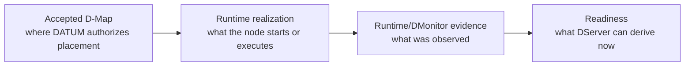
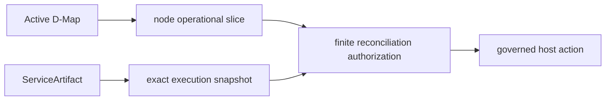
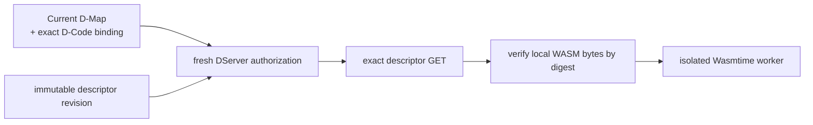
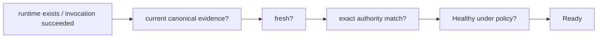

# Realize an accepted deployment

Accepted authority and running software are intentionally different facts. DATUM v1 keeps **placement**, **runtime realization**, **evidence** and **readiness** separate.

## Authority versus realization versus evidence



No arrow becomes automatic just because the previous object exists.

## Operational container/native-process path

The node-side reconciler is:

```text
smartsentinel-operational-reconcile
```

It resolves the node's operational slice and artifact assignments, runs the reconciliation decision path and can optionally perform governed host mutation.

A preview-shaped invocation is:

```sh
cargo run --locked --manifest-path DATUM/Cargo.toml \
  --bin smartsentinel-operational-reconcile -- \
  --config DATUM/config.toml \
  --node-id tutorial-node \
  --dserver-url "$DSERVER_URL" \
  --project-id "$PROJECT_ID" \
  --out reconcile-report.json
```

Without `--execute`, this does not request ordinary reconciliation host mutation.

## Why accepted placement is not enough

Operational realization additionally depends on facts such as:

- active Resource Registry binding for the node;
- current node-specific operational D-Graph slice;
- exact ServiceArtifact assignment;
- execution projection/generation and required pinning completeness;
- finite reconciliation authorization;
- local execution policy.



## Reconciliation authorization

Host mutation requires a finite authorization that binds the current node/resource, operational graph revision and exact artifact execution snapshot. The current implementation uses durable authorization with a finite lease for real reconcile/rollback mutation.

This makes an important distinction:

```text
placement accepted
    ≠ artifact snapshot authorized
    ≠ host mutation performed
```

A later content-changing ServiceArtifact update does not retroactively rewrite an already-issued immutable snapshot.

## Execute the accepted realization

After reviewing the preview and satisfying the authorization/pinning prerequisites, add:

```text
--execute
```

The agent then enforces the authorization, identity and local mutation boundaries before creating/updating the container or managed native process.

For containers this can include pulling/verifying the governed image identity, configuration/volume/network/port realization and container start. For native processes it can include verified acquisition/materialization by content SHA-256 and managed spawn/adoption under the node-local runtime.

## Native-process boundary

Native process acquisition currently starts from an **already-present absolute Linux executable source path** plus exact SHA-256. Native `apt`, `dnf`, `yum` or repository acquisition is not implemented yet.

The managed runtime materializes verified content under its own controlled root before execution. The original package-manager-installed path is therefore preparation/input, not unmanaged execution authority.

## D-Code path

Canonical D-Code uses a different realization path:



Prerequisites include:

1. structural D-Node authority;
2. current accepted placement;
3. exact registered D-Code descriptor revision selected by current authority;
4. matching node-local WASM bytes;
5. local D-Node identity.

Automatic WASM distribution is not implemented yet; copying/installing module bytes is a separate operational step.

## Governed D-Code invocation

Prepare an input payload, then use the governed invocation client. Conceptually the client performs:

```text
fresh authorize
→ exact descriptor fetch
→ authority/identity cross-check
→ local content digest verification
→ isolated invocation
```

The caller does not get to choose an arbitrary local module or “latest” artifact revision.

## Migration, cleanup and rollback

DATUM v1 distinguishes three node-side operational modes:

```text
ordinary reconciliation  → desired current services
cleanup                   → previously placed service no longer desired here
rollback                  → explicit rollback operation
```

Source cleanup has its own `cleanup` authorization and `--cleanup` reconciler path. It is intentionally separate from ordinary rollback so cleanup of one vacated service cannot accidentally apply rollback semantics to unrelated co-located services.

## Runtime success is still not readiness

A running container, a live managed process or a successful WASM invocation is not automatically Ready.



Use DMonitor/readiness APIs for current governance conclusions rather than Docker/process success alone.

## What is not implemented yet

- automatic D-Code module distribution;
- native package-manager acquisition as a governed primitive;
- a single turnkey command that hides all placement, authorization, realization and evidence boundaries;
- the new user-facing management dashboard described in the roadmap.

These capabilities can be added without changing the v1 rule that authority, realization and evidence remain distinct.

## Sources

See [Sources and provenance](../reference/sources.md) for the current operational reconciler, native runtime and D-Code execution source anchors.
