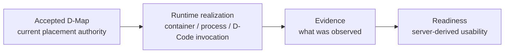
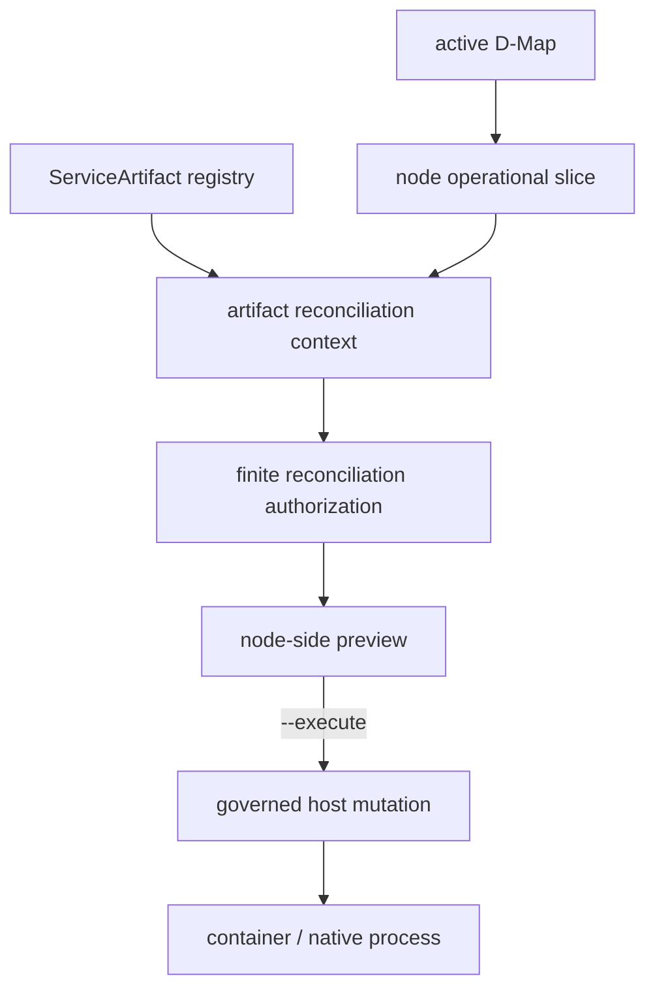
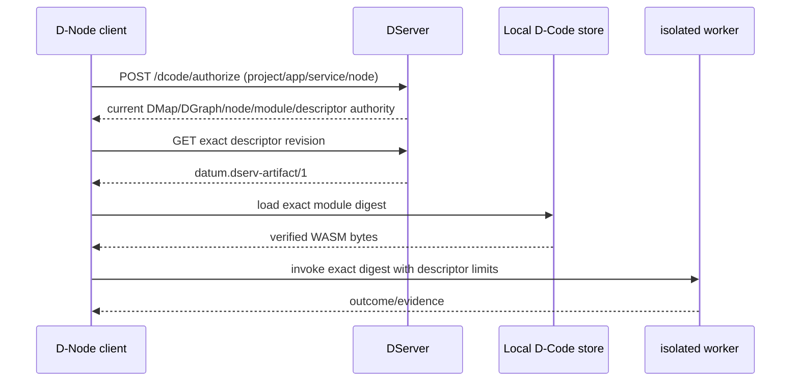
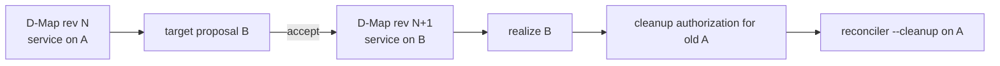
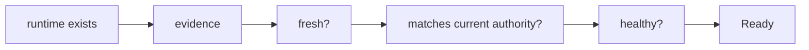

# Realize an accepted deployment

Accepted placement authority and running software are intentionally different facts. DATUM v1 has two important realization paths: **operational reconciliation** for container/native services and **governed D-Code invocation** for application WebAssembly.

For a complete practical example, see [Mosquitto end to end](mosquitto-end-to-end.md). For the reusable lifecycle, see [From service model to execution on a node](service-to-node.md).

## Authority → realization → evidence



No arrow is automatic merely because the previous box exists.

## Path A — operational reconciliation

Operational reconciliation realizes long-running `ServiceArtifact` assignments.



### Why `--execute` is separate

The node-side CLI is explicit:

```text
smartsentinel-operational-reconcile
```

Without `--execute`, it can resolve/fetch/evaluate/report without requesting execution of host mutation. A preview-shaped command is:

```sh
cargo run --locked --manifest-path DATUM/Cargo.toml \
  --bin smartsentinel-operational-reconcile -- \
  --config DATUM/config.toml \
  --node-id "$NODE_ID" \
  --dserver-url "$DSERVER_URL" \
  --project-id "$PROJECT_ID" \
  --out reconcile-preview.json
```

The operational path requires more than an active D-Map. Current host mutation is gated by such facts as:

- active Resource Registry binding;
- exact operational graph identity/revision;
- current artifact assignment snapshot;
- execution generation/projection digest;
- pinning completeness/policy;
- finite authorization lease;
- local resource/identity/policy checks.

### Current authorization shape

A reconcile/rollback host-mutation authorization must be usable as a finite lease. Current API issuance requires `persistence_scope = durable` with `valid_for_seconds` for these mutation paths.

Example request:

```json
{
  "dgraph_id": "dgraph:example",
  "dgraph_revision": 2,
  "authorized_by": "operator-example",
  "allow_host_mutation": true,
  "operation": "reconcile",
  "persistence_scope": "durable",
  "valid_for_seconds": 900
}
```

Endpoint:

```text
POST /api/v1/nodes/:node_id/operational-reconciliation/authorize
```

When accepted, the authorization snapshots the exact resolved artifact assignments and binds service-level `{artifact_id, execution_generation, execution_projection_digest}` values.

### Execute

After reviewing the preview and current authorization:

```sh
cargo run --locked --manifest-path DATUM/Cargo.toml \
  --bin smartsentinel-operational-reconcile -- \
  --config DATUM/config.toml \
  --node-id "$NODE_ID" \
  --dserver-url "$DSERVER_URL" \
  --project-id "$PROJECT_ID" \
  --execute \
  --out reconcile-execute.json
```

For containers, the agent uses the supported governed container lifecycle/pinning/configuration path. For native processes, it uses exact native acquisition plus managed process runtime state.

## Native process realization

Native acquisition in DATUM v1 is deliberately narrow:

```text
absolute local Linux source path
        +
exact lowercase SHA-256
        ↓
content-addressed managed materialization
        ↓
relative entrypoint under managed artifact directory
        ↓
governed managed process
```

The acquisition layer rejects relative source paths, malformed hashes and path traversal. The runtime persists identity needed to distinguish/recover the process safely.

A distribution package manager such as `apt` can be used as external host preparation, but DATUM v1 native acquisition does not itself mean “run apt”. A governed package-manager acquisition capability is planned separately. See [Model an existing service](model-existing-service.md).

## Container realization

Container artifacts can declare image, ports, network, aliases, volumes, configuration mounts and command arguments.

For `image_source_kind = registry`, server-owned platform-specific OCI identity can be resolved using:

```text
POST /api/v1/service-artifacts/:artifact_id/image-identity/resolve
```

A client cannot supply `resolved_image_identity` directly in an ordinary artifact create/update request.

## Path B — governed D-Code

D-Code realization is invocation-oriented rather than a continuously running container/process lifecycle.



The governed path does not use a logical “latest artifact” lookup. A fresh authorization identifies the exact descriptor revision, and the client fetches that exact immutable revision before loading local bytes.

See [DServer → D-Node governed D-Code execution](../architecture/dserver-dnode-dcode-flow.md).

## Registration/install availability is not authority

For D-Code:

```text
D2 registered in DServer
+ H2 bytes installed on the node
≠ H2 active
```

A new accepted D-Deploy authority must bind/select D2 before fresh authorization resolves it. Multiple immutable revisions can coexist.

For operational ServiceArtifacts, the same broad principle holds: a catalog/registry record and locally available Docker image/native source do not themselves create D-Map placement authority or a host-mutation lease.

## Migration and cleanup

Migration adds an important post-cutover realization fact.



The old source runtime is not simply killed because a new D-Map exists. The server derives cleanup directives from accepted history/current absence, a distinct `operation = cleanup` authorization is issued, and the agent processes only cleanup directives under its dedicated `--cleanup` mode.

The CLI therefore exposes three distinct intents:

```text
normal reconciliation: --execute
rollback processing:   --rollback
source cleanup:         --cleanup
```

`--cleanup` and `--rollback` are mutually exclusive.

Rollback of placement is represented by a **new governed D-Deploy transition**, not by rewinding an old acceptance.

## Running is not Ready



Operational reconciliation evidence, D-Code invocation evidence and canonical DMonitor readiness are related but distinct domains. A successful Docker/native/WASM action does not automatically prove application readiness.

## Sources

- [Node reconciler CLI](https://github.com/dnredson/datum/blob/c08ccc4d715d9eb76644e3f1bd7d80a7945265c4/DATUM/src/bin/smartsentinel-operational-reconcile.rs)
- [Node reconciliation engine](https://github.com/dnredson/datum/blob/c08ccc4d715d9eb76644e3f1bd7d80a7945265c4/DATUM/src/agent/operational_reconciliation.rs)
- [Operational authorization API](https://github.com/dnredson/datum/blob/c08ccc4d715d9eb76644e3f1bd7d80a7945265c4/dserver/src/api/operational_dgraph.rs)
- [Operational authorization contract](https://github.com/dnredson/datum/blob/c08ccc4d715d9eb76644e3f1bd7d80a7945265c4/dserver/src/core/operational_dgraph.rs)
- [Native executable acquisition](https://github.com/dnredson/datum/blob/c08ccc4d715d9eb76644e3f1bd7d80a7945265c4/DATUM/src/agent/native_process_acquisition.rs)
- [D-Code governed client](https://github.com/dnredson/datum/blob/c08ccc4d715d9eb76644e3f1bd7d80a7945265c4/DATUM/src/dcode/client.rs)
