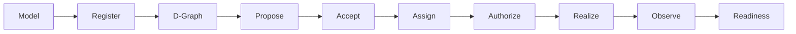

# From service model to execution on a node

This is the reusable DATUM v1 lifecycle for turning software into governed runtime realization.



Each box is a different claim. Do not collapse them into one `deployed=true` state.

## 1. Understand the software

Collect the facts needed to realize it:

- logical service identity;
- container, native process or D-Code;
- exact executable/content identity;
- ports, configuration and persistent volumes;
- ordinary bindings and secrets;
- dependencies;
- execution/health/availability probes;
- resource requirements and eligible nodes.

## 2. Author the execution artifact

For long-running containers or native processes, create a project-scoped `ServiceArtifact`.

For canonical application D-Code, create/register `datum.dserv-artifact/1` descriptor revisions and install exact matching WASM bytes on the target D-Node through the node-local content store.

These artifact families are related to the same logical service but serve different authority/execution roles.

## 3. Register execution identity

Operational artifact registration creates server-owned execution projection identity/generation. Registry-backed container images can additionally be resolved to immutable platform-specific OCI identity.

D-Code registration stores immutable descriptor revisions by:

```text
(application_id, dserv_id, descriptor_digest)
```

Registration is availability, not activation.

## 4. Describe the logical application

Create a placement-free D-Graph:

```text
D-Servs + D-Calls
```

Do not embed node IDs, Docker names, IP addresses or live health in it.

## 5. Ask D-Deploy to plan

D-Deploy combines the D-Graph with authoritative structural continuum facts, existing commitments and artifact eligibility to produce a candidate placement proposal.

The proposal is not authority.

## 6. Review and explicitly accept

Acceptance creates/materializes the active D-Map. This is the moment the candidate placement becomes current placement authority.

```text
proposal
    ↓ review
explicit acceptance
    ↓
active D-Map
```

## 7. Derive node-specific desired state

DServer projects the accepted authority into the operational slice relevant to each D-Node. A node should not accept a caller-authored replacement topology as execution authority.

## 8. Establish current execution authorization

For container/native realization, host mutation requires current operational prerequisites and a finite reconciliation authorization bound to an exact artifact snapshot.

For D-Code, the client requests fresh execution authorization that binds exact D-Map, D-Graph, D-Node and D-Code descriptor identities.

## 9. Preview before mutation

For operational reconciliation, run the reconciler without `--execute` first. Inspect the report and ensure the proposed action matches the accepted placement and expected artifact identity.

## 10. Realize on the node

Container path:

```text
exact ServiceArtifact assignment
→ governed image/config/network/volume handling
→ Docker runtime
```

Native-process path:

```text
absolute source path + SHA-256
→ verified managed materialization
→ managed process runtime
```

D-Code path:

```text
fresh authorization
→ exact descriptor fetch
→ local WASM digest verification
→ isolated Wasmtime worker
```

## 11. Observe reality

Execution success is an event/fact, not desired state. Runtime evidence and DMonitor observations answer what actually happened.

## 12. Derive readiness

Readiness combines admitted evidence, freshness and exact authority correlation. Therefore:

```text
accepted ≠ running
running ≠ healthy
healthy observation ≠ fresh
fresh health ≠ exact-current correlation
all required current evidence ⇒ readiness
```

## Migration and cleanup

When an accepted placement moves a service from one node to another, the new target and old source have different responsibilities:

```text
new node
  └─ realize current desired service

old node
  └─ cleanup only if derived history/current authority says the old realization is vacated
```

DATUM v1 has a dedicated governed cleanup operation/path so source cleanup cannot be confused with ordinary desired-state reconciliation or broad rollback.

## UI-friendly derived lifecycle

A dashboard can present the following **derived** progression:

```text
Modeled
→ Registered
→ Execution identity complete
→ Proposed
→ Accepted
→ Assigned
→ Authorized
→ Realized
→ Observed
→ Healthy
→ Ready
```

During migration it can additionally show:

```text
Cleanup pending → Cleanup completed
```

These are presentation concepts, not another canonical persisted state machine. The planned dashboard should read facts from the domains that own them.

## What is not implemented yet

The following should be shown honestly as planned rather than hidden behind the lifecycle diagram:

- automatic D-Code module distribution;
- native package-manager acquisition;
- a packaged turnkey installation/deployment experience;
- the new management dashboard itself.

## Use this checklist for each new service

Before declaring onboarding complete, verify:

- model is correct;
- artifact is registered;
- execution content identity is complete enough for policy;
- service appears in the intended D-Graph;
- proposal was reviewed;
- D-Map was explicitly accepted;
- target node receives the correct operational projection/authority;
- authorization is current;
- realization occurred on the target;
- old realization cleanup is handled if placement moved;
- evidence is current;
- readiness reflects observed reality.

## Sources

See [Sources and provenance](../reference/sources.md), [Model an existing service](model-existing-service.md), [Basic governed deploy](basic-deploy.md) and [Runtime realization](runtime-realization.md).
