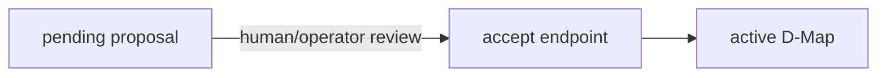
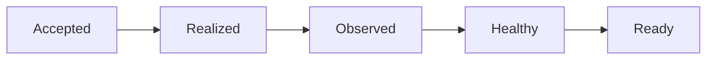
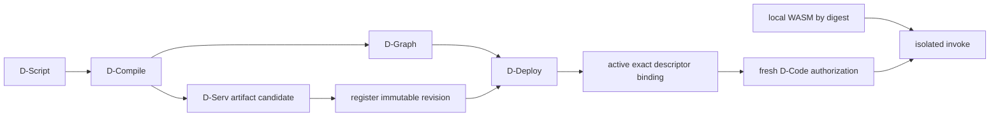
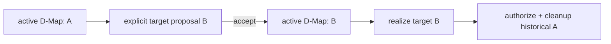

# From service model to execution on a node

This page is the reusable end-to-end map behind the concrete [Mosquitto tutorial](mosquitto-end-to-end.md). Use it when introducing a new service to DATUM, regardless of whether the service is a broker, database, API, simulator or other long-running operational component.

## The complete lifecycle

```mermaid
flowchart LR
    S0["1 · Understand software"] --> S1["2 · Author ServiceArtifact"]
    S1 --> S2["3 · Register / pin identity"]
    S2 --> S3["4 · Put service in D-Graph"]
    S3 --> S4["5 · Plan placement"]
    S4 --> S5["6 · Accept D-Map"]
    S5 --> S6["7 · Derive node slice"]
    S6 --> S7["8 · Authorize reconciliation"]
    S7 --> S8["9 · Preview"]
    S8 --> S9["10 · Execute on node"]
    S9 --> S10["11 · Observe"]
    S10 --> S11["12 · Derive readiness"]
```



The lifecycle has deliberately more than one “success” point. A service can be modeled but unregistered, registered but unplaced, accepted but unrealized, running but unhealthy, or healthy but not admitted as current evidence.

## 1. Understand the service before encoding it

Create a small fact sheet:

```text
logical service_id:
runtime kind:
executable/image identity:
arguments/command:
ports:
configuration files:
persistent data:
dependencies:
non-secret bindings:
secret references:
execution probe:
health probe:
availability probe:
eligible nodes:
```

Do not skip this step. Most artifact mistakes are modeling mistakes before they are JSON mistakes.

Use [Model an existing service](model-existing-service.md) for concrete container/native examples.

## 2. Author the operational artifact

For container/native-process runtime, encode the fact sheet as a project-scoped `ServiceArtifact`.

The runtime discriminator is explicit:

```json
{"runtime":{"kind":"container","container":{"...":"..."}}}
```

or:

```json
{"runtime":{"kind":"native_process","native_process":{"...":"..."}}}
```

A valid artifact also carries probes and a control-plane section for eligibility, acquisition, lifecycle, health checks, bindings/secrets and reconciliation decision policy.

### Server-owned identity must remain server-owned

Do not populate fields such as:

- `execution_generation`;
- `execution_projection_digest`;
- `runtime.container.resolved_image_identity`.

DServer computes/owns those through the corresponding registry/pinning transitions.

## 3. Register it with project scope

```sh
curl -fsS -X POST \
  "$DSERVER_URL/api/v1/service-artifacts" \
  -H "X-Datum-Project: $PROJECT_ID" \
  -H 'content-type: application/json' \
  --data-binary @service-artifact.json \
  | tee registered-artifact.json
```

Registration means:

> DServer now has a normalized project-scoped desired realization descriptor.

Registration does **not** mean:

> this service is placed, accepted, installed, started or healthy.

## 4. Make execution identity sufficiently explicit

### Registry-backed container

Use the explicit image-identity resolution endpoint when required by current pinning policy:

```text
POST /api/v1/service-artifacts/:artifact_id/image-identity/resolve
```

The result is server-owned, platform-specific OCI identity.

### Native process

The artifact must already declare exact executable identity at authoring time:

```text
acquisition.kind   = native_process_executable
acquisition.source = /absolute/linux/path/to/source-binary
acquisition.sha256 = 64 lowercase hex characters
```

The node later materializes and re-verifies those exact bytes under its managed native-process root.

## 5. Represent the logical service in the D-Graph

The D-Graph is not a copy of the artifact. It describes logical application structure.

For a one-service application:

```json
{
  "schema": "datum.dgraph/1",
  "application_id": "app:example",
  "dgraph_id": "dgraph:example",
  "revision": 1,
  "services": [
    {
      "service_id": "my-service",
      "execution_requirement": {"dnode_abi": "datum-dnode/0"},
      "resource_requirement": {
        "cpu_cores": 1,
        "memory_bytes": 134217728
      }
    }
  ],
  "calls": []
}
```

The current operational artifact join depends on stable service identity. Avoid registering multiple ServiceArtifacts that ambiguously resolve the same service unless the current resolver has an explicit disambiguation authority for your flow.

## 6. Create a candidate placement

For the deterministic v1 planner:

```sh
curl -fsS -X POST \
  "$DSERVER_URL/api/v1/ddeploy/plan" \
  -H "X-Datum-Project: $PROJECT_ID" \
  -H 'content-type: application/json' \
  --data-binary @plan-request.json \
  | tee plan-response.json
```

The planner derives feasibility from:

- D-Graph structural resource requirements;
- authoritative D-Continuum nodes/capabilities;
- current project structural commitments;
- ServiceArtifact node eligibility.

It does not make a service active merely by producing a proposal.

## 7. Review and explicitly accept



The acceptance endpoint uses proposal identity/digest so a reviewed candidate is not silently substituted.

After acceptance, read the active deployment and record:

- D-Map id;
- revision;
- digest;
- exact placements;
- proposal/acceptance provenance.

This is the point where placement becomes authority.

## 8. Understand what DServer derives for the node

The operational plane projects current authority into a node-specific desired slice. Conceptually:

```text
active D-Map
   + D-Graph snapshot
   ↓
node-specific desired services
   + ServiceArtifact join
   ↓
artifact reconciliation context
```

The context contains execution-relevant artifact data, including server-owned generation/projection identity. It is not simply “whatever artifact is newest now” when a valid authorization snapshot is attached.

## 9. Request a finite host-mutation authorization

Operational realization is a host mutation and therefore has a separate gate.

The current reconcile authorization request binds:

```text
project
node
operational D-Graph id/revision
resource binding
operation = reconcile
allow_host_mutation
finite durable lease
artifact snapshot
execution pinning mode
```

Example body:

```json
{
  "dgraph_id": "dgraph:example",
  "dgraph_revision": 1,
  "authorized_by": "operator-example",
  "allow_host_mutation": true,
  "operation": "reconcile",
  "persistence_scope": "durable",
  "valid_for_seconds": 900
}
```

The current API refuses reconcile/rollback host-mutation authorizations that cannot satisfy the finite-lease requirement rather than issuing an authorization that can never be used safely.

## 10. Preview before execution

Run the node-side reconciler without `--execute` first:

```sh
smartsentinel-operational-reconcile \
  --config config.toml \
  --node-id "$NODE_ID" \
  --dserver-url "$DSERVER_URL" \
  --project-id "$PROJECT_ID" \
  --out reconcile-preview.json
```

The exact binary path depends on how you built/installed the DATUM tools; `cargo run --bin smartsentinel-operational-reconcile -- ...` is equivalent from a source checkout.

Review:

- resolved service assignment;
- artifact generation/projection identity;
- pinning/completeness findings;
- control-plane authorization state;
- intended local mutation;
- probes/current observed state.

## 11. Execute the governed realization

Only after the current authorization and preview are acceptable:

```sh
smartsentinel-operational-reconcile \
  --config config.toml \
  --node-id "$NODE_ID" \
  --dserver-url "$DSERVER_URL" \
  --project-id "$PROJECT_ID" \
  --execute \
  --out reconcile-execute.json
```

For a container, the governed path can verify/pull/configure/start according to the supported artifact lifecycle and current local policy.

For a native process, the governed path verifies/materializes the exact declared source bytes and manages the process under DATUM's native runtime state.

The artifact never grants itself permission to mutate the host. Mutation is allowed only when the operational authorization/local enforcement gates agree.

## 12. Verify convergence, not only startup

After the first execution:

1. inspect the reconciliation report;
2. inspect the real process/container on the node;
3. run reconciliation again;
4. check that a converged service does not require unnecessary replacement;
5. inspect operational/canonical evidence separately.

A repeated successful reconciliation without host mutation is often a stronger operational signal than a one-time successful start.

## 13. Observe and interpret evidence

Do not flatten these into one status:



- **Accepted**: current D-Map authority exists.
- **Realized**: a concrete container/process/module execution exists.
- **Observed**: an evidence producer reported runtime facts.
- **Healthy**: admitted observations report a healthy condition.
- **Ready**: current readiness policy positively admits fresh, authority-correlated evidence for all required realizations.

This distinction is especially useful for troubleshooting and for a future dashboard.

## Container, native and D-Code paths compared

| Step | Container ServiceArtifact | Native ServiceArtifact | Canonical D-Code |
|---|---|---|---|
| executable identity | OCI image/platform identity | local source binary SHA-256 | WASM module SHA-256 |
| descriptor | ServiceArtifact | ServiceArtifact | `datum.dserv-artifact/1` |
| bytes delivered automatically by DServer? | no — node/container runtime handles image acquisition | no — source file must exist locally for current native acquisition | no — module must be installed in local D-Code store |
| placement authority | D-Map | D-Map | D-Map + exact D-Code descriptor binding |
| execution gate | operational reconcile authorization | operational reconcile authorization | fresh D-Code authorization |
| runtime | Docker | managed native process | isolated Wasmtime worker per invocation |
| evidence/readiness | separate | separate | separate |

## D-Code variant of the lifecycle

D-Code differs at the realization boundary but preserves the same principle: **available content is not active authority**.



See [DCompile and D-Code API](../reference/dcompile-dcode-api.md) for the exact-revision flow.

## Migration is another governed transition

Once the service is running on node A, moving it to B is not “copy and kill”. Phase 119's model is:



Rollback is another new acceptance. Source cleanup is a separate governed operation and may lag target authority/realization.

## A dashboard-friendly lifecycle vocabulary

The dashboard phase has not been specified here, but the existing architecture naturally exposes several independent facts worth visualizing separately:

| View concept | Backing fact today |
|---|---|
| **Modeled** | artifact/D-Graph content exists |
| **Registered** | artifact registry contains normalized artifact |
| **Execution identity complete** | OCI/native/D-Code exact identity requirements satisfied |
| **Proposed** | pending D-Deploy proposal |
| **Accepted** | active D-Map |
| **Assigned to node** | active placement / operational desired service |
| **Authorized** | current finite reconcile lease or D-Code authorization |
| **Realized** | node report/process/container execution |
| **Observed** | evidence exists |
| **Healthy** | admitted health condition |
| **Ready** | readiness evaluator result |
| **Cleanup pending** | historical source realization no longer desired but not yet removed |

!!! note
    These labels are a documentation/UI mental model, **not a new canonical state enum**. A future dashboard should derive them from current authoritative/evidence domains rather than persist a second competing truth.

## Sources

- [ServiceArtifact registry/validation](https://github.com/dnredson/datum/blob/c08ccc4d715d9eb76644e3f1bd7d80a7945265c4/dserver/src/core/service_artifact_registry.rs)
- [DServer mounted routes](https://github.com/dnredson/datum/blob/c08ccc4d715d9eb76644e3f1bd7d80a7945265c4/dserver/src/main.rs)
- [Operational authorization contract](https://github.com/dnredson/datum/blob/c08ccc4d715d9eb76644e3f1bd7d80a7945265c4/dserver/src/core/operational_dgraph.rs)
- [Operational reconciliation API](https://github.com/dnredson/datum/blob/c08ccc4d715d9eb76644e3f1bd7d80a7945265c4/dserver/src/api/operational_dgraph.rs)
- [Node-side reconciliation engine](https://github.com/dnredson/datum/blob/c08ccc4d715d9eb76644e3f1bd7d80a7945265c4/DATUM/src/agent/operational_reconciliation.rs)
- [Native acquisition](https://github.com/dnredson/datum/blob/c08ccc4d715d9eb76644e3f1bd7d80a7945265c4/DATUM/src/agent/native_process_acquisition.rs)
- [Phase 119I closure review](https://github.com/dnredson/datum/blob/c08ccc4d715d9eb76644e3f1bd7d80a7945265c4/documentation/reference/phase119i-independent-final-migration-closure-review.md)
